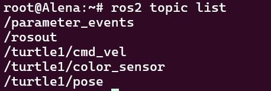
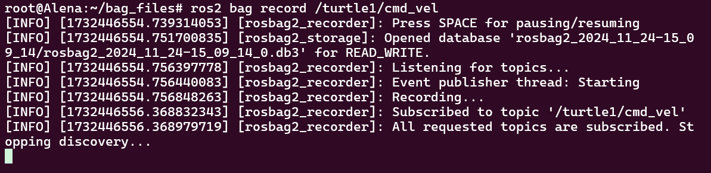
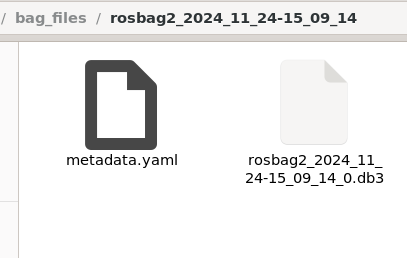
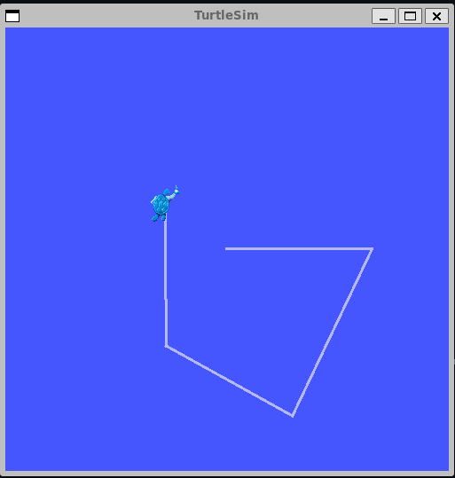
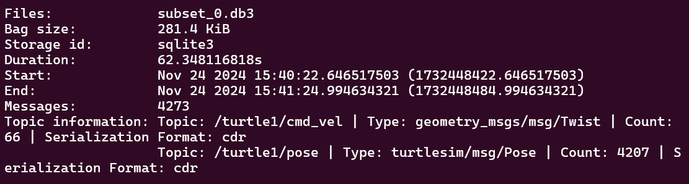
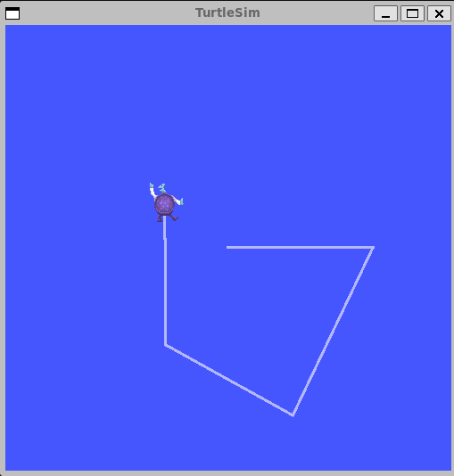

# Recording and playing back data

**Цель**: Записывать данные, опубликованные по топику, чтобы в любой момент можно было воспроизвести и изучить их.

# Общие сведения

`ros2 bag` - это инструмент командной строки для записи данных, опубликованных в топиках в вашей системе. Он накапливает данные, переданные по любому количеству топиков, и сохраняет их в базе данных. Затем вы можете воспроизвести эти данные для воспроизведения результатов ваших тестов и экспериментов. Запись топиков - это также отличный способ поделиться своими наработками и дать возможность другим воссоздать их.

# Задачи

## 1. Setup

Вы будете записывать ввод с клавиатуры в системе `turtlesim`, чтобы сохранить и воспроизвести его позже, поэтому начните с запуска узлов `/turtlesim` и `/teleop_turtle`.

Откройте новый терминал и выполните команду:

```shell
ros2 run turtlesim turtlesim_node
```

Откройте другой терминал и выполните команду:

```shell
ros2 run turtlesim turtle_teleop_key
```

Давайте также создадим новую директорию для хранения сохраненных записей:


## 2. Выберите топик

`ros2 bag` может записывать данные из опубликованных сообщений только в топики. Чтобы просмотреть список топиков вашей системы, откройте новый терминал и выполните команду:

```shell
ros2 topic list
```



Как мы узнали ранее, узел `/turtle_teleop` публикует команды в топике `/turtle1/cmd_vel`, чтобы заставить черепаху двигаться в turtlesim.

Чтобы увидеть данные, которые публикует тема `/turtle1/cmd_vel`, выполните команду:

```shell
ros2 topic echo /turtle1/cmd_vel
```

Сначала ничего не появится, потому что `teleop` не публикует никаких данных. Вернитесь на терминал, где вы запустили `teleop`, и выберите его, чтобы он стал активным. Используйте клавиши со стрелками, чтобы перемещать черепашку, и вы увидите, что данные публикуются на терминале, где запущена `ros2 topic echo`.


## 3. `ros2 bag record`

## 3.1. Запись одного топика

Чтобы записать данные, опубликованные в топике, используйте синтаксис команды:

```shell
ros2 bag record <topic_name>
```

Перед выполнением этой команды на выбранном вами топике откройте новый терминал и перейдите в каталог `bag_files`, который вы создали ранее, потому что файл rosbag будет сохранен в том каталоге, в котором вы его запустили.

Выполните команду:

```shell
ros2 bag record /turtle1/cmd_vel
```

В терминале вы увидите следующие сообщения:



Теперь `ros2 bag` записывает данные, опубликованные в топике `/turtle1/cmd_vel`. Вернитесь к телеоп-терминалу и снова подвигайте черепаху. Движения не имеют значения, но постарайтесь создать узнаваемую картину, чтобы увидеть ее при последующем воспроизведении данных.


Нажмите `Ctrl+C`, чтобы остановить запись.

Данные будут накоплены в новом каталоге bag с именем по шаблону `rosbag2_год_месяц_день_час_минута_секунда`. Этот каталог будет содержать `metadata.yaml` вместе с файлом bag в записанном формате.



## 3.2. Запись нескольких топиков

Вы можете записать несколько топиков, а также изменить имя файла, в который сохраняется `ros2 bag`.

Выполните следующую команду:

```shell
ros2 bag record -o subset /turtle1/cmd_vel /turtle1/pose
```

Опция `-o` позволяет выбрать уникальное имя для файла мешка. Следующая строка, в данном случае `subset`, является именем файла.

Чтобы записать несколько топиков одновременно, просто перечислите их через пробел.

Вы увидите следующее сообщение, подтверждающее, что записываются оба топика.


Вы можете перемещать черепашку и нажать `Ctrl+C`, когда закончите.



## 4. `ros2 bag info`

Вы можете просмотреть подробную информацию о записи, выполнив команду:

```shell
ros2 bag info <bag_file_name>
```

Выполнив эту команду над файлом `subset`, вы получите список информации о файле:

```shell
ros2 bag info subset
```



## 5. `ros2 bag play`

Перед воспроизведением файла пакета введите `Ctrl+C` в терминале, где запущен teleop. Затем убедитесь, что окно turtlesim открыто, чтобы вы могли увидеть файл bag в действии.

Введите команду:

```shell
ros2 bag play subset
```

Терминал выдаст сообщение:

```shell
[INFO] [rosbag2_storage]: Opened database 'subset'.
```

Ваша черепашка будет следовать по тому же пути, который вы указали во время записи (хотя и не на 100% точно, т.к. turtlesim чувствителен к небольшим изменениям в синхронизации системы).



Поскольку в файле `subset` записан топик `/turtle1/pose`, команда `ros2 bag play` не прервется до тех пор, пока запущен turtlesim, даже если вы не двигаетесь.

Это происходит потому, что пока узел `/turtlesim` активен, он регулярно публикует данные в топике `/turtle1/pose`. Возможно, вы заметили в приведенном выше результате примера `ros2 bag info`, что в топике `Count` темы `/turtle1/cmd_vel` было только 9; именно столько раз мы нажимали на клавиши со стрелками во время записи.

Обратите внимание, что `/turtle1/pose` имеет значение `Count` более 3000; пока мы вели запись, данные по этому топику были опубликованы 3000 раз.

Чтобы получить представление о том, как часто публикуются данные о положении, можно выполнить команду:

```shell
ros2 topic hz /turtle1/pose
```


...

# Заключение

С помощью команды `ros2 bag` вы можете записывать данные, передаваемые по топикам в вашей системе ROS 2. Если вы хотите поделиться своей работой с другими или проанализировать собственные эксперименты, это отличный инструмент, о котором стоит знать.
