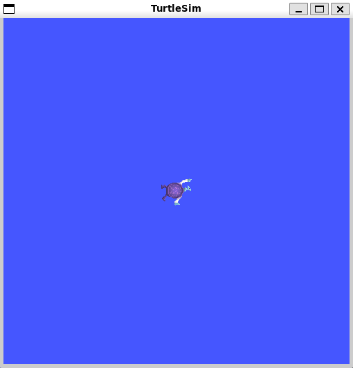
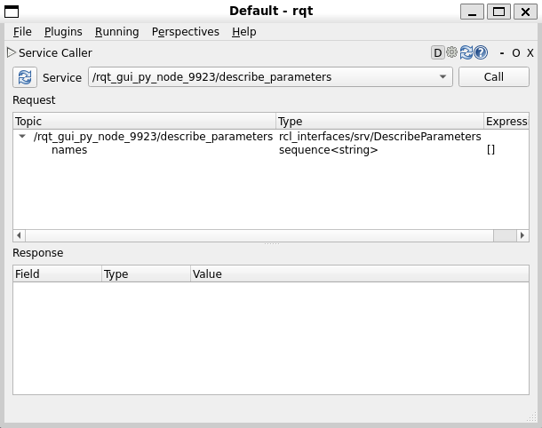
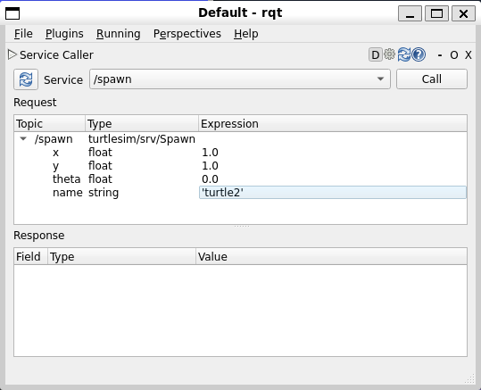
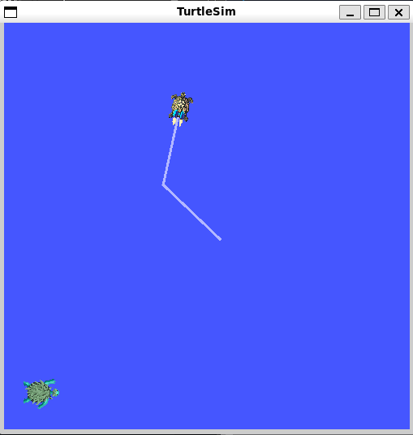
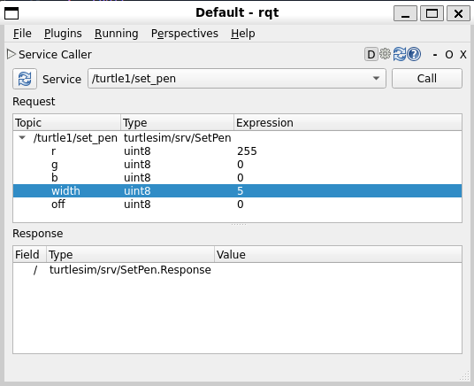
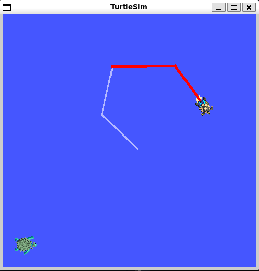
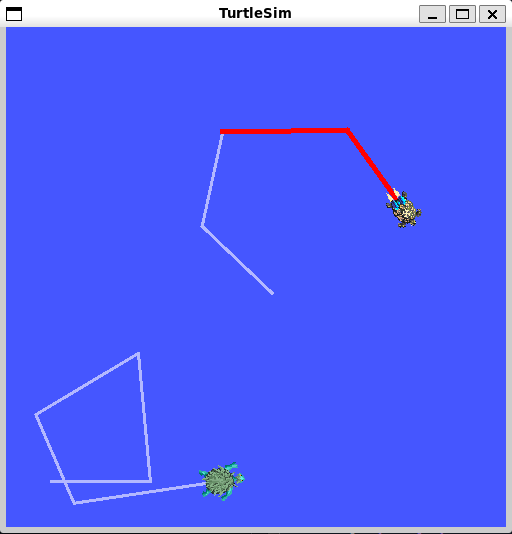

# Using `turtlesim`, `ros2`, and `rqt`



**Цель**: Установить и использовать пакет `turtlesim` и инструменты `rqt` для подготовки к предстоящим учебным занятиям.

Turtlesim – небольшой симулятор для изучения ROS 2. Он на самом простом уровне показывает возможности ROS 2, обучая идеям, которые лежат в основе создания реального робота и его симуляции.

Ros2 tool --  это средство управления ROS 2. Оно поддерживает множество команд, относящихся к разным аспектам системы и её работы. Можно использовать ros2 tool для создания узла, установки параметра и много другого. Ros2 tool устанавливается вместе с ROS 2.

Rqt – графический пользовательский интерфейс для ROS 2. Все, что можно сделать в rqt, можно выполнить также используя командную строку, но rqt предлагает более понятный пользователю интерфейс.

## 1 Установка `turtlesim`

Для установки `turtlesim` выполняется команда:

```shell
sudo apt update

sudo apt install ros-humble-turtlesim
```

Для проверки, установлен ли `turtlesim` можно выполнить команду:

```shell
ros2 pkg executables turtlesim
```

> Если `turtulesim` действительно установлен, эта комманда вернет список исполняемых файлов:
> ```shell
> turtlesim draw_square
> turtlesim mimic
> turtlesim turtle_teleop_key
> turtlesim turtlesim_node
> ```

## 2 Запуск `turtlesim`

Чтобы запустить `turtlesim`, необходимо ввести следующую команду:

```shell
ros2 run turtlesim turtlesim_node
```


В результате этого откроется окошко с черепахой в центре, а в консоли будет выведена информация о запуске и создании черепахи в некоторых координатах:

```shell
[INFO] [turtlesim]: Starting turtlesim with node name /turtlesim
[INFO] [turtlesim]: Spawning turtle [turtle1] at x=[5.544445], y=[5.544445], theta=[0.000000]
```

## 3 Использвание `turtlesim`

Открываем новый терминал и запускаем новый узел для контроля черепахи:

```shell
ros2 run turtlesim turtle_teleop_key
```

В этот момент у нас открыто 3 окна: 2 окна с запущенной оболочкой и одно – визуальное представление turtlesim с черепахой в центе.

Теперь можно управлять черепахой используя стрелки на клавиатуре. Черепаха будет перемещаться по экрану оставляя за собой след.

## 4 Установка `rqt`

На Linux, для установки `rqt` необходимо выполнить:

```shell
sudo apt update

sudo apt install '~nros-humble-rqt*'
```

Чтобы запустить rqt:

```shell
rqt
```

## 5 Использование rqt

При первом запуске rqt, окно будет пустым. Выберите `Plugins > Services > Service Caller` в меню rqt.



Чтобы убедиться что все сервисы узла `turtlesim` доступны необходимо нажать на кнопку «обновление» (синяя кнопка с круглой стрелкой), расположенную слева от выпадающего меню.
Далее необходимо нажать на выпадающее меню сервисов, чтобы увидеть все сервисы `turtlesim`. Затем нужно выбрать сервис `/spawn`.

### 5.1 Пробуем пользоваться сервисом `/spawn`

С помощью rqt вызовите сервис `/spawn`. `/spawn` создаст еще одну черепаху в окне `turtlesim`.

Давайте дадим новой черепашке имя, например: `turtle2`. Затем введем некоторые правильные координаты, например: `x = 1.0` и `y = 1.0`.



> Если вы попытаетесь создать новую черепаху с тем же именем, что и существующая, например, черепаха по умолчанию turtle1, вы получите сообщение об ошибке в терминале, в котором запущен turtlesim_node:

> ```shell
> [ERROR] [turtlesim]: A turtle named [turtle1] already exists
> ```

Чтобы создать вторую черепаху необходимо вызвать сервис. Это можно сделать нажав на кнопку `Call` в правом верхнем углу окна `rqt`.


При успешном вызове сервиса в окне `turtlesim` появляется новая черепаха (немного не такая, как прежняя), в указаных нами координатах.




Если снова обновить список сервисов в окне `rqt`, можно заметить новые сервисы, связанные с созданной черепахой, расположенные в подкатегории `/turtle2/…`, в дополнении к сервисам в категории `/turtle1/…`.

### 5.2 Пробуем пользоваться сервисом `/set_pen`

Используя сервис `/set_pen` можно дать черепахе уникальную ручку (инструмент рисующих хвост за черепахой, а как вы думали он появлялся раньше?). 



В параметрах `/set_pen` можно указать значения `r`, `g`, `b` для цвета ручки (заметьте что они имеют тип `uint8`, принимая при этом значения от 0 до 255), а также `width`, параметр устанавливающий толщину линии.

Например, чтобы заставить черепаху «рисовать» при движении красной линией, можно установить следующие параметры:

`r = 255, g = 0, b = 0, width = 5`.

При этом нужно не забыть вызвать настроенный нами сервис.

После этого можно вернуться в терминал с запущенным `turtle_teleop_key` и убедиться, что параметры успешно обновлены, а черепаха действительно оставляет красный след, пробуя управлять черепахой с клавиатуры.




Возможно вы также заметили, что пока никак нельзя управлять второй черепахой. Так происходит, потому что для неё пока не существует узла `teleop`.

## 6 Переназначение [узла teleop]

Для управления второй черепахой необходим новый узел `teleop`. Однако создав новый такой узел, пользуясь инструкцией выше, можно убедиться в том, что он также управляет первой черепахой. Для изменение его поведения необходимо переназначить топик `cmd_vel`.

Для этого в новом терминале нужно запустить следующую строчку:

```shell
ros2 run turtlesim turtle_teleop_key --ros-args --remap turtle1/cmd_vel:=turtle2/cmd_vel
```

Теперь мы можем перемещать вторую черепаху, когда активно окно нового терминала, и старую — когда активно окно терминала с запущенным ранее узлом `turtle_teleop_key`.



## 7 Закрываем `turtlesim`

Чтобы остановить симуляцию, можно нажать `ctrl + c` в терминале с `telesim` и `q` в терминалах с `turtle_teleop_key`.