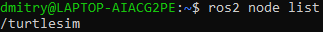
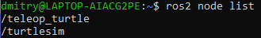
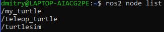
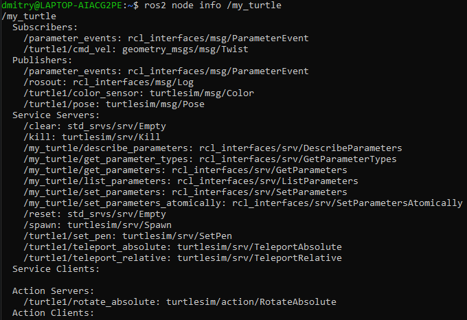
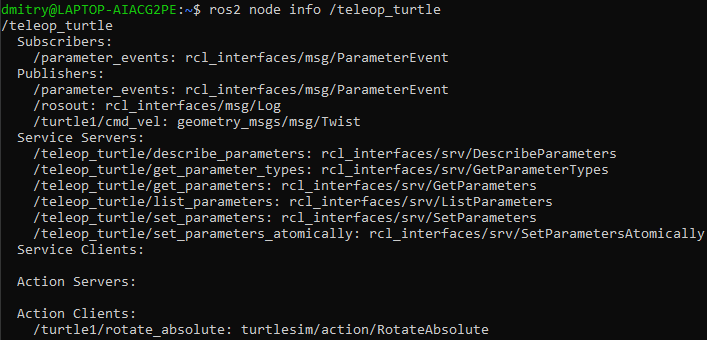

# Understanding nodes

> **Цель**: Узнать о функциях узлов в ROS 2 и инструментах для взаимодействия с ними.

# Общие сведения

## 1 Граф ROS 2

В следующих нескольких туториалах речь идет о нескольких ключевых концепциях ROS 2, которые вместе образуют то, что называется графом ROS (2).

Граф ROS – это сеть из элементов, вместе и одновременно обрабатывающих данные. Если вы попытаетесь представить его визуально, то это будет нечто, охватывающее все исполняемые файлы и все связи между ними.

## 2 Узлы в ROS 2

Каждый узел в ROS 2 должен быть ответственен за одну отдельную задачу, например, за управление двигателем в колесе или за отсылку данных, собранных с лазерного дальномера. Каждый узел может отправлять или получать данные при помощи топиков (topics), сервисов (services), действий (actions) или параметров (parameters).


Полная робо-система состоит из многих узлов, работающих одновременно. В ROS 2 один исполняемый файл может содержать как один так и больее одного узла.

# Упражнения

## 1 ros2 run

Команда `ros2 run` запускает исполняемый файл из пакета:

```shell
ros2 run <package_name> <executable_name>
```

Этой командой мы уже пользовались, когда запускали `turtlesim`.

В команде:

```shell
ros2 run turtlesim turtlesim_node
```

`turtlesim` – имя пакета, а `turtlesim_node` – имя исполняемого файла.

Однако мы все ещё не знаем названия узлов. Для этого используется команда `ros2 node list`

## 2 `ros2 node list`

`ros2 node list` перечисляет имена всех запущенных узлов. Это может быть особенно полезно, когда необходимо взаимодействовать с тем или иным узлом, или же при работе с робо-системой, содержащей множество различных узлов, в которой постоянно необходимо следить за их изменениями.

Попробуем ввести в терминал команду 

```shell
ros2 node list.
```

Терминал вернет нам имя узла:



(В данном случае `/turtlesim`, поскольку мы запускали `turtlesim`.)

Откроем новый терминал и запустим в нем исполняемый файл `turtle_teleop_key` из пакета `turtlesim`, а затем вернувший в терминал, где мы можем выполнять команды `ros2` снова выполним `ros2 bode list`. Теперь в нем можно увидеть следующее:



### 2.1 Переназначение

Переназначение позволяет переопределить свойства узлов, заданные по умолчанию, например, имя узла, имена топиков и сервисов и т.д. Ранее мы переназначали топик `cmd_vel` для переключения управления на вторую черепаху.

Теперь переопределим имя узла `/turtlesim`. Для этого выполним следующую команду:

```shell
ros2 run turtlesim turtlesim_node --ros-args --remap __node:=my_turtle
```

Поскольку мы вызываем run, откроется ещё одно окно `turtlesim`. Если после этого вернуться в терминал и посмотреть список активных узлов, можно увидеть уже три имени:



## 3. `ros2 node info`

Теперь, когда мы знаем названия узлов, можно также получить доступ к дополнительной информации о них:

```shell
ros2 node info <node_name>
```

Чтобы изучить узел `my_turtle`, выполним следующее:

```shell
ros2 node info /my_turtle
```

`Ros2 node info` возвращает список всех «издателей» и «подписчиков» узла, а также список всех доступных сервисов и действий (т.е. все связи этого узла в `Графе ROS`). Выведенная информация должна выглядеть как то так:



Запустив же эту команду для узла `/teleop_turtle`, можно увидеть следующее:

