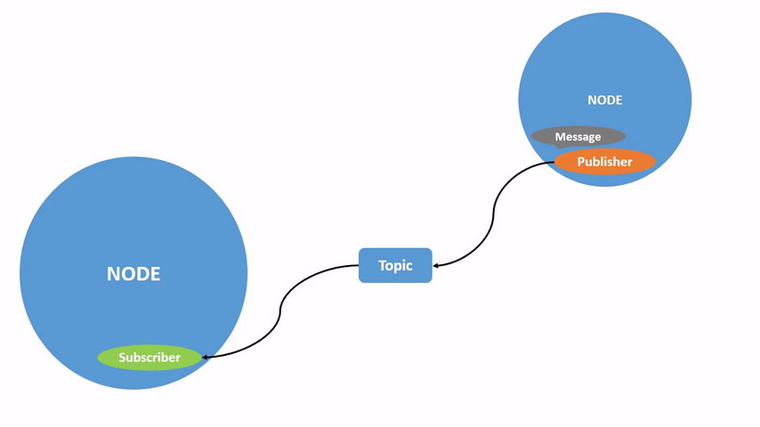

# Понимание топиков (topics)

**Цель**: Использовать `rqt_graph` и инструменты командной строки для изучения тем `ROS 2`.

# Общие сведения

ROS 2 разбивает сложные системы на множество модульных узлов. Топики - это важный элемент графа ROS, который служит шиной для обмена сообщениями между узлами.



Узел может публиковать данные в любом количестве топиков и одновременно иметь подписки на любое количество топиков.


Топики - это один из основных способов перемещения данных между узлами и, соответственно, между различными частями системы.

# Задачи

## 1 Настройка
К этому моменту вы уже должны быть в состоянии запустить turtlesim)

Откройте новый терминал и выполните команду:

```shell
ros2 run turtlesim turtlesim_node
```

Откройте другой терминал и выполните команду:

```shell
ros2 run turtlesim turtle_teleop_key
```

Вспомните из предыдущего урока, что по умолчанию имена этих узлов - `/turtlesim` и `/teleop_turtle`.

## 2 rqt_graph

На протяжении всего этого урока мы будем использовать `rqt_graph` для визуализации изменяющихся узлов и тем, а также связей между ними.

Чтобы запустить `rqt_graph`, откройте новый терминал и введите команду:

```shell
rqt_graph
```

Вы также можете открыть `rqt_graph`, открыв `rqt` и выбрав `Plugins > Introspection > Node Graph`.


Вы должны увидеть указанные выше узлы и топик, а также два действия по центре графа (пока не будем обращать на них внимания). Если вы наведете курсор на топик слева, то увидите выделение цветом, как на изображении выше.

На графике показано, как узел /turtlesim и узел /teleop_turtle общаются друг с другом по топику. Узел /teleop_turtle публикует данные (нажатия клавиш, которые вы вводите для перемещения черепахи) в топик /turtle1/cmd_vel, а узел /turtlesim подписан на этот топик, чтобы получать данные.

Функция выделения в rqt_graph очень полезна при изучении сложных систем с большим количеством узлов и топиков, связанных между собой различными способами.

rqt_graph - это графический инструмент интроспекции. Теперь мы рассмотрим некоторые инструменты командной строки для интроспекции топиков.

## 3 ros2 topic list

Выполнив команду `ros2 topic list` в новом терминале, вы получите список всех топиков, активных в данный момент в системе:


`ros2 topic list -t` вернет тот же список топиков, на этот раз с указанием типа топика в скобках:


Благодаря этим атрибутам, в частности типу, узлы знают, что они говорят об одной и той же информации, когда она перемещается по топикам.

Если вам интересно, где находятся все эти топики в rqt_graph, вы можете снять все флажки в разделе **Hide**:


Однако пока оставьте эти опции отмеченными, чтобы избежать путаницы.

## 4 ros2 topic echo

Чтобы просмотреть данные, опубликованные по тому или иному топику, используйте:

```shell
ros2 topic echo <topic_name>
```

Поскольку мы знаем, что `/teleop_turtle` публикует данные в `/turtlesim` через топик `/turtle1/cmd_vel`, давайте воспользуемся `echo`, чтобы исследовать этот топик:

```shell
ros2 topic echo /turtle1/cmd_vel
```

Сначала эта команда не вернет никаких данных. Это потому, что она ждет, пока `/teleop_turtle` что-нибудь опубликует.

Вернитесь в терминал, где запущена команда `turtle_teleop_key`, и используйте стрелки, чтобы перемещать черепашку. Следите за терминалом, где одновременно запущен ваш echo, и вы увидите, что данные о положении публикуются для каждого вашего движения:


Теперь вернитесь в `rqt_graph` и снимите флажок `Debug`.


`/_ros2cli_1576` - это узел, созданный командой `echo`, которую мы только что выполнили (номер может быть другим). Теперь вы видите, что издатель публикует данные по топику `cmd_vel`, и на него подписаны два подписчика.

## 5 ros2 topic info

Топики не обязательно должны быть связаны только с общением один на один; они могут быть один на один, много на один или много на много.

Другой способ взглянуть на это - выполнить следующую команду:

```shell
ros2 topic info /turtle1/cmd_vel
```

Которая вернет:


## 6 ros2 interface show

Узлы отправляют данные по топикам с помощью сообщений. Издатели и подписчики должны отправлять и получать сообщения одного и того же типа, чтобы общаться.

Типы топиков, которые мы видели ранее после выполнения команды `ros2 topic list -t`, позволяют нам узнать, какой тип сообщения используется в каждом топике. Вспомним, что топик `cmd_vel` имеет тип:

```shell
geometry_msgs/msg/Twist
```

Это означает, что в пакете `geometry_msgs` есть `msg` под названием `Twist`.

Теперь мы можем выполнить команду `ros2 interface show <msg_type>` для этого типа, чтобы узнать его детали. В частности, какую структуру данных ожидает сообщение.

```shell
ros2 interface show geometry_msgs/msg/Twist
```

Для типа сообщения, приведенного выше, это дает:


Это говорит о том, что узел `/turtlesim` ожидает сообщение с двумя векторами, линейным и угловым, по три элемента в каждом. Если вы вспомните данные, которые, как мы видели, `/teleop_turtle` передавал узлу `/turtlesim` с помощью команды `echo`, то они имеют ту же структуру:


## 7 ros2 topic pub

Теперь, когда у вас есть структура сообщений, вы можете публиковать данные в топик прямо из командной строки:

```shell
ros2 topic pub <topic_name> <msg_type> '<args>'
```

Аргумент `'<args>'' - это фактические данные, которые вы передадите топику, в структуре, которую вы только что обнаружили в предыдущем разделе.

Для непрерывной работы черепашке (как и настоящим роботам, которых она призвана имитировать) требуется постоянный поток команд. Чтобы заставить черепаху двигаться и поддерживать ее в движении, вы можете использовать следующую команду. Важно отметить, что этот аргумент должен быть введен в синтаксисе YAML. Введите полную команду следующим образом:

```
ros2 topic pub /turtle1/cmd_vel geometry_msgs/msg/Twist "{linear: {x: 2.0, y: 0.0, z: 0.0}, angular: {x: 0.0, y: 0.0, z: 1.8}}"
```

Без параметров командной строки `ros2 topic pub` публикует команду непрерывным потоком с частотой 1 Гц.


Иногда вы можете захотеть опубликовать данные в топике только один раз (а не постоянно). Чтобы опубликовать команду только один раз, добавьте опцию `--once`.

```shell
ros2 topic pub --once -w 2 /turtle1/cmd_vel geometry_msgs/msg/Twist "{linear: {x: 2.0, y: 0.0, z: 0.0}, angular: {x: 0.0, y: 0.0, z: 1.8}}"
```

`--once` - необязательный аргумент, означающий «опубликовать одно сообщение и выйти».

`-w 2` - необязательный аргумент, означающий «ждать двух подходящих подписок». Это необходимо, поскольку на нас подписаны и черепаха `turtlesim`, и топик `echo`.

В терминале вы увидите следующий вывод:

```shell
Waiting for at least 2 matching subscription(s)...
publisher: beginning loop
publishing #1: geometry_msgs.msg.Twist(linear=geometry_msgs.msg.Vector3(x=2.0, y=0.0, z=0.0), angular=geometry_msgs.msg.Vector3(x=0.0, y=0.0, z=1.8))
```

И вы увидите, как ваша черепашка будет двигаться так:


Вы можете обновить rqt_graph, чтобы увидеть происходящее в графическом виде. Вы увидите, что узел `ros2 topic pub ...` (`/_ros2cli_30358`) публикует топик `/turtle1/cmd_vel`, который сейчас получают и узел `ros2 topic echo ...` (`/_ros2cli_26646`), и узел `/turtlesim`.


Наконец, вы можете запустить `echo` на топике `pose` и перепроверить rqt_graph:

```shell
ros2 topic echo /turtle1/pose
```


Вы видите, что узел `/turtlesim` также публикует сообщения в топик `pose`, на который подписан новый узел `echo`.

При публикации сообщений с временными метками у `pub` есть два метода для автоматического заполнения их текущим временем. Для сообщений с `std_msgs/msg/Header`, поле заголовка может быть установлено в `auto` для заполнения поля `stamp`.

```shell
ros2 topic pub /pose geometry_msgs/msg/PoseStamped '{header: "auto", pose: {position: {x: 1.0, y: 2.0, z: 3.0}}}'
```

Если сообщение не использует полный заголовок, а содержит только поле с типом `builtin_interfaces/msg/Time`, ему может быть присвоено значение `now`.

```shell
ros2 topic pub /reference sensor_msgs/msg/TimeReference '{header: "auto", time_ref: "now", source: "dumy"}'
```

## 8 ros2 topic hz

Вы также можете просмотреть скорость публикации данных:

```shell
ros2 topic hz /turtle1/pose
```

Он возвращает данные о скорости, с которой узел `/turtlesim` публикует данные в топик `pose`.


## 9 ros2 topic bw

Пропускную способность, используемую топиком, можно просмотреть с помощью:

```shell
ros2 topic bw /turtle1/pose
```

Он возвращает данные об использовании полосы пропускания и количестве сообщений, публикуемых в топике `/turtle1/pose`.


## 10 ros2 topic find

Чтобы вывести список доступных топиков определенного типа, используйте:

```shell
ros2 topic find <topic_type>
```

Напомним, что топик `cmd_vel` имеет тип:

```shell
geometry_msgs/msg/Twist
```

Команда `find` выводит топики, доступные при задании типа сообщения:

```shell
ros2 topic find geometry_msgs/msg/Twist
```

Что выведет:

