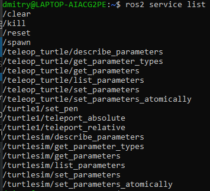
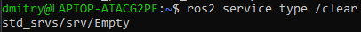
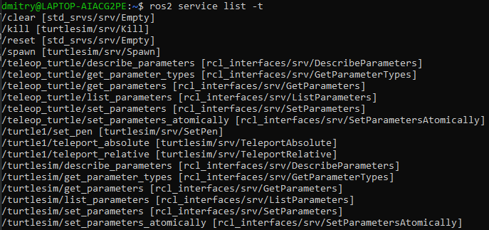
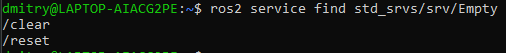
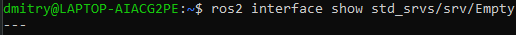
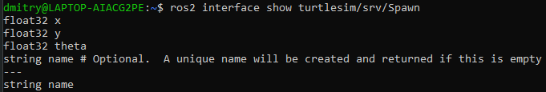
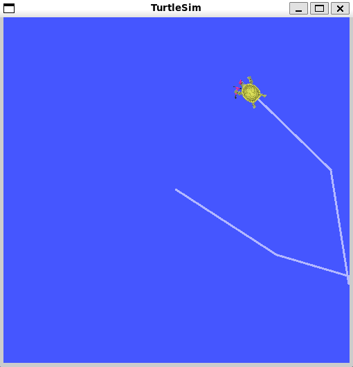
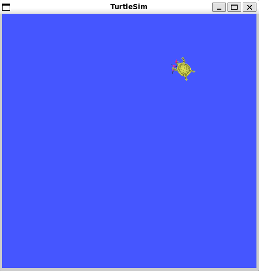
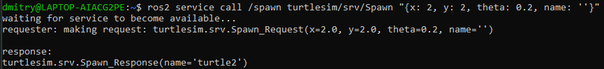
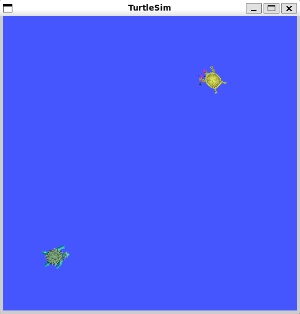

# Понимание сервисов

**Цель**: Узнать о сервисах в ROS 2 с помощью инструментов командной строки.

# Общие сведения

Сервисы - это еще один способ взаимодействия узлов в графе ROS. Сервисы основаны на модели «вызов-ответ», в отличие от модели «издатель-подписчик» в топиках. В то время как топики позволяют узлам подписываться на потоки данных и получать постоянные обновления, сервисы предоставляют данные только тогда, когда их специально вызывает клиент.


# Tasks

## 1 Setup

Запустите два узла `turtlesim`, `/turtlesim` и /`teleop_turtle`.

Откройте новый терминал и выполните команду:

```shell
ros2 run turtlesim turtlesim_node
```

Откройте другой терминал и выполните команду:

```shell
ros2 run turtlesim turtle_teleop_key
```

## 2 `ros2 service list`

Выполнив команду `ros2 service list` в новом терминале, вы получите список всех служб, активных в данный момент в системе:



Вы увидите, что на обоих узлах есть шесть одинаковых сервисов с `параметрами` в названиях. Почти каждый узел в ROS 2 имеет эти инфраструктурные сервисы, на основе которых строятся параметры. Подробнее о параметрах будет рассказано в следующем уроке. В этом учебнике сервисы параметров будут опущены из обсуждения.

Пока что давайте сосредоточимся на сервисах, специфичных для черепах: `/clear`, `/kill`, `/reset`, `/spawn`, `/turtle1/set_pen`, `/turtle1/teleport_absolute` и `/turtle1/teleport_relative`. 

## 3 `ros2 service type`

У сервисов есть типы, которые описывают, как структурированы данные запроса и ответа сервиса. Типы сервисов определяются аналогично типам топиков, за исключением того, что типы сервисов состоят из двух частей: одно сообщение для запроса, другое - для ответа.

Чтобы узнать тип службы, используйте команду:

```shell
ros2 service type <service_name>
```

Давайте посмотрим на службу `/clear` в turtlesim. В новом терминале введите команду:

```shell
ros2 service type /clear
```

Которая должна вернуть:



Тип `Empty` означает, что вызов сервиса не отправляет никаких данных при запросе и не получает никаких данных при получении ответа.

### 3.1 `ros2 service list -t`

Чтобы увидеть типы всех активных служб одновременно, вы можете добавить опцию `--show-types`, сокращенно `-t`, к команде `list`:

```shell
ros2 service list -t
```

Данная команда вернет:


## 4 `ros2 service find`

Если вы хотите найти все службы определенного типа, можно воспользоваться командой:

```shell
ros2 service find <type_name>
```

Например, вы можете найти все сервисы с типом `Empty` следующим образом:

```shell
ros2 service find std_srvs/srv/Empty
```



## 5 `ros2 interface show`

Вы можете вызывать службы из командной строки, но сначала вам нужно узнать структуру входных аргументов.

```shell
ros2 interface show <type_name>
```

Попробуйте сделать это на типе службы `/clear`, `Empty`:

```shell
ros2 interface show std_srvs/srv/Empty
```



Символ `---` отделяет структуру запроса (вверху) от структуры ответа (внизу). Но, как вы узнали ранее, тип `Empty` не отправляет и не получает никаких данных. Поэтому, естественно, его структура пуста.

Давайте проанализируем сервис с типом, который отправляет и получает данные, например `/spawn`. Из результатов `ros2 service list -t` мы знаем, что тип `/spawn` - `turtlesim/srv/Spawn`.

Чтобы увидеть аргументы запроса и ответа службы `/spawn`, выполните команду:

```shell
ros2 interface show turtlesim/srv/Spawn
```



Информация над строкой `---` говорит нам об аргументах, необходимых для вызова `/spawn`. `x`, `y` и `theta` определяют двумерную позу создаваемой черепахи, а `name` явно необязателен.

Информация под строкой - это не то, что вам нужно знать в данном случае, но она может помочь вам понять тип данных в ответе, который вы получите в результате вызова.

## 6 `ros2 service call`

Теперь, когда вы знаете, что такое тип сервиса, как найти тип сервиса и как найти структуру аргументов этого типа, вы можете вызывать сервис с помощью:

```shell
ros2 service call <service_name> <service_type> <arguments>
```

Часть `<arguments>` является необязательной. Например, вы знаете, что у типизированных сервисов `Empty` нет аргументов:

```shell
ros2 service call /clear std_srvs/srv/Empty
```

Эта команда очистит окно turtlesim от всех линий, которые нарисовала ваша черепаха.




Теперь давайте породим новую черепаху, вызвав `/spawn` и задав аргументы. Ввод `<arguments>` при вызове сервиса из командной строки должен быть в синтаксисе YAML.

Введите команду:

```shell
ros2 service call /spawn turtlesim/srv/Spawn "{x: 2, y: 2, theta: 0.2, name: ''}"
```

Вы получите представление о происходящем в стиле метода, а затем ответ службы:



Ваше окно turtlesim сразу же обновится с новой черепахой:

