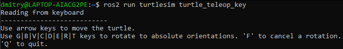
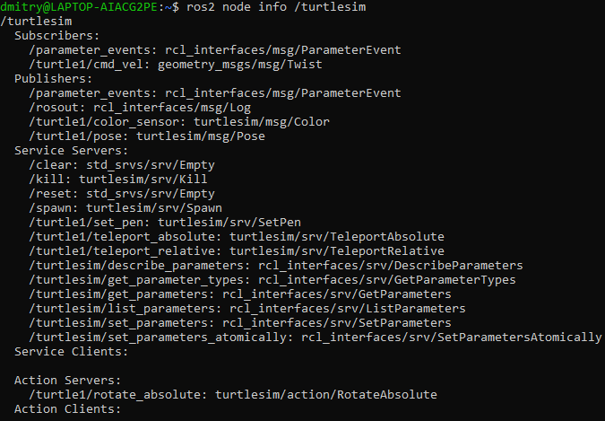
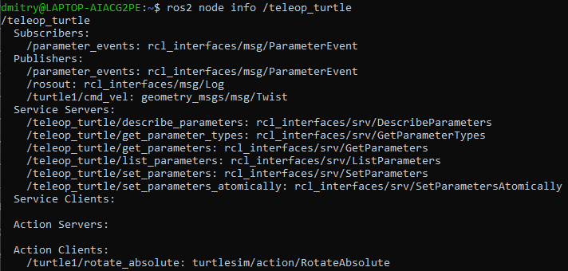
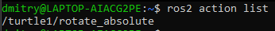
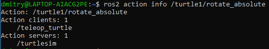
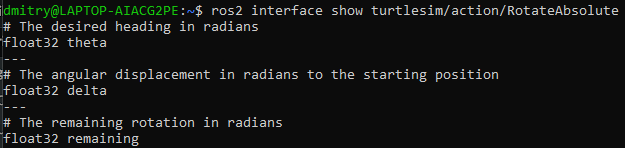
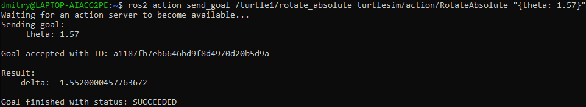

# Understanding actions

**Цель**: Интроспективные действия в ROS 2.

# Общие сведения

Действия - это один из типов взаимодействия в ROS 2, который предназначен для выполнения длительных задач. Они состоят из трех частей: цели, обратной связи и результата. 

Действия строятся на основе топиков и сервисов. Их функциональность аналогична сервисам, за исключением того, что действия можно отменить. Они также обеспечивают постоянную обратную связь, в отличие от сервисов, которые возвращают один ответ. 

Действия используют модель клиент-сервер, аналогичную модели издатель-подписчик. Узел «клиент действия» отправляет цель узлу «сервер действия», который подтверждает цель и возвращает поток обратной связи и результат.


# Задачи

## 1. Setup

Запустите два узла turtlesim, `/turtlesim` и `/teleop_turtle`.

Откройте новый терминал и выполните команду:

```shell
ros2 run turtlesim turtlesim_node
```

Откройте другой терминал и выполните команду:

```shell
ros2 run turtlesim turtle_teleop_key
```

## 2. Используйте действия

При запуске узла `/teleop_turtle` вы увидите в терминале следующее сообщение:



Давайте сосредоточимся на второй строке, которая соответствует действию.

Обратите внимание, что буквенные клавиши `G|B|V|C|D|E|R|T` образуют "коробку" вокруг клавиши `F` на американской QWERTY-клавиатуре. Положение каждой клавиши вокруг `F` соответствует ее ориентации в turtlesim.

Обратите внимание на терминал, где запущен узел `/turtlesim`. Каждый раз, когда вы нажимаете одну из этих клавиш, вы отправляете цель на сервер действий, который является частью узла `/turtlesim`. Цель состоит в том, чтобы повернуть черепаху лицом в определенном направлении. Как только черепаха завершит вращение, на экране появится сообщение, сообщающее о результате выполнения цели:

```shell
[INFO] [turtlesim]: Rotation goal completed successfully
```

Клавиша `F` отменяет цель в середине ее выполнения.

Попробуйте нажать клавишу `C`, а затем нажать клавишу `F`, прежде чем черепаха успеет завершить вращение. В терминале, где запущен узел `/turtlesim`, вы увидите сообщение:

```
[INFO] [turtlesim]: Rotation goal canceled
```

Остановить цель может не только сторона клиента (ввод в `teleop`), но и сторона сервера (узел `/turtlesim`). Когда сторона сервера решает остановить обработку цели, говорят, что цель "прервана".

Попробуйте нажать клавишу `D`, а затем клавишу `G` до того, как завершится первое вращение. В терминале, где запущен узел `/turtlesim`, вы увидите сообщение:

```
[WARN] [turtlesim]: Rotation goal received before a previous goal finished. Aborting previous goal
```

Этот действующий сервер решил прервать выполнение первой цели, потому что получил новую. Он мог бы выбрать что-то другое, например отклонить новую цель или выполнить вторую цель после завершения первой. Не думайте, что каждый сервер действий решит прервать текущую цель, когда получит новую.

## 3. `ros2 node info`

Чтобы увидеть список действий, которые предоставляет узел, в данном случае `/turtlesim`, откройте новый терминал и выполните команду:

```shell
ros2 node info /turtlesim
```

Который вернет список подписчиков, издателей, сервисов, серверов действий и клиентов действий `/turtlesim`:



Обратите внимание, что действие `/turtle1/rotate_absolute` для `/turtlesim` находится в разделе `Action Servers`. Это означает, что `/turtlesim` реагирует на действие `/turtle1/rotate_absolute` и обеспечивает обратную связь.

Узел `/teleop_turtle` имеет имя `/turtle1/rotate_absolute` в разделе `Action Clients`, что означает, что он посылает цели для этого имени действия. Чтобы увидеть это, выполните команду:

```shell
ros2 node info /teleop_turtle
```



## 4. `ros2 action list`

Чтобы определить все действия в графе ROS, выполните команду:

```shell
ros2 action list
```



Это единственное действие в графике ROS на данный момент. Оно управляет вращением черепахи, как вы видели ранее. Вы также уже знаете, что существует один клиент действия (часть `/teleop_turtle`) и один сервер действия (часть `/turtlesim`) для этого действия из команды `ros2 node info <node_name>`.

## 4.1. `ros2 action list -t`

У действий есть типы, как у тем и услуг. Чтобы найти тип действия `/turtle1/rotate_absolute`, выполните команду:

```shell
ros2 action list -t
```


В скобках справа от имени каждого действия (в данном случае только `/turtle1/rotate_absolute`) указан тип действия, `turtlesim/action/RotateAbsolute`.

## 5. `ros2 action info`

Вы можете дополнительно проанализировать действие `/turtle1/rotate_absolute` с помощью команды:

```shell
ros2 action info /turtle1/rotate_absolute
```



Это говорит нам о том, что мы узнали ранее, запустив `ros2 node info` на каждом узле: Узел `/teleop_turtle` имеет клиент действия, а узел `/turtlesim` имеет сервер действия для действия `/turtle1/rotate_absolute`.

## 6. `ros2 interface show`

Еще одна информация, которая вам понадобится перед отправкой или выполнением цели действия - это структура типа действия.

```shell
ros2 interface show turtlesim/action/RotateAbsolute
```

Which will return:



Раздел этого сообщения над первым `---` - это структура (тип данных и имя) запроса цели. Следующий раздел - это структура результата. Последняя секция - структура обратной связи.

## 7. `ros2 action send_goal`

Теперь давайте отправим цель действия из командной строки со следующим синтаксисом:

```shell
ros2 action send_goal <action_name> <action_type> <values>
```

`<values>` должны быть в формате YAML.

Следите за окном turtlesim и введите в терминале следующую команду:

```shell
ros2 action send_goal /turtle1/rotate_absolute turtlesim/action/RotateAbsolute "{theta: 1.57}"
```

Вы должны увидеть вращение черепахи, а также следующее сообщение в терминале:



Все цели имеют уникальный идентификатор, который отображается в ответном сообщении. Вы также можете увидеть результат - поле с именем `delta`, которое представляет собой смещение к начальной позиции.

Чтобы увидеть обратную связь по этой цели, добавьте `--feedback` к команде `ros2 action send_goal`:

```shell
ros2 action send_goal /turtle1/rotate_absolute turtlesim/action/RotateAbsolute "{theta: -1.57}" --feedback
```

Your terminal will return the message:

```
Sending goal:
     theta: -1.57

Goal accepted with ID: 94822f76d49f496d8854d0dfe6de8c87

Feedback:
    remaining: -3.122000217437744

Feedback:
    remaining: -3.1059999465942383

…

Result:
    delta: 3.1040000915527344

Goal finished with status: SUCCEEDED
```


# Резюме

Действия похожи на сервисы, которые позволяют выполнять длительные задачи, обеспечивают регулярную обратную связь и могут быть отменены.

Роботизированная система, скорее всего, будет использовать действия для навигации. Цель действия может предписывать роботу отправиться в определенное место. Пока робот добирается до места, он может отправлять обновления по пути (т. е. обратную связь), а затем сообщение о конечном результате, когда он достигнет места назначения.

В Turtlesim есть сервер действий, на который клиенты действий могут отправлять цели для вращения черепашек. В этом уроке вы проанализировали действие `/turtle1/rotate_absolute`, чтобы лучше понять, что такое действия и как они работают.