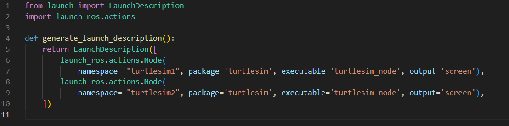
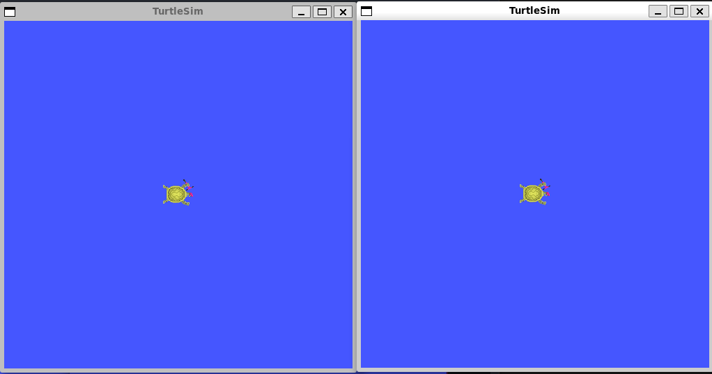
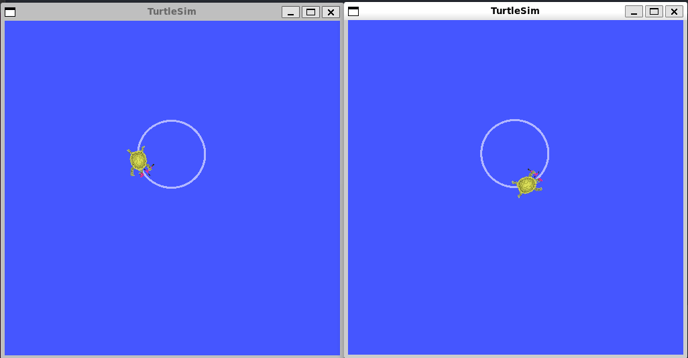

# Launching nodes

**Цель**: Использовать инструмент командной строки для одновременного запуска нескольких узлов

# Общие сведения

В большинстве вводных уроков мы открывали новые терминалы для каждого нового запущенного узла. По мере создания более сложных систем с большим количеством одновременно работающих узлов открытие терминалов и повторный ввод конфигурационных данных становится утомительным.

Файлы запуска позволяют одновременно запускать и настраивать несколько исполняемых файлов, содержащих узлы ROS 2.

Запуск одного файла запуска с помощью команды `ros2 launch` запустит всю вашу систему - все узлы и их конфигурации - одновременно.

# Задачи

## 1. Запуск файла запуска

Откройте новый терминал и выполните команду:

```shell
ros2 launch turtlesim multisim.launch.py
```

Эта команда запустит следующий файл запуска:



Это позволит запустить два узла turtlesim:



## 2. Управление узлами Turtlesim

Теперь, когда эти узлы запущены, вы можете управлять ими, как и любыми другими узлами ROS 2. Например, вы можете заставить черепашек двигаться в противоположных направлениях, открыв два дополнительных терминала и выполнив следующие команды:

Во втором терминале:

```shell
ros2 topic pub  /turtlesim1/turtle1/cmd_vel geometry_msgs/msg/Twist "{linear: {x: 2.0, y: 0.0, z: 0.0}, angular: {x: 0.0, y: 0.0, z: 1.8}}"
```

В третьем терминале:

```shell
ros2 topic pub  /turtlesim2/turtle1/cmd_vel geometry_msgs/msg/Twist "{linear: {x: 2.0, y: 0.0, z: 0.0}, angular: {x: 0.0, y: 0.0, z: -1.8}}"
```

После выполнения этих команд вы должны увидеть что-то вроде следующего:



# Резюме

Важность того, что вы сделали до сих пор, заключается в том, что вы запустили два узла turtlesim с помощью одной команды. Когда вы научитесь писать собственные файлы запуска, вы сможете запускать несколько узлов - и настраивать их конфигурацию - аналогичным образом, с помощью команды `ros2 launch`.
