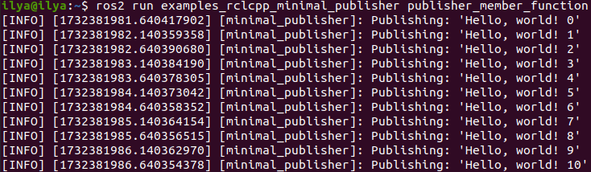
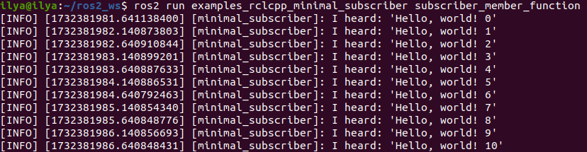

# Использование `colcon` для сборки пакетов

`colcon` - это итерация инструментов сборки ROS `catkin_make`, `catkin_make_isolated`, `catkin_tools` и `ament_tools`.

## Установка colcon

```bash
sudo apt install python3-colcon-common-extensions
```
## Основы

Рабочее пространство ROS - это каталог с определенной структурой. Обычно в ней есть подкаталог `src. Внутри этого подкаталога находится исходный код пакетов ROS. Как правило, каталог начинается с пустого места.

`colcon` выполняет сборку из исходных текстов. По умолчанию он создаст следующие каталоги в качестве аналогов каталога `rc`:

- В директории `build` будут храниться промежуточные файлы. Для каждого пакета будет создана подпапка, в которой, например, будет вызываться CMake.
- Каталог `install` - это место, куда будет устанавливаться каждый пакет. По умолчанию каждый пакет будет установлен в отдельный подкаталог.
- Каталог `log` содержит различную журнальную информацию о каждом вызове colcon.

### Создание рабочего пространства

Сначала создайте каталог (`ros2_ws`), в котором будет находиться наше рабочее пространство:

```bash
mkdir -p ~/ros2_ws/src
cd ~/ros2_ws
```
На данный момент рабочая область содержит единственный пустой каталог `src`:

```bash
.
└── src

1 directory, 0 files
```

### Добавление исходников

Давайте клонируем репозиторий примеров в каталог `src` рабочего пространства:

```bash
git clone https://github.com/ros2/examples src/examples -b humble
```
Теперь в рабочей области должен быть исходный код примеров ROS 2:

```bash
.
└── src
    └── examples
        ├── CONTRIBUTING.md
        ├── LICENSE
        ├── rclcpp
        ├── rclpy
        └── README.md

4 directories, 3 files
```

### Сборка рабочего пространства

В корне рабочей области запустите `colcon build`. Поскольку такие типы сборки, как `ament_cmake`, не поддерживают концепцию пространства `devel` и требуют установки пакета, colcon поддерживает опцию `--symlink-install`. Это позволяет изменять установленные файлы, изменяя файлы в пространстве `source (например, файлы Python или другие некомпилируемые ресурсы) для ускорения итерации.

```bash
colcon build --symlink-install
```

После завершения сборки мы должны увидеть директории `build`, `install` и `log`:

```bash
.
├── build
├── install
├── log
└── src

4 directories, 0 files
```

### Запуск тестов

Чтобы запустить тесты для пакетов, которые мы только что собрали, выполните следующие действия:

```bash
colcon test
```

### Источник окружения

Когда colcon успешно завершит сборку, результат будет находиться в директории `install`. Прежде чем вы сможете использовать установленные исполняемые файлы или библиотеки, вам нужно будет добавить их в пути и библиотеки. colcon создаст bash/bat файлы в директории `install`, чтобы помочь настроить окружение. Эти файлы добавят все необходимые элементы в ваши пути и библиотеки, а также предоставят любые команды bash или shell, экспортируемые пакетами.

```bash
source install/setup.bash
```

### Проверка работы

С созданным окружением мы можем запускать исполняемые файлы, собранные colcon. Давайте запустим узел подписчика из примеров:

```bash
ros2 run examples_rclcpp_minimal_subscriber subscriber_member_function
```

В другом терминале запустим узел-издатель (не забудьте указать исходный текст сценария настройки):

```bash
ros2 run examples_rclcpp_minimal_publisher publisher_member_function
```

Вы должны увидеть сообщения от издателя и подписчика с увеличивающимися цифрами.





## Настройка `colcon_cd`

Команда `colcon_cd` позволяет быстро сменить текущий рабочий каталог оболочки на каталог пакета. Например, команда `colcon_cd some_ros_package` быстро приведет вас в каталог `~/ros2_ws/src/some_ros_package`.

```bash
echo "source /usr/share/colcon_cd/function/colcon_cd.sh" >> ~/.bashrc
echo "export _colcon_cd_root=/opt/ros/humble/" >> ~/.bashrc
```
