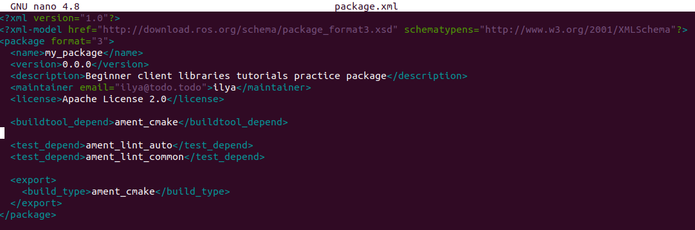

# Создание пакета

## Справочная информация

### 1. Что такое пакет ROS 2?

Пакет - это организационная единица для вашего кода ROS 2. Если вы хотите, чтобы ваш код можно было установить или поделиться им с другими, то вам нужно организовать его в виде пакета. С помощью пакетов вы можете выпустить свою работу над ROS 2 и позволить другим легко собирать и использовать ее.

Для создания пакетов в ROS 2 используется система сборки ament, а в качестве инструмента сборки - colcon. Вы можете создать пакет, используя CMake или Python, которые официально поддерживаются, хотя существуют и другие типы сборки.

### 2. Что входит в состав пакета ROS 2?

Пакеты ROS 2 Python и CMake имеют свой минимально необходимый состав:

- `CMakeLists.txt` файл, описывающий, как собрать код в пакете
- `include/<package_name>` каталог, содержащий публичные заголовки для пакета
- `package.xml` файл, содержащий метаинформацию о пакете
- `src` каталог, содержащий исходный код пакета

Простейший пакет может иметь файловую структуру, которая выглядит следующим образом:

```bash
my_package/
     CMakeLists.txt
     include/my_package/
     package.xml
     src/
```

### 3. Пакеты в рабочем пространстве

Одно рабочее пространство может содержать столько пакетов, сколько вы хотите, каждый в своей папке. Также в одном рабочем пространстве могут находиться пакеты разных типов сборки (CMake, Python и т. д.). Нельзя иметь вложенные пакеты.

Лучше всего иметь папку src в рабочей области и создавать пакеты в ней. Это позволяет сохранить верхний уровень рабочего пространства «чистым».

Тривиальное рабочее пространство может выглядеть следующим образом:

```bash
workspace_folder/
    src/
      cpp_package_1/
          CMakeLists.txt
          include/cpp_package_1/
          package.xml
          src/

      py_package_1/
          package.xml
          resource/py_package_1
          setup.cfg
          setup.py
          py_package_1/
      ...
      cpp_package_n/
          CMakeLists.txt
          include/cpp_package_n/
          package.xml
          src/
```

## Задания

### 1. Создание пакета

Мы будем использовать рабочую область, созданную в предыдущем уроке, `ros2_ws`, для создания нового пакета.

Сначала давайте перейдем в папку src. Для этого введите команду:
```bash
cd ~/ros2_ws/src
```

Теперь создадим наш первый пакет. Синтаксис команды для создания нового пакета в ROS 2 следующий:
```bash
ros2 pkg create --build-type ament_cmake --license Apache-2.0 <package_name>
```

В этом уроке мы используем дополнительный аргумент `--node-name`, который создаст для нас простой исполняемый файл типа Hello World. Введите следующую команду:
```bash
ros2 pkg create --build-type ament_cmake --license Apache-2.0 --node-name my_node my_package
```
Теперь в каталоге `src` вашего рабочего пространства появится новая папка под названием `my_package`.

После выполнения команды в терминале появится следующее сообщение:
```bash
going to create a new package
package name: my_package
destination directory: /home/user/ros2_ws/src
package format: 3
version: 0.0.0
description: TODO: Package description
maintainer: ['<name> <email>']
licenses: ['TODO: License declaration']
build type: ament_cmake
dependencies: []
node_name: my_node
creating folder ./my_package
creating ./my_package/package.xml
creating source and include folder
creating folder ./my_package/src
creating folder ./my_package/include/my_package
creating ./my_package/CMakeLists.txt
creating ./my_package/src/my_node.cpp
```


Вы можете увидеть автоматически сгенерированные файлы для нового пакета.

### 2. Сборка пакета

Размещение пакетов в рабочем пространстве особенно ценно тем, что вы можете собирать много пакетов одновременно, выполнив команду `colcon build` в корне рабочего пространства. В противном случае вам пришлось бы собирать каждый пакет по отдельности.

Давайте вернемся в корень рабочей области. Для этого введите:
```bash
cd ~/ros2_ws
```

Теперь соберем наши пакеты следующей командой:
```bash
colcon build
```

После выполнения команды мы увидим, что собрался не только наш пакет, но и пакет `turtlesim` из `ros_tutorials`, который мы добавили ранее. Когда в рабочем пространстве много пакетов, такая полная сборка может занять много времени.

Чтобы в следующий раз собрать только пакет `my_package`, нужно выполнить команду:

```bash
colcon build --packages-select my_package
```


### 3. Источник установочного файла

Чтобы использовать новый пакет и исполняемый файл, сначала откройте новый терминал и создайте исходный код вашей основной установки ROS 2.

Затем, находясь в директории `ros2_ws`, выполните следующую команду, чтобы создать исходное рабочее пространство:

```bash
source install/local_setup.bash
```

После выполнения этой команды наше рабочее пространство добавлено в путь, и мы можем использовать созданный пакет.

### 4. Использование пакета

Чтобы запустить наш узел, который мы создали с помощью аргумента `--node-name`, следует выполнить команду:
```bash
ros2 run my_package my_node
```

В терминале появится сообщение:
```bash
hello world my_package package
```


### 5. Изучение содержимого пакета

Давайте посмотрим, что находится в нашем новом пакете. Если мы заглянем в директорию `ros2_ws/src/my_package`, то увидим следующие файлы и папки:
```bash
CMakeLists.txt  include  package.xml  src
```

Возможно, вы заметили в ответном сообщении после создания пакета, что поля `description` и `license` содержат пометки `TODO`. Это потому, что описание пакета и декларация лицензии не устанавливаются автоматически, но необходимы, если вы хотите выпустить свой пакет. Поле `maintainer` также может потребоваться заполнить.

### 6. Настройка файла package.xml

Теперь давайте настроим метаданные нашего пакета. Откройте файл `package.xml` в текстовом редакторе. Вы увидите следующее содержимое:

```xml
<?xml version="1.0"?>
<?xml-model
   href="http://download.ros.org/schema/package_format3.xsd"
   schematypens="http://www.w3.org/2001/XMLSchema"?>
<package format="3">
 <name>my_package</name>
 <version>0.0.0</version>
 <description>TODO: Package description</description>
 <maintainer email="user@todo.todo">user</maintainer>
 <license>TODO: License declaration</license>

 <buildtool_depend>ament_cmake</buildtool_depend>

 <test_depend>ament_lint_auto</test_depend>
 <test_depend>ament_lint_common</test_depend>

 <export>
   <build_type>ament_cmake</build_type>
 </export>
</package>
```

Введите своё имя и электронную почту в строку сопровождающего, если она не была заполнена автоматически. Затем отредактируйте строку описания, чтобы кратко описать пакет:

```bash
<description>Beginner client libraries tutorials practice package</description>
```

Затем обновим информацию о лицензии:
```xml
<license>Apache License 2.0</license>
```

Не забудьте сохранить, когда закончите редактирование.



Ниже тега лицензии вы увидите несколько имен тегов, заканчивающихся на _depend. Это место, где ваш package.xml будет перечислять свои зависимости от других пакетов, чтобы colcon мог их искать. my_package прост и не имеет никаких зависимостей, но вы увидите, как это место будет использовано в последующих уроках.

## Заключение

Вы создали пакет, чтобы упорядочить свой код и сделать его удобным для использования другими.
Ваш пакет был автоматически заполнен необходимыми файлами, а затем вы использовали colcon для его сборки, чтобы вы могли использовать его исполняемые файлы в своем локальном окружении.
