# Написание простого издателя и подписчика (C++)

## Справочная информация

Узлы - это исполняемые процессы, которые взаимодействуют в графе ROS. В этом учебнике узлы будут передавать друг другу информацию в виде строковых сообщений по теме. В данном примере используется простая система «говорящего» и «слушающего»; один узел публикует данные, а другой подписывается на тему, чтобы получать эти данные.

## Задачи

### 1. Создание пакета

Откройте новый терминал и создайте исходный код вашей установки ROS 2, чтобы команды `ros2` работали.

Перейдите в каталог `ros2_ws`, созданный в предыдущем уроке.

Напомним, что пакеты должны создаваться в директории `src`, а не в корне рабочей области. Поэтому перейдите в каталог `ros2_ws/src` и выполните команду создания пакета:

```bash
ros2 pkg create --build-type ament_cmake --license Apache-2.0 cpp_pubsub
```
Ваш терминал выдаст сообщение, подтверждающее создание пакета `cpp_pubsub` и всех его необходимых файлов и папок.


Перейдите в каталог `ros2_ws/src/cpp_pubsub/src`. Напомним, что это каталог в любом пакете CMake, в котором находятся исходные файлы, содержащие исполняемые файлы.

### 2. Создание узла издателя

Загрузите пример кода talker, введя следующую команду:

```bash
wget -O publisher_member_function.cpp https://raw.githubusercontent.com/ros2/examples/humble/rclcpp/topics/minimal_publisher/member_function.cpp
```

Теперь появится новый файл с именем `publisher_member_function.cpp`. Откройте этот файл с помощью удобного для вас текстового редактора.


### 2.1. Изучение кода

В верхней части кода находятся стандартные заголовки C++, которые вы будете использовать. После стандартных заголовков C++ идет включение `rclcpp/rclcpp.hpp`, которое позволяет использовать наиболее распространенные части системы ROS 2. Последним идет `std_msgs/msg/string.hpp`, который включает в себя встроенный тип сообщений, который вы будете использовать для публикации данных.


Эти строки представляют собой зависимости узла. Напомним, что зависимости должны быть добавлены в `package.xml` и `CMakeLists.txt`, что вы сделаете в следующем разделе.

Следующая строка создает класс узла `MinimalPublisher`, наследуя от `rclcpp::Node`. Каждый `this` в коде ссылается на узел.

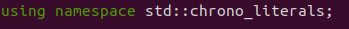

Публичный конструктор называет узел `minimal_publisher` и инициализирует `count_` в 0. Внутри конструктора издатель инициализируется типом сообщения `String`, именем темы `topic` и необходимым размером очереди для ограничения сообщений в случае резервного копирования. Далее инициализируется `timer_`, что заставляет функцию `timer_callback` выполняться дважды в секунду.

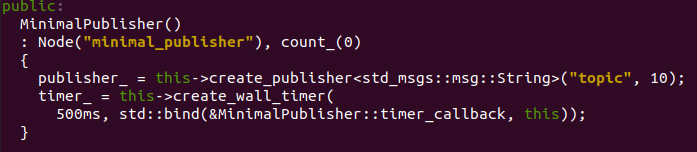

Функция `timer_callback` - это место, где устанавливаются данные сообщений и происходит их фактическая публикация. Макрос `RCLCPP_INFO` обеспечивает вывод каждого опубликованного сообщения на консоль.

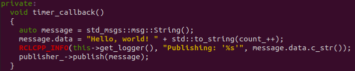

Последними объявляются поля таймера, издателя и счетчика.

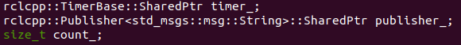

За классом `MinimalPublisher` следует класс `main`, в котором, собственно, и выполняется узел. `rclcpp::init` инициализирует ROS 2, а `rclcpp::spin` начинает обрабатывать данные от узла, включая обратные вызовы от таймера.

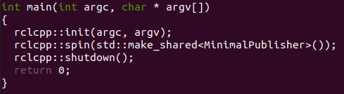

### 2.2. Добавление зависимостей

Перейдите на один уровень назад в директорию `ros2_ws/src/cpp_pubsub`, где для вас были созданы файлы `CMakeLists.txt` и `package.xml`.

Откройте файл `package.xml` в текстовом редакторе.

Как уже говорилось в предыдущем уроке, не забудьте заполнить теги `<description>`, `<maintainer>` и `<license>`:


Добавьте новую строку после зависимости `ament_cmake` buildtool и вставьте следующие зависимости, соответствующие заявлениям include вашего узла:

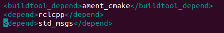

Это объявляет, что пакету нужны `rclcpp` и `std_msgs`, когда его код собирается и выполняется.

Обязательно сохраните файл.

### 2.3. CMakeLists.txt

Теперь откройте файл `CMakeLists.txt`. Ниже существующей зависимости `find_package(ament_cmake REQUIRED)` добавьте строки:


После этого добавьте исполняемый файл и назовите его `talker`, чтобы вы могли запустить узел с помощью `ros2 run`:


Наконец, добавьте секцию `install(TARGETS...)`, чтобы `ros2 run` мог найти ваш исполняемый файл:

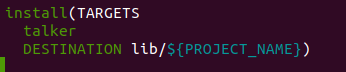

Вы можете очистить ваш `CMakeLists.txt`, удалив некоторые ненужные секции и комментарии, чтобы он выглядел следующим образом:

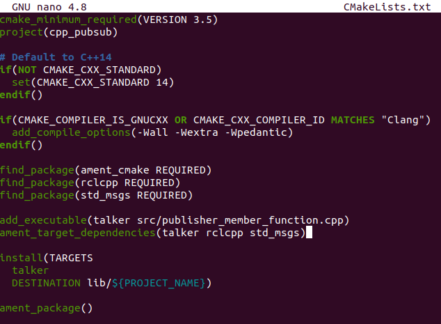

### 3. Создание узла подписчика

Вернитесь в `ros2_ws/src/cpp_pubsub/src` для создания следующего узла. Введите в терминал следующий код:

```bash
wget -O subscriber_member_function.cpp https://raw.githubusercontent.com/ros2/examples/humble/rclcpp/topics/minimal_subscriber/member_function.cpp
```

Убедитесь, что эти файлы существуют:

```bash
publisher_member_function.cpp  subscriber_member_function.cpp
```

Откройте файл `subscriber_member_function.cpp в текстовом редакторе.

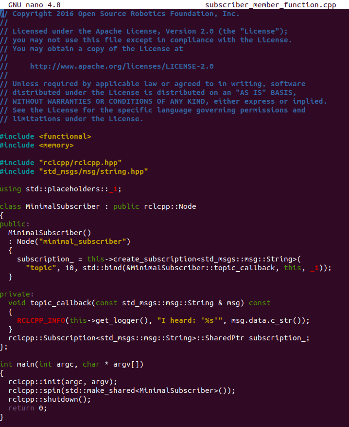

### 3.1. Изучение кода

Код узла подписчика практически идентичен коду издателя. Теперь узел называется `minimal_subscriber`, а конструктор использует класс `create_subscription` узла для выполнения обратного вызова.

Таймера нет, потому что подписчик просто отвечает всякий раз, когда данные публикуются в теме `topic`.


Функция `topic_callback` получает данные строкового сообщения, опубликованного в теме, и просто записывает их в консоль с помощью макроса `RCLCPP_INFO`.

Единственным объявлением поля в этом классе является подписка.

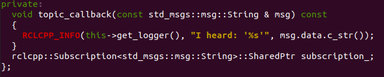

Функция `main` точно такая же, только теперь она раскручивает узел `MinimalSubscriber`. Для узла-издателя раскрутка означает запуск таймера, а для подписчика - просто подготовку к приему сообщений, когда бы они ни пришли.

Поскольку этот узел имеет те же зависимости, что и узел издателя, ничего нового в `package.xml` добавлять не нужно.

### 3.2. CMakeLists.txt

Откройте заново `CMakeLists.txt` и добавьте исполняемый файл и цель для узла subscriber ниже записей узла publisher.

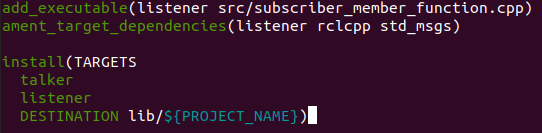

Не забудьте сохранить файл, и ваша система pub/sub будет готова.

### 4. Сборка и запуск

Скорее всего, у вас уже установлены пакеты `rclcpp` и `std_msgs` как часть вашей системы ROS 2. Хорошей практикой является запуск `rosdep` в корне вашего рабочего пространства (`ros2_ws`), чтобы проверить наличие отсутствующих зависимостей перед сборкой:

```bash
rosdep install -i --from-path src --rosdistro humble -y
```

Все еще находясь в корне рабочей области, `ros2_ws`, соберите новый пакет:

```bash
colcon build --packages-select cpp_pubsub
```

Откройте новый терминал, перейдите в раздел `ros2_ws` и найдите установочные файлы:

```bash
. install/setup.bash
```

Теперь запустите узел talker:

```bash
ros2 run cpp_pubsub talker
```

Терминал должен начать публиковать информационные сообщения каждые 0,5 секунды, как показано ниже:

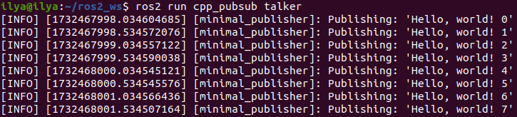

Откройте другой терминал, снова создайте файлы настроек внутри `ros2_ws`, а затем запустите узел прослушивателя:

```bash
ros2 run cpp_pubsub listener
```

Слушатель начнет печатать сообщения в консоль, начиная с того количества сообщений, на котором в данный момент находится издатель, как показано ниже:


Введите `Ctrl+C` в каждом терминале, чтобы остановить вращение узлов.

## Заключение

Вы создали два узла для публикации и подписки на данные по теме. Перед их компиляцией и запуском вы добавили их зависимости и исполняемые файлы в файлы конфигурации пакета.

