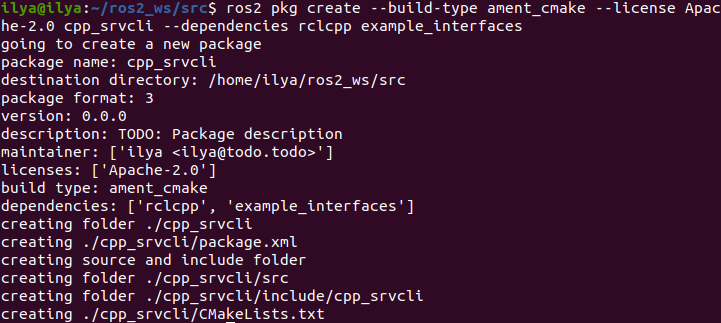
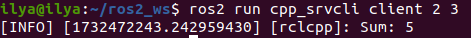
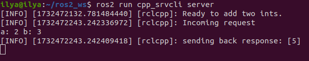

# Написание простого сервиса и клиента (C++)

## Справочная информация

Когда узлы общаются с помощью сервисов, узел, посылающий запрос на получение данных, называется клиентским узлом, а узел, отвечающий на запрос, - сервисным узлом. Структура запроса и ответа определяется файлом .srv.

В качестве примера здесь используется простая система сложения целых чисел; один узел запрашивает сумму двух целых чисел, а другой отвечает результатом.

## Задачи

### 1. Создание пакета

Откройте новый терминал и создайте исходный код вашей установки ROS 2, чтобы команды `ros2` работали.

Перейдите в каталог `ros2_ws`, созданный в предыдущем уроке.

Напомним, что пакеты должны создаваться в директории `src`, а не в корне рабочей области. Перейдите в каталог `ros2_ws/src` и создайте новый пакет:

```bash
ros2 pkg create --build-type ament_cmake --license Apache-2.0 cpp_srvcli --dependencies rclcpp example_interfaces
```



Ваш терминал выдаст сообщение, подтверждающее создание вашего пакета `cpp_srvcli` и всех необходимых файлов и папок.

Аргумент `--dependencies` автоматически добавит необходимые строки зависимостей в `package.xml` и `CMakeLists.txt`. `example_interfaces` - это пакет, включающий .srv-файл, необходимый для структурирования запросов и ответов:

```bash
int64 a
int64 b
---
int64 sum
```

Первые две строки - это параметры запроса, а ниже через тире - ответ.

### 1.1. Обновление `package.xml`

Поскольку при создании пакета вы использовали опцию `--dependencies`, вам не нужно вручную добавлять зависимости в `package.xml` или `CMakeLists.txt`.

Однако, как всегда, не забудьте добавить в `package.xml` описание, email и имя сопровождающего, а также информацию о лицензии.

```bash
<description>C++ client server tutorial</description>
<maintainer email="you@email.com">Your Name</maintainer>
<license>Apache License 2.0</license>
```

### 2. Написание узла службы

Внутри директории `ros2_ws/src/cpp_srvcli/src` создайте новый файл `add_two_ints_server.cpp` и вставьте в него следующий код:

```bash
#include "rclcpp/rclcpp.hpp"
#include "example_interfaces/srv/add_two_ints.hpp"

#include <memory>

void add(const std::shared_ptr<example_interfaces::srv::AddTwoInts::Request> request,
          std::shared_ptr<example_interfaces::srv::AddTwoInts::Response>      response)
{
  response->sum = request->a + request->b;
  RCLCPP_INFO(rclcpp::get_logger("rclcpp"), "Incoming request\na: %ld" " b: %ld",
                request->a, request->b);
  RCLCPP_INFO(rclcpp::get_logger("rclcpp"), "sending back response: [%ld]", (long int)response->sum);
}

int main(int argc, char **argv)
{
  rclcpp::init(argc, argv);

  std::shared_ptr<rclcpp::Node> node = rclcpp::Node::make_shared("add_two_ints_server");

  rclcpp::Service<example_interfaces::srv::AddTwoInts>::SharedPtr service =
    node->create_service<example_interfaces::srv::AddTwoInts>("add_two_ints", &add);

  RCLCPP_INFO(rclcpp::get_logger("rclcpp"), "Ready to add two ints.");

  rclcpp::spin(node);
  rclcpp::shutdown();
}
```

### 2.1. Изучение кода

Первые два утверждения `#include` - это зависимости вашего пакета.

Функция `add` складывает два целых числа из запроса и отдает сумму в ответ, одновременно уведомляя консоль о своем статусе с помощью логов.

```bash
void add(const std::shared_ptr<example_interfaces::srv::AddTwoInts::Request> request,
         std::shared_ptr<example_interfaces::srv::AddTwoInts::Response>      response)
{
    response->sum = request->a + request->b;
    RCLCPP_INFO(rclcpp::get_logger("rclcpp"), "Incoming request\na: %ld" " b: %ld",
        request->a, request->b);
    RCLCPP_INFO(rclcpp::get_logger("rclcpp"), "sending back response: [%ld]", (long int)response->sum);
}
```

Функция `main` построчно выполняет следующие действия:

- Инициализирует клиентскую библиотеку ROS 2 C++:

```bash
rclcpp::init(argc, argv);
```

- Создает узел с именем `add_two_ints_server`:

```bash
std::shared_ptr<rclcpp::Node> node = rclcpp::Node::make_shared("add_two_ints_server");
```

- Создает сервис с именем `add_two_ints` для этого узла и автоматически рекламирует его в сетях с помощью метода `&add`:

```bash
rclcpp::Service<example_interfaces::srv::AddTwoInts>::SharedPtr service =
node->create_service<example_interfaces::srv::AddTwoInts>("add_two_ints", &add);
```

- Печатает сообщение в журнале, когда все готово:

```bash
RCLCPP_INFO(rclcpp::get_logger("rclcpp"), "Ready to add two ints.");
```

- Раскручивает узел, делая службу доступной.

```bash
rclcpp::spin(node);
```

### 2.2. Добавление исполняемого файла

Макрос `add_executable` генерирует исполняемый файл, который можно запустить с помощью `ros2 run`. Добавьте следующий блок кода в `CMakeLists.txt` для создания исполняемого файла с именем `server`:

```bash
add_executable(server src/add_two_ints_server.cpp)
ament_target_dependencies(server rclcpp example_interfaces)
```

Чтобы `ros2 run` мог найти исполняемый файл, добавьте следующие строки в конец файла, прямо перед `ament_package()`:

```bash
install(TARGETS
    server
  DESTINATION lib/${PROJECT_NAME})
```

### 3. Создание клиентского узла

Внутри директории `ros2_ws/src/cpp_srvcli/src` создайте новый файл `add_two_ints_client.cpp` и вставьте в него следующий код:

```bash
#include "rclcpp/rclcpp.hpp"
#include "example_interfaces/srv/add_two_ints.hpp"

#include <chrono>
#include <cstdlib>
#include <memory>

using namespace std::chrono_literals;

int main(int argc, char **argv)
{
  rclcpp::init(argc, argv);

  if (argc != 3) {
      RCLCPP_INFO(rclcpp::get_logger("rclcpp"), "usage: add_two_ints_client X Y");
      return 1;
  }

  std::shared_ptr<rclcpp::Node> node = rclcpp::Node::make_shared("add_two_ints_client");
  rclcpp::Client<example_interfaces::srv::AddTwoInts>::SharedPtr client =
    node->create_client<example_interfaces::srv::AddTwoInts>("add_two_ints");

  auto request = std::make_shared<example_interfaces::srv::AddTwoInts::Request>();
  request->a = atoll(argv[1]);
  request->b = atoll(argv[2]);

  while (!client->wait_for_service(1s)) {
    if (!rclcpp::ok()) {
      RCLCPP_ERROR(rclcpp::get_logger("rclcpp"), "Interrupted while waiting for the service. Exiting.");
      return 0;
    }
    RCLCPP_INFO(rclcpp::get_logger("rclcpp"), "service not available, waiting again...");
  }

  auto result = client->async_send_request(request);
  // Wait for the result.
  if (rclcpp::spin_until_future_complete(node, result) ==
    rclcpp::FutureReturnCode::SUCCESS)
  {
    RCLCPP_INFO(rclcpp::get_logger("rclcpp"), "Sum: %ld", result.get()->sum);
  } else {
    RCLCPP_ERROR(rclcpp::get_logger("rclcpp"), "Failed to call service add_two_ints");
  }

  rclcpp::shutdown();
  return 0;
}
```

### 3.1. Изучение кода

Как и в случае с узлом службы, следующие строки кода создают узел, а затем создают клиента для этого узла:

```bash
std::shared_ptr<rclcpp::Node> node = rclcpp::Node::make_shared("add_two_ints_client");
rclcpp::Client<example_interfaces::srv::AddTwoInts>::SharedPtr client =
  node->create_client<example_interfaces::srv::AddTwoInts>("add_two_ints");
```

Далее создается запрос. Его структура определяется файлом .srv, о котором говорилось ранее.

```bash
auto request = std::make_shared<example_interfaces::srv::AddTwoInts::Request>();
request->a = atoll(argv[1]);
request->b = atoll(argv[2]);
```

Цикл `while` дает клиенту 1 секунду на поиск сервисных узлов в сети. Если он не найдет ни одного, то продолжит ожидание.

```bash
RCLCPP_INFO(rclcpp::get_logger("rclcpp"), "service not available, waiting again...");
```

Если клиент будет прерван (например, вы введете `Ctrl+C` в терминале), он вернет сообщение об ошибке, в котором будет указано, что он был прерван.

```bash
RCLCPP_ERROR(rclcpp::get_logger("rclcpp"), "Interrupted while waiting for the service. Exiting.");
```

Затем клиент отправляет свой запрос, и узел вращается до тех пор, пока не получит ответ или не выйдет из строя.

### 3.2. Добавление исполняемого файла

Вернитесь в `CMakeLists.txt`, чтобы добавить исполняемый файл и цель для нового узла. После удаления ненужных шаблонов из автоматически сгенерированного файла, ваш `CMakeLists.txt` должен выглядеть следующим образом:

```bash
cmake_minimum_required(VERSION 3.5)
project(cpp_srvcli)

find_package(ament_cmake REQUIRED)
find_package(rclcpp REQUIRED)
find_package(example_interfaces REQUIRED)

add_executable(server src/add_two_ints_server.cpp)
ament_target_dependencies(server rclcpp example_interfaces)

add_executable(client src/add_two_ints_client.cpp)
ament_target_dependencies(client rclcpp example_interfaces)

install(TARGETS
  server
  client
  DESTINATION lib/${PROJECT_NAME})

ament_package()
```

### 4. Сборка и запуск

Хорошей практикой является запуск `rosdep` в корне вашего рабочего пространства (`ros2_ws`), чтобы проверить наличие отсутствующих зависимостей перед сборкой:

```bash
rosdep install -i --from-path src --rosdistro humble -y
```

Перейдите в корень рабочей области, ros2_ws, и соберите новый пакет:

```bash
colcon build --packages-select cpp_srvcli
```

Откройте новый терминал, перейдите в раздел `ros2_ws` и найдите установочные файлы:

```bash
source install/setup.bash
```

Теперь запустите узел службы:

```bash
ros2 run cpp_srvcli server
```

Терминал должен выдать следующее сообщение, а затем подождать:


Откройте другой терминал, снова создайте файлы настроек внутри `ros2_ws`. Запустите клиентскую ноду, а затем любые два целых числа, разделенные пробелом:

```bash
ros2 run cpp_srvcli client 2 3
```

Если вы выбрали, например, `2` и `3`, клиент получит такой ответ:



Вернитесь в терминал, где запущен ваш узел службы. Вы увидите, что он опубликовал сообщения журнала о получении запроса, полученных данных и ответа, который он отправил обратно:



Введите `Ctrl+C` в терминале сервера, чтобы остановить вращение узла.

## Резюме

Вы создали два узла для запроса и ответа на данные через сервис. Вы добавили их зависимости и исполняемые файлы в файлы конфигурации пакетов, чтобы можно было собрать и запустить их и увидеть работу системы сервис/клиент.
