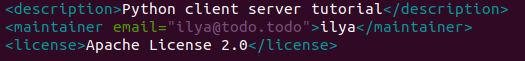
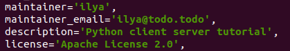
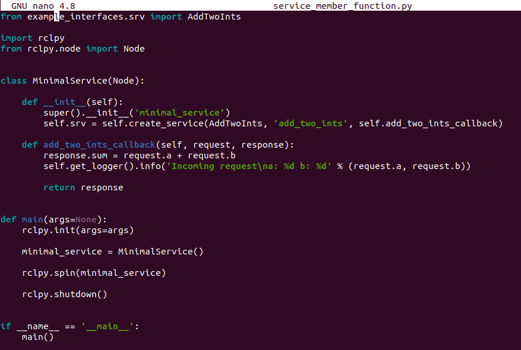
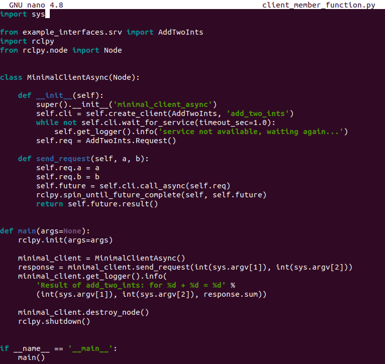
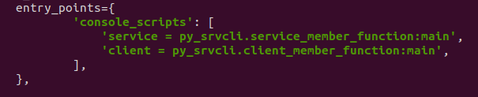
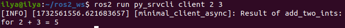
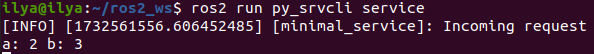

# Написание простого сервиса и клиента (Python)

## Справочная информация

Когда узлы взаимодействуют с помощью сервисов, узел, отправляющий запрос на получение данных, называется клиентским узлом, а узел, отвечающий на запрос, - сервисным узлом. Структура запроса и ответа определяется файлом .srv.

В данном примере используется простая система сложения целых чисел; один узел запрашивает сумму двух целых чисел, а другой отвечает результатом.

## Задания

### 1. Создание пакета

Откройте новый терминал и создайте исходный код вашей установки ROS 2, чтобы команды `ros2` работали.

```bash
ros2 pkg create --build-type ament_python py_srvcli --dependencies rclpy example_interfaces
```

Ваш терминал выдаст сообщение, подтверждающее создание пакета `py_srvcli` и всех его необходимых файлов и папок.

Аргумент `--dependencies` автоматически добавит необходимые строки зависимостей в `package.xml`. `example_interfaces` - это пакет, включающий файл .srv, который понадобится вам для структурирования запросов и ответов:

```bash
int64 a
int64 b
---
int64 sum
```

Первые две строки - это параметры запроса, а ниже через тире - ответ.

### 1.1. Обновление `package.xml`

Поскольку при создании пакета вы использовали опцию `--dependencies`, вам не нужно вручную добавлять зависимости в `package.xml`.

Однако, как всегда, не забудьте добавить в `package.xml` описание, email и имя сопровождающего, а также информацию о лицензии.

```bash
<description>Python client server tutorial</description>
<maintainer email="you@email.com">Your Name</maintainer>
<license>Apache License 2.0</license>
```



### 1.2. Обновление setup.py

Добавьте ту же информацию в файл `setup.py` для полей `maintainer`, `maintainer_email`, `description` и `icense`:

```bash
maintainer='Your Name',
maintainer_email='you@email.com',
description='Python client server tutorial',
license='Apache License 2.0',
```



### 2. Написание узла обслуживания

В каталоге `ros2_ws/src/py_srvcli/py_srvcli` создайте новый файл `service_member_function.py` и вставьте в него следующий код:

```bash
from example_interfaces.srv import AddTwoInts

import rclpy
from rclpy.node import Node


class MinimalService(Node):

    def __init__(self):
        super().__init__('minimal_service')
        self.srv = self.create_service(AddTwoInts, 'add_two_ints', self.add_two_ints_callback)

    def add_two_ints_callback(self, request, response):
        response.sum = request.a + request.b
        self.get_logger().info('Incoming request\na: %d b: %d' % (request.a, request.b))

        return response


def main(args=None):
    rclpy.init(args=args)

    minimal_service = MinimalService()

    rclpy.spin(minimal_service)

    rclpy.shutdown()


if __name__ == '__main__':
    main()
```



### 2.1. Изучение кода

Первый оператор `import` импортирует тип сервиса `AddTwoInts` из пакета `example_interfaces`. Следующий оператор `import` импортирует клиентскую библиотеку ROS 2 Python, а именно класс `Node`.

```bash
from example_interfaces.srv import AddTwoInts

import rclpy
from rclpy.node import Node
```

Конструктор класса `MinimalService` инициализирует узел с именем `minimal_service`. Затем он создает сервис и определяет его тип, имя и обратный вызов.


```bash
def __init__(self):
    super().__init__('minimal_service')
    self.srv = self.create_service(AddTwoInts, 'add_two_ints', self.add_two_ints_callback)
```

Определение обратного вызова службы получает данные запроса, суммирует их и возвращает сумму в качестве ответа.

```bash
def add_two_ints_callback(self, request, response):
    response.sum = request.a + request.b
    self.get_logger().info('Incoming request\na: %d b: %d' % (request.a, request.b))

    return response
```

Наконец, главный класс инициализирует клиентскую библиотеку ROS 2 Python, инстанцирует класс `MinimalService` для создания сервисного узла и раскручивает узел для обработки обратных вызовов.

### 2.2. Добавление точки входа

Чтобы команда `ros2 run` могла запустить ваш узел, вы должны добавить точку входа в `setup.py` (находится в каталоге `ros2_ws/src/py_srvcli`).

Добавьте следующую строку между скобками `'console_scripts':`:

```bash
'service = py_srvcli.service_member_function:main',
```

### 3. Создание клиентского узла

В каталоге `ros2_ws/src/py_srvcli/py_srvcli` создайте новый файл `client_member_function.py` и вставьте в него следующий код:

```bash
import sys

from example_interfaces.srv import AddTwoInts
import rclpy
from rclpy.node import Node


class MinimalClientAsync(Node):

    def __init__(self):
        super().__init__('minimal_client_async')
        self.cli = self.create_client(AddTwoInts, 'add_two_ints')
        while not self.cli.wait_for_service(timeout_sec=1.0):
            self.get_logger().info('service not available, waiting again...')
        self.req = AddTwoInts.Request()

    def send_request(self, a, b):
        self.req.a = a
        self.req.b = b
        self.future = self.cli.call_async(self.req)
        rclpy.spin_until_future_complete(self, self.future)
        return self.future.result()


def main(args=None):
    rclpy.init(args=args)

    minimal_client = MinimalClientAsync()
    response = minimal_client.send_request(int(sys.argv[1]), int(sys.argv[2]))
    minimal_client.get_logger().info(
        'Result of add_two_ints: for %d + %d = %d' %
        (int(sys.argv[1]), int(sys.argv[2]), response.sum))

    minimal_client.destroy_node()
    rclpy.shutdown()


if __name__ == '__main__':
    main()
```



### 3.1. Изучение кода

Единственным отличием оператора `import` для клиента является `import sys`. Код узла клиента использует sys.argv для получения доступа к входным аргументам командной строки для запроса.

Определение конструктора создает клиента с тем же типом и именем, что и узел службы. Тип и имя должны совпадать, чтобы клиент и сервис могли взаимодействовать.

Цикл `while` в конструкторе раз в секунду проверяет, доступен ли сервис, соответствующий типу и имени клиента.

Ниже конструктора находится определение запроса, а затем `main`.

Единственное существенное отличие в `main` клиента - это цикл `while`. Цикл проверяет `future` на наличие ответа от сервиса, пока система работает. Если сервис отправил ответ, результат будет записан в журнале.

### 3.2. Добавьте точку входа

Как и для узла службы, для запуска узла клиента необходимо добавить точку входа.

Поле `entry_points` в вашем файле `setup.py` должно выглядеть следующим образом:

```bash
entry_points={
    'console_scripts': [
        'service = py_srvcli.service_member_function:main',
        'client = py_srvcli.client_member_function:main',
    ],
},
```



### 4. Сборка и запуск

Хорошей практикой является запуск `rosdep` в корне вашего рабочего пространства (`ros2_ws`), чтобы проверить наличие отсутствующих зависимостей перед сборкой:

```bash
rosdep install -i --from-path src --rosdistro foxy -y
```

Вернитесь в корень рабочей области, `ros2_ws`, и соберите новый пакет:

```bash
colcon build --packages-select py_srvcli
```

Откройте новый терминал, перейдите в раздел `ros2_ws` и найдите установочные файлы:

```bash
source install/setup.bash
```

Теперь запустите узел службы:

```bash
ros2 run py_srvcli service
```

Узел будет ждать запроса от клиента.

Откройте другой терминал и снова создайте файлы настроек внутри `ros2_ws`. Запустите клиентский узел, а затем любые два целых числа, разделенные пробелом:

```bash
ros2 run py_srvcli client 2 3
```

Если вы выбрали, например, `2` и `3`, клиент получит такой ответ:



Вернитесь в терминал, где запущен ваш узел службы. Вы увидите, что он опубликовал сообщения журнала, когда получил запрос:



Введите `Ctrl+C` в терминале сервера, чтобы остановить вращение узла.

## Заключение

Вы создали два узла для запроса и ответа на данные через сервис. Вы добавили их зависимости и исполняемые файлы в файлы конфигурации пакетов, чтобы можно было собрать и запустить их, что позволило вам увидеть систему сервиса/клиента в работе.
