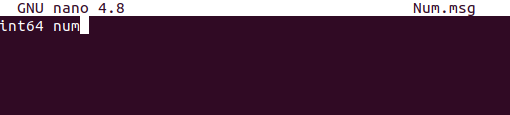
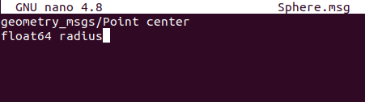
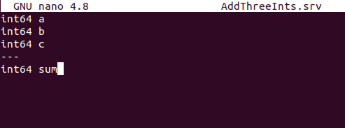
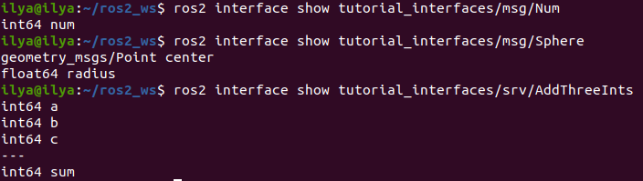

# Создание пользовательских файлов msg и srv

## Справочная информация

В предыдущих уроках вы использовали интерфейсы сообщений и сервисов, чтобы узнать о темах, сервисах и простых узлах издатель/подписчик (C++/Python) и сервис/клиент (C++/Python). В этих случаях используемые вами интерфейсы были предопределены.

Хотя использование предопределенных определений интерфейсов является хорошей практикой, вам, вероятно, придется иногда определять собственные сообщения и службы. В этом уроке вы познакомитесь с простейшим методом создания собственных определений интерфейсов.Хотя использование предопределенных определений интерфейсов является хорошей практикой, вам, вероятно, придется иногда определять собственные сообщения и службы. В этом уроке вы познакомитесь с простейшим методом создания собственных определений интерфейсов.

## Задания

### 1. Создание нового пакета

В этом уроке вы будете создавать пользовательские файлы `.msg` и `.srv` в отдельном пакете, а затем использовать их в отдельном пакете. Оба пакета должны находиться в одном рабочем пространстве.

Поскольку мы будем использовать пакеты pub/sub и service/client, созданные в предыдущих уроках, убедитесь, что вы находитесь в том же рабочем пространстве, что и эти пакеты (`ros2_ws/src`), а затем выполните следующую команду для создания нового пакета:

```bash
ros2 pkg create --build-type ament_cmake tutorial_interfaces
```

`tutorial_interfaces` - это имя нового пакета. Обратите внимание, что это и может быть только пакет CMake, но это не ограничивает, в каких типах пакетов вы можете использовать свои сообщения и сервисы. Вы можете создавать свои собственные интерфейсы в пакете CMake, а затем использовать их в узле C++ или Python, о чем будет рассказано в последнем разделе.

Файлы `.msg` и `.srv` должны быть помещены в каталоги с названиями `msg` и `srv` соответственно. Создайте эти каталоги в `ros2_ws/src/tutorial_interfaces`:

```bash
mkdir msg srv
```

### 2. Создание пользовательских определений

### 2.1. Определение msg

В только что созданном каталоге `tutorial_interfaces/msg` создайте новый файл `Num.msg` с одной строкой кода, объявляющей его структуру данных:

```bash
int64 num
```



Это пользовательское сообщение, передающее одно 64-битное целое число `num`.

Также в только что созданном каталоге `tutorial_interfaces/msg` создайте новый файл `Sphere.msg` со следующим содержимым:

```bash
geometry_msgs/Point center
float64 radius
```



Это пользовательское сообщение использует сообщение из другого пакета сообщений (в данном случае `geometry_msgs/Point`).

### 2.2. Определение srv

В директории `tutorial_interfaces/srv`, которую вы только что создали, создайте новый файл `AddThreeInts.srv` со следующей структурой запросов и ответов:

```bash
int64 a
int64 b
int64 c
---
int64 sum
```



Это ваш пользовательский сервис, который запрашивает три целых числа с именами `a`, `b` и `c`, а в ответ получает целое число с именем `sum`.

### 3. `CMakeLists.txt`

Чтобы преобразовать определенные вами интерфейсы в код для конкретного языка (например, C++ и Python), чтобы их можно было использовать в этих языках, добавьте следующие строки в `CMakeLists.txt`:

```bash
find_package(geometry_msgs REQUIRED)
find_package(rosidl_default_generators REQUIRED)

rosidl_generate_interfaces(${PROJECT_NAME}
  "msg/Num.msg"
  "msg/Sphere.msg"
  "srv/AddThreeInts.srv"
  DEPENDENCIES geometry_msgs # Add packages that above messages depend on, in this case geometry_msgs for Sphere.msg
)
```

### 4. `package.xml`

Поскольку интерфейсы полагаются на `rosidl_default_generators` для генерации кода, специфичного для данного языка, вам необходимо объявить зависимость от инструмента сборки. `rosidl_default_runtime` - это зависимость от времени выполнения или стадии выполнения, необходимая для последующего использования интерфейсов. `rosidl_interface_packages` - это имя группы зависимостей, с которой должен быть связан ваш пакет `tutorial_interfaces`, объявленное с помощью тега `<member_of_group>`.

Добавьте следующие строки в элемент `<package>` файла `package.xml`:

```bash
<depend>geometry_msgs</depend>
<buildtool_depend>rosidl_default_generators</buildtool_depend>
<exec_depend>rosidl_default_runtime</exec_depend>
<member_of_group>rosidl_interface_packages</member_of_group>
```

### 5. Соберите пакет `tutorial_interfaces`.

Теперь, когда все части вашего пакета пользовательских интерфейсов собраны, вы можете собрать пакет. В корне рабочей области (`~/ros2_ws`) выполните следующую команду:

```bash
colcon build --packages-select tutorial_interfaces
```

Теперь интерфейсы будут доступны другим пакетам ROS 2.

### 6. Подтверждение создания msg и srv

В новом терминале выполните следующую команду из рабочей области (`ros2_ws`), чтобы создать источник:

```bash
source install/setup.bash
```

Теперь вы можете убедиться, что создание интерфейса прошло успешно, используя команду `ros2 interface show`:

```bash
ros2 interface show tutorial_interfaces/msg/Num
```

должно вернуться:

```bash
int64 num
```

И

```bash
ros2 interface show tutorial_interfaces/msg/Sphere
```

должно вернуться:

```bash
geometry_msgs/Point center
        float64 x
        float64 y
        float64 z
float64 radius
```

И

```bash
ros2 interface show tutorial_interfaces/srv/AddThreeInts
```

должно вернуться:

```bash
int64 a
int64 b
int64 c
---
int64 sum
```



### 7. Протестирование новых интерфейсов

Для этого шага вы можете использовать пакеты, созданные в предыдущих уроках. Несколько простых изменений в узлах, файлах `CMakeLists.txt` и `package.xml` позволят вам использовать новые интерфейсы.

### 7.1. Тестирование `Num.msg` с pub/sub

Немного изменив пакет издателя/подписчика, созданный в предыдущем уроке (на C++ или Python), вы можете увидеть `Num.msg` в действии. Поскольку вы будете заменять стандартное строковое msg на числовое, вывод будет немного отличаться.

#### Publisher

```bash
import rclpy
from rclpy.node import Node

from tutorial_interfaces.msg import Num    # CHANGE


class MinimalPublisher(Node):

    def __init__(self):
        super().__init__('minimal_publisher')
        self.publisher_ = self.create_publisher(Num, 'topic', 10)     # CHANGE
        timer_period = 0.5
        self.timer = self.create_timer(timer_period, self.timer_callback)
        self.i = 0

    def timer_callback(self):
        msg = Num()                                           # CHANGE
        msg.num = self.i                                      # CHANGE
        self.publisher_.publish(msg)
        self.get_logger().info('Publishing: "%d"' % msg.num)  # CHANGE
        self.i += 1


def main(args=None):
    rclpy.init(args=args)

    minimal_publisher = MinimalPublisher()

    rclpy.spin(minimal_publisher)

    minimal_publisher.destroy_node()
    rclpy.shutdown()


if __name__ == '__main__':
    main()
```

#### Subscriber

```bash
import rclpy
from rclpy.node import Node

from tutorial_interfaces.msg import Num        # CHANGE


class MinimalSubscriber(Node):

    def __init__(self):
        super().__init__('minimal_subscriber')
        self.subscription = self.create_subscription(
            Num,                                              # CHANGE
            'topic',
            self.listener_callback,
            10)
        self.subscription

    def listener_callback(self, msg):
            self.get_logger().info('I heard: "%d"' % msg.num) # CHANGE


def main(args=None):
    rclpy.init(args=args)

    minimal_subscriber = MinimalSubscriber()

    rclpy.spin(minimal_subscriber)

    minimal_subscriber.destroy_node()
    rclpy.shutdown()


if __name__ == '__main__':
    main()
```

#### package.xml

Добавьте следующую строку:

```bash
<exec_depend>tutorial_interfaces</exec_depend>
```

После внесения вышеуказанных правок и сохранения всех изменений соберите пакет:

```bash
colcon build --packages-select py_pubsub
```

Затем откройте два новых терминала, создайте источник ros2_ws в каждом из них и запустите:

```bash
ros2 run py_pubsub talker
```

```bash
ros2 run py_pubsub listener
```

Поскольку `Num.msg` передает только целое число, говорящий должен публиковать только целочисленные значения, а не строку, которую он публиковал ранее:

```bash
[INFO] [minimal_publisher]: Publishing: '0'
[INFO] [minimal_publisher]: Publishing: '1'
[INFO] [minimal_publisher]: Publishing: '2'
```

### 7.2. Тестирование `AddThreeInts.srv` с помощью сервиса/клиента

Немного изменив пакет сервиса/клиента, созданный в предыдущем уроке (на C++ или Python), вы можете увидеть `AddThreeInts.srv` в действии. Поскольку вы измените исходный двухцелочисленный запрос srv на трехцелочисленный, вывод будет немного отличаться.

#### Service

```bash
from tutorial_interfaces.srv import AddThreeInts     # CHANGE

import rclpy
from rclpy.node import Node


class MinimalService(Node):

    def __init__(self):
        super().__init__('minimal_service')
        self.srv = self.create_service(AddThreeInts, 'add_three_ints', self.add_three_ints_callback)        # CHANGE

    def add_three_ints_callback(self, request, response):
        response.sum = request.a + request.b + request.c                                                  # CHANGE
        self.get_logger().info('Incoming request\na: %d b: %d c: %d' % (request.a, request.b, request.c)) # CHANGE

        return response

def main(args=None):
    rclpy.init(args=args)

    minimal_service = MinimalService()

    rclpy.spin(minimal_service)

    rclpy.shutdown()

if __name__ == '__main__':
    main()
```

### Client

```bash
from tutorial_interfaces.srv import AddThreeInts       # CHANGE
import sys
import rclpy
from rclpy.node import Node


class MinimalClientAsync(Node):

    def __init__(self):
        super().__init__('minimal_client_async')
        self.cli = self.create_client(AddThreeInts, 'add_three_ints')       # CHANGE
        while not self.cli.wait_for_service(timeout_sec=1.0):
            self.get_logger().info('service not available, waiting again...')
        self.req = AddThreeInts.Request()                                   # CHANGE

    def send_request(self):
        self.req.a = int(sys.argv[1])
        self.req.b = int(sys.argv[2])
        self.req.c = int(sys.argv[3])                  # CHANGE
        self.future = self.cli.call_async(self.req)


def main(args=None):
    rclpy.init(args=args)

    minimal_client = MinimalClientAsync()
    minimal_client.send_request()

    while rclpy.ok():
        rclpy.spin_once(minimal_client)
        if minimal_client.future.done():
            try:
                response = minimal_client.future.result()
            except Exception as e:
                minimal_client.get_logger().info(
                    'Service call failed %r' % (e,))
            else:
                minimal_client.get_logger().info(
                    'Result of add_three_ints: for %d + %d + %d = %d' %                               # CHANGE
                    (minimal_client.req.a, minimal_client.req.b, minimal_client.req.c, response.sum)) # CHANGE
            break

    minimal_client.destroy_node()
    rclpy.shutdown()


if __name__ == '__main__':
    main()
```

#### package.xml

Добавьте следующую строку:

```bash
<exec_depend>tutorial_interfaces</exec_depend>
```

После внесения вышеуказанных правок и сохранения всех изменений соберите пакет:

```bash
colcon build --packages-select py_srvcli
```

Затем откройте два новых терминала, создайте источник `ros2_ws` в каждом из них и запустите:

```bash
ros2 run py_srvcli service
```

```bash
ros2 run py_srvcli client 2 3 1
```

## Заключение

В этом уроке вы узнали, как создавать пользовательские интерфейсы в собственном пакете и как использовать эти интерфейсы в других пакетах.
