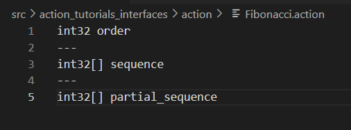
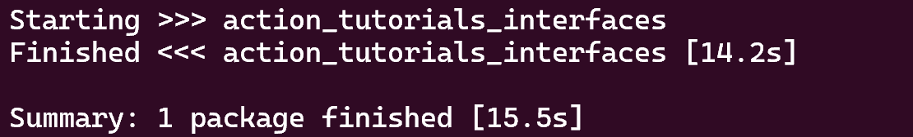
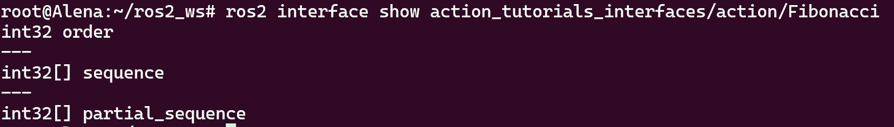

# Creating an action

**Цель:** Определить действие в пакете ROS 2.

Этот туториал покажет вам, как определить и создать действие, которое вы сможете использовать с сервером действий и клиентом действий, о которых пойдет речь в следующем учебнике.

## Предварительные требования

У вас должны быть установлены ROS 2 и colcon.

Настройте рабочее пространство и создайте пакет с именем `action_tutorials_interfaces`:

```
mkdir -p ros2_ws/src # вы можете использовать существующее рабочее пространство с этой системой именования
cd ros2_ws/src
ros2 pkg create action_tutorials_interfaces
```

## 1 Определение действия

Действия определяются в файлах `.action` следующего формата:

```shell
# Запрос
---
# Результат
---
# Обратная связь
```

Определение действия состоит из трех определений сообщений, разделенных `---`.

* Сообщение *запроса* отправляется от клиента действий к серверу действий для инициирования новой цели.
* Сообщение *результата* отправляется от сервера действий к клиенту действий, когда цель достигнута.
* Сообщения *обратной связи* периодически отправляются от сервера действий к клиенту действий с обновлениями о состоянии цели.

Экземпляр действия обычно называется *целью*.

Допустим, мы хотим определить новое действие "Фибоначчи" для вычисления последовательности Фибоначчи.

Создайте директорию `action` в нашем пакете ROS 2 `action_tutorials_interfaces`:

```
cd action_tutorials_interfaces
mkdir action
```

В директории `action` создайте файл с именем `Fibonacci.action` со следующим содержимым:

```
int32 order
---
int32[] sequence
---
int32[] partial_sequence
```



Запрос цели - это последовательность Фибоначчи `order`, которую мы хотим вычислить, результат - это окончательная последовательность `sequence`, а обратная связь - это частичная последовательность `partial_sequence`, вычисленная на данный момент.

## 2 Построение действия

Прежде чем мы сможем использовать новый тип действия в нашем коде, мы должны передать определение в конвейер генерации кода ROS IDL.

Это достигается путем добавления следующих строк в наш `CMakeLists.txt` перед строкой `ament_package()`, в пакете `action_tutorials_interfaces`:

```cmake
find_package(rosidl_default_generators REQUIRED)

rosidl_generate_interfaces(${PROJECT_NAME}
  "action/Fibonacci.action"
)
```

Мы также должны добавить необходимые зависимости в наш `package.xml`:

```
<buildtool_depend>rosidl_default_generators</buildtool_depend>

<depend>action_msgs</depend>

<member_of_group>rosidl_interface_packages</member_of_group>
```

Обратите внимание, что нам нужно зависеть от `action_msgs`, так как определения действий включают дополнительные метаданные (например, идентификаторы целей).

Теперь мы должны иметь возможность создать пакет, содержащий определение действия "Фибоначчи":

```shell
# Перейдите в корневую директорию рабочего пространства
cd ~/ros2_ws
# Build
colcon build
```



По соглашению, типы действий будут префиксироваться их пакетом и словом `action`. Таким образом, когда мы хотим сослаться на наше новое действие, оно будет иметь полный имя `action_tutorials_interfaces/action/Fibonacci`.

Мы можем проверить, успешно ли создано действие, с помощью командной строки:

```shell
# Исходный код нашего рабочего пространства
. install/setup.bash
# Проверьте, существует ли наше определение действия
ros2 interface show action_tutorials_interfaces/action/Fibonacci
```

Вы должны увидеть определение действия Фибоначчи, напечатанное на экране.



## Заключение

В этом учебнике вы узнали структуру определения действия. Вы также узнали, как правильно создать новый интерфейс действия с помощью `CMakeLists.txt` и `package.xml`, и как проверить успешное построение.
