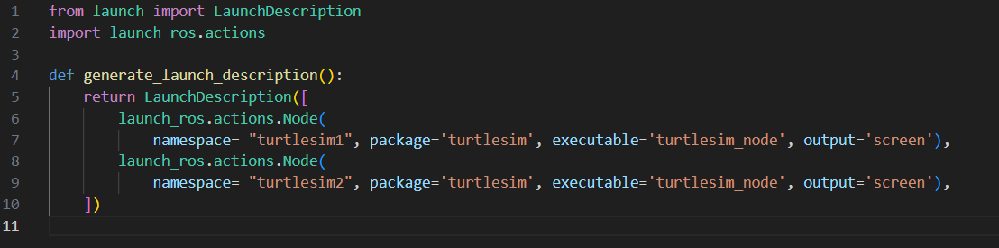
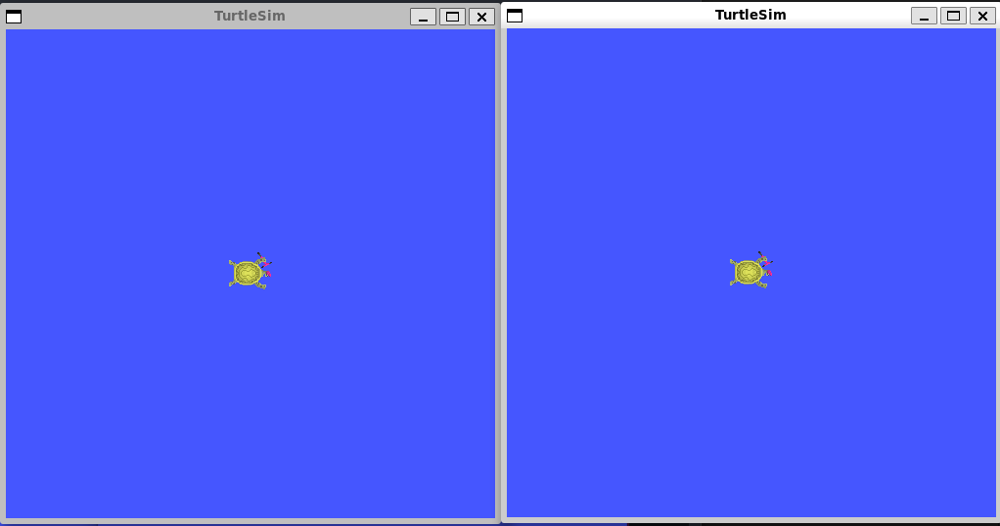
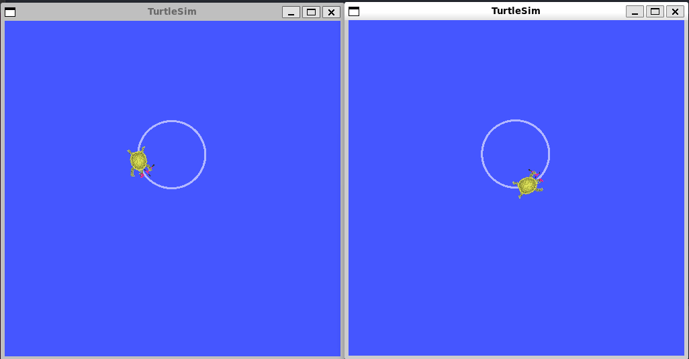

# Launching nodes

In most of the introductory tutorials, you have been opening new terminals for every new node you run. As you create more complex systems with more and more nodes running simultaneously, opening terminals and reentering configuration details becomes tedious.

Launch files allow you to start up and configure a number of executables containing ROS 2 nodes simultaneously.

Running a single launch file with the `ros2 launch` command will start up your entire system - all nodes and their configurations - at once.

#### 1. Running a Launch File

Open a new terminal and run:

```
ros2 launch turtlesim multisim.launch.py
```

This command will run the following launch file:



This will run two turtlesim nodes:



#### 2. Control the Turtlesim Nodes

Now that these nodes are running, you can control them like any other ROS 2 nodes. For example, you can make the turtles drive in opposite directions by opening up two additional terminals and running the following commands:

In the second terminal:

```
ros2 topic pub  /turtlesim1/turtle1/cmd_vel geometry_msgs/msg/Twist "{linear: {x: 2.0, y: 0.0, z: 0.0}, angular: {x: 0.0, y: 0.0, z: 1.8}}"
```

In the third terminal:

```
ros2 topic pub  /turtlesim2/turtle1/cmd_vel geometry_msgs/msg/Twist "{linear: {x: 2.0, y: 0.0, z: 0.0}, angular: {x: 0.0, y: 0.0, z: -1.8}}"
```

After running these commands, you should see something like the following:



#### Summary

The significance of what you've done so far is that you've run two turtlesim nodes with one command. Once you learn to write your own launch files, you'll be able to run multiple nodes - and set up their configuration - in a similar way, with the `ros2 launch` command.
