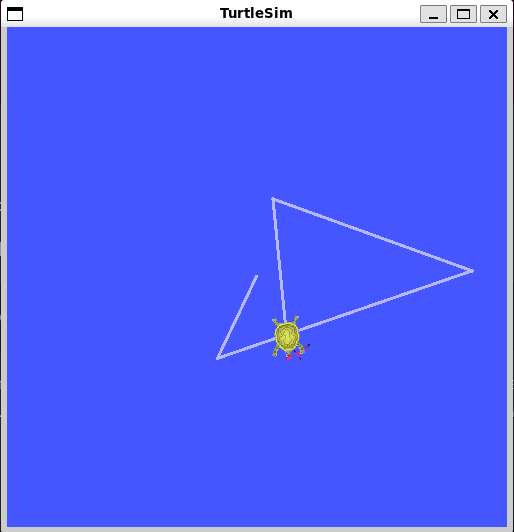
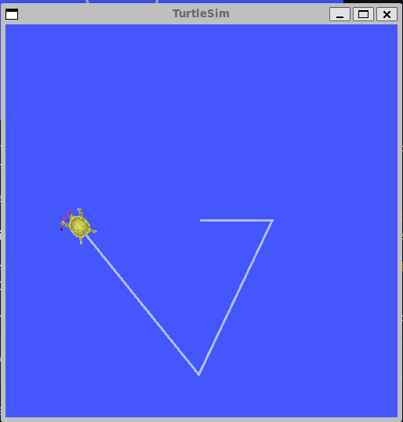

# Recording and playing back data

`ros2 bag` is a command line tool for recording data published on topics in your system. It accumulates the data passed on any number of topics and saves it in a database. You can then replay the data to reproduce the results of your tests and experiments. Recording topics is also a great way to share your work and allow others to recreate it.

#### 1. Setup

You'll be recording your keyboard input in the `turtlesim` system to save and replay later on, so begin by starting up the `/turtlesim` and `/teleop_turtle` nodes.

Open a new terminal and run:

```
ros2 run turtlesim turtlesim_node
```

Open another terminal and run:

```
ros2 run turtlesim turtle_teleop_key
```

Let's also make a new directory to store our saved recordings:


#### 2. Choose a topic

`ros2 bag` can only record data from published messages in topics. To see the list of your system's topics, open a new terminal and run the command:

```
ros2 topic list
```

Which will return:


In the topics tutorial, you learned that the `/turtle_teleop` node publishes commands on the `/turtle1/cmd_vel` topic to make the turtle move in turtlesim.

To see the data that `/turtle1/cmd_vel` is publishing, run the command:

```
ros2 topic echo /turtle1/cmd_vel
```

Nothing will show up at first because no data is being published by the teleop. Return to the terminal where you ran the teleop and select it so it's active. Use the arrow keys to move the turtle around, and you will see data being published on the terminal running `ros2 topic echo`.


#### 3. ros2 bag record

#### 3.1. Record a single topic

To record the data published to a topic use the command syntax:

```
ros2 bag record <topic_name>
```

Before running this command on your chosen topic, open a new terminal and move into the `bag_files` directory you created earlier, because the rosbag file will save in the directory where you run it.

Run the command:

```
ros2 bag record /turtle1/cmd_vel
```

You will see the following messages in the terminal:


Now `ros2 bag` is recording the data published on the `/turtle1/cmd_vel` topic. Return to the teleop terminal and move the turtle around again. The movements don't matter, but try to make a recognizable pattern to see when you replay the data later.



Press `Ctrl+C` to stop recording.

The data will be accumulated in a new bag directory with a name in the pattern of `rosbag2_year_month_day-hour_minute_second`. This directory will contain a `metadata.yaml` along with the bag file in the recorded format.


#### 3.2. Record multiple topics

You can also record multiple topics, as well as change the name of the file `ros2 bag` saves to.

Run the following command:

```
ros2 bag record -o subset /turtle1/cmd_vel /turtle1/pose
```

The `-o` option allows you to choose a unique name for your bag file. The following string, in this case `subset`, is the file name.

To record more than one topic at a time, simply list each topic separated by a space.

You will see the following message, confirming that both topics are being recorded.


You can move the turtle around and press `Ctrl+C` when you're finished.

#### 4. ros2 bag info

You can see details about your recording by running:

```
ros2 bag info <bag_file_name>
```

Running this command on the `subset` bag file will return a list of information on the file:

```
ros2 bag info subset
```


#### 5. ros2 bag play

Before replaying the bag file, enter `Ctrl+C` in the terminal where the teleop is running. Then make sure your turtlesim window is visible so you can see the bag file in action.

Enter the command:

```
ros2 bag play subset
```

The terminal will return the message:

```
[INFO] [rosbag2_storage]: Opened database 'subset'.
```

Your turtle will follow the same path you entered while recording (though not 100% exactly; turtlesim is sensitive to small changes in the system's timing).



Because the `subset` file recorded the `/turtle1/pose` topic, the `ros2 bag play` command won't quit for as long as you had turtlesim running, even if you weren't moving.

This is because as long as the `/turtlesim` node is active, it publishes data on the `/turtle1/pose` topic at regular intervals. You may have noticed in the `ros2 bag info` example result above that the `/turtle1/cmd_vel` topic's `Count` information was only 9; that's how many times we pressed the arrow keys while recording.

Notice that `/turtle1/pose` has a `Count` value of over 3000; while we were recording, data was published on that topic 3000 times.

To get an idea of how often position data is published, you can run the command:

```
ros2 topic hz /turtle1/pose
```


...

#### Summary

You can record data passed on topics in your ROS 2 system using the `ros2 bag` command. Whether you're sharing your work with others or introspecting your own experiments, it's a great tool to know about.
