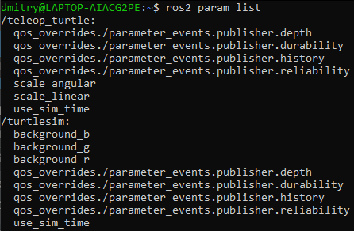
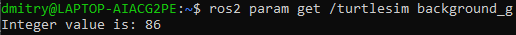

# Understanding parameters

**Цель**: Узнать, как получать, устанавливать, сохранять и перезагружать параметры в ROS 2.

# Общие сведения

Параметр - это значение конфигурации узла. Параметры можно рассматривать как настройки узла.
Узел может хранить параметры в виде целых чисел, плавающих чисел, булевых чисел, строк и списков. В ROS 2 каждый узел хранит свои собственные параметры.

# Задачи

## 1. Setup

Запустите два узла turtlesim, `/turtlesim` и `/teleop_turtle.`.

Откройте новый терминал и выполните команду:

```shell
ros2 run turtlesim turtlesim_node
```

Откройте другой терминал и выполните команду:

```shell
ros2 run turtlesim turtle_teleop_key
```

## 2. `ros2 param list`

Чтобы увидеть параметры, принадлежащие вашим узлам, откройте новый терминал и введите команду:

```shell
ros2 param list
```

Вы увидите пространства имен узлов, `/teleop_turtle` и `/turtlesim`, а затем параметры каждого узла:



У каждого узла есть параметр `use_sim_time`; он не является уникальным для turtlesim.

Судя по их названиям, параметры `/turtlesim` определяют цвет фона окна turtlesim, используя значения цветов RGB.

Чтобы определить тип параметра, вы можете использовать `ros2 param get`.

## 3. `ros2 param get`

Чтобы отобразить тип и текущее значение параметра, используйте команду:

```shell
ros2 param get <node_name> <parameter_name>
```

Давайте узнаем текущее значение параметра `/turtlesim` `background_g`:

```
ros2 param get /turtlesim background_g
```



Теперь вы знаете, что background_g имеет целочисленное значение.

Если вы выполните ту же команду для background_r и background_b, то получите значения 69 и 255, соответственно.

## 4. `ros2 param set`

Чтобы изменить значение параметра во время выполнения, используйте команду:

```shell
ros2 param set <node_name> <parameter_name> <value>
```

Изменим цвет фона `/turtlesim`:

```shell
ros2 param set /turtlesim background_r 200
```

Ваш терминал должен выдать сообщение:

```shell
Set parameter successful
```

При этом фон вашего окна turtlesim должен изменить цвет:


## 5. `ros2 param dumb`

Вы можете просмотреть все текущие значения параметров узла с помощью команды:

```shell
ros2 param dump <node_name>
```

По умолчанию команда выводит данные на стандартный вывод (`stdout`), но вы также можете перенаправить значения параметров в файл, чтобы сохранить их на будущее. Чтобы сохранить текущую конфигурацию параметров `/turtlesim` в файл `turtlesim.yaml`, введите команду:

```shell
ros2 param dump /turtlesim > turtlesim.yaml
```

Вы найдете новый файл в текущем рабочем каталоге, в котором запущена ваша консоль. Если вы откроете этот файл, то увидите следующее содержимое:

```shell
/turtlesim:
  ros__parameters:
    background_b: 255
    background_g: 86
    background_r: 200
    qos_overrides:
      /parameter_events:
        publisher:
          depth: 1000
          durability: volatile
          history: keep_last
          reliability: reliable
    use_sim_time: false
```

Выгрузка параметров пригодится, если в будущем вы захотите перезагрузить узел с теми же параметрами.

## 6. `ros2 param load`

Вы можете загрузить параметры из файла в текущий работающий узел с помощью команды:

```shell
ros2 param load <node_name> <parameter_file>
```

Чтобы загрузить файл `turtlesim.yaml`, созданный с помощью `ros2 param dump`, в параметры узла `/turtlesim`, введите команду:

```shell
ros2 param load /turtlesim turtlesim.yaml
```

Ваш терминал выдаст сообщение:

```shell
Set parameter background_b successful
Set parameter background_g successful
Set parameter background_r successful
Set parameter qos_overrides./parameter_events.publisher.depth failed: parameter 'qos_overrides./parameter_events.publisher.depth' cannot be set because it is read-only
Set parameter qos_overrides./parameter_events.publisher.durability failed: parameter 'qos_overrides./parameter_events.publisher.durability' cannot be set because it is read-only
Set parameter qos_overrides./parameter_events.publisher.history failed: parameter 'qos_overrides./parameter_events.publisher.history' cannot be set because it is read-only
Set parameter qos_overrides./parameter_events.publisher.reliability failed: parameter 'qos_overrides./parameter_events.publisher.reliability' cannot be set because it is read-only
Set parameter use_sim_time successful
```

## 7. Load parameter file on node startup

Чтобы запустить тот же узел с сохраненными значениями параметров, используйте:

```shell
ros2 run <package_name> <executable_name> --ros-args --params-file <file_name>
```

Это та же команда, которую вы всегда используете для запуска turtlesim, с добавленными флагами `--ros-args` и `--params-file`, за которыми следует файл, который вы хотите загрузить.

Остановите запущенный узел turtlesim и попробуйте перезагрузить его с сохраненными параметрами, используя:

```shell
ros2 run turtlesim turtlesim_node --ros-args --params-file turtlesim.yaml
```

Окно turtlesim должно появиться как обычно, но с фиолетовым фоном, который вы установили ранее.

# Резюме

Узлы имеют параметры, определяющие их значения по умолчанию. Вы можете получать и устанавливать значения параметров из командной строки. Также можно сохранить настройки параметров в файл, чтобы перезагрузить их в будущем сеансе.
