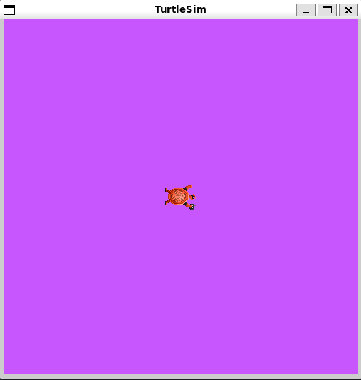

# Understanding parameters

A parameter is a configuration value of a node. You can think of parameters as node settings.
A node can store parameters as integers, floats, booleans, strings, and lists. In ROS 2, each node maintains its own parameters.

#### 1.Setup

Start up the two turtlesim nodes, `/turtlesim` and `/teleop_turtle.`

Open a new terminal and run:

```bash
ros2 run turtlesim turtlesim_node
```

Open another terminal and run:

```bash
ros2 run turtlesim turtle_teleop_key
```

#### 2 .ros2 param list

To see the parameters belonging to your nodes, open a new terminal and enter the command:

```bash
ros2 param list
```

You will see the node namespaces, /teleop_turtle and /turtlesim, followed by each node’s parameters:

```bash
/teleop_turtle:
  qos_overrides./parameter_events.publisher.depth
  qos_overrides./parameter_events.publisher.durability
  qos_overrides./parameter_events.publisher.history
  qos_overrides./parameter_events.publisher.reliability
  scale_angular
  scale_linear
  use_sim_time
/turtlesim:
  background_b
  background_g
  background_r
  qos_overrides./parameter_events.publisher.depth
  qos_overrides./parameter_events.publisher.durability
  qos_overrides./parameter_events.publisher.history
  qos_overrides./parameter_events.publisher.reliability
  use_sim_time
```

Every node has the parameter `use_sim_time`; it’s not unique to turtlesim.

Based on their names, it looks like `/turtlesim`’s parameters determine the background color of the turtlesim window using RGB color values.

To determine a parameter’s type, you can use `ros2 param get`.

#### 3.ROS2 param_get

To display the type and current value of a parameter, use the command:

```bash
ros2 param get 
```

Let’s find out the current value of /turtlesim’s parameter background_g:

```
ros2 param get /turtlesim background_g
```

Which will return the value:

```
Integer value is: 86
```

Now you know background_g holds an integer value.

If you run the same command on background_r and background_b, you will get the values 69 and 255, respectively.

#### 4.ROS2 param set

To change a parameter’s value at runtime, use the command:

```
ros2 param set 
```

Let’s change /turtlesim’s background color:

```
ros2 param set /turtlesim background_r 200
```

Your terminal should return the message:

```
Set parameter successful
```

And the background of your turtlesim window should change colors:



#### 5.ROS2 param dumb

You can view all of a node’s current parameter values by using the command:

```
ros2 param dump 
```

The command prints to the standard output (stdout) by default but you can also redirect the parameter values into a file to save them for later. To save your current configuration of /turtlesim’s parameters into the file turtlesim.yaml, enter the command:

```
ros2 param dump /turtlesim > turtlesim.yaml
```

You will find a new file in the current working directory your shell is running in. If you open this file, you’ll see the following content:

```
/turtlesim:
  ros__parameters:
    background_b: 255
    background_g: 86
    background_r: 200
    qos_overrides:
      /parameter_events:
        publisher:
          depth: 1000
          durability: volatile
          history: keep_last
          reliability: reliable
    use_sim_time: false
```

Dumping parameters comes in handy if you want to reload the node with the same parameters in the future.

#### 6.ROS2 param load

You can load parameters from a file to a currently running node using the command:

```
ros2 param load 
```

To load the turtlesim.yaml file generated with ros2 param dump into /turtlesim node’s parameters, enter the command:

```
ros2 param load /turtlesim turtlesim.yaml
```

Your terminal will return the message:

```
Set parameter background_b successful
Set parameter background_g successful
Set parameter background_r successful
Set parameter qos_overrides./parameter_events.publisher.depth failed: parameter 'qos_overrides./parameter_events.publisher.depth' cannot be set because it is read-only
Set parameter qos_overrides./parameter_events.publisher.durability failed: parameter 'qos_overrides./parameter_events.publisher.durability' cannot be set because it is read-only
Set parameter qos_overrides./parameter_events.publisher.history failed: parameter 'qos_overrides./parameter_events.publisher.history' cannot be set because it is read-only
Set parameter qos_overrides./parameter_events.publisher.reliability failed: parameter 'qos_overrides./parameter_events.publisher.reliability' cannot be set because it is read-only
Set parameter use_sim_time successful
```

#### 7.Load parameter file on node startup

To start the same node using your saved parameter values, use:

```
ros2 run <package_name> <executable_name> --ros-args --params-file <file_name>
```

This is the same command you always use to start turtlesim, with the added flags `--ros-args` and `--params-file`, followed by the file you want to load.

Stop your running turtlesim node, and try reloading it with your saved parameters, using:

```
ros2 run turtlesim turtlesim_node --ros-args --params-file turtlesim.yaml
```

The turtlesim window should appear as usual, but with the purple background you set earlier.

#### Summary

Nodes have parameters to define their default configuration values. You can get and set parameter values from the command line. You can also save the parameter settings to a file to reload them in a future session.
