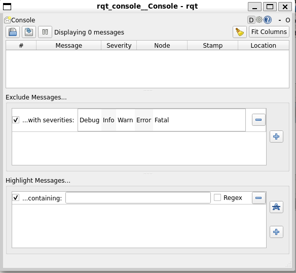
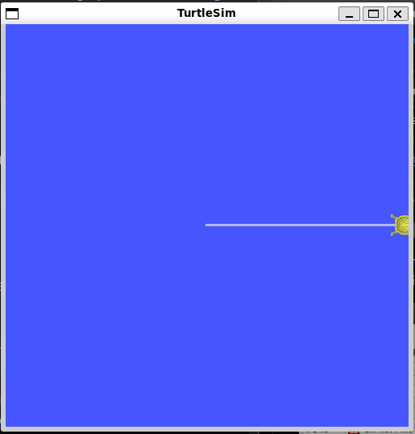
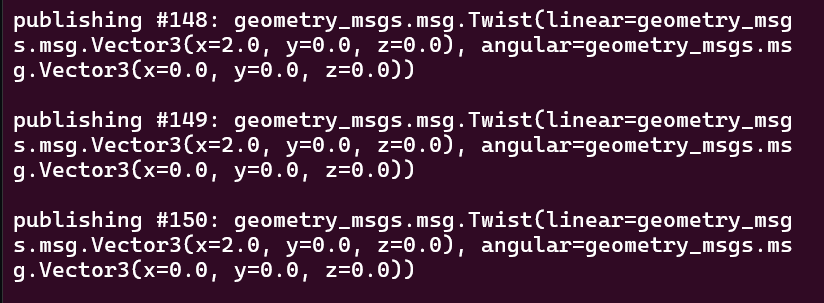
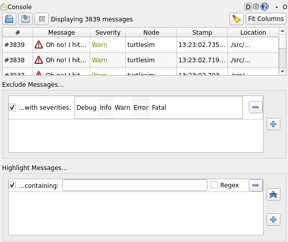

# Using rqt_console to view logs

**Цель**: познакомиться с rqt_console, инструментом для интроспекции сообщений журнала.

# Предыстория

`rqt_console` - это инструмент с графическим интерфейсом, используемый для просмотра сообщений журнала в ROS 2. Обычно сообщения журнала отображаются в вашем терминале. С помощью `rqt_console` вы можете собирать эти сообщения в течение определенного времени, просматривать их внимательно и более организованно, фильтровать их, сохранять и даже перезагружать сохраненные файлы, чтобы проанализировать их в другое время.

Узлы используют журналы для вывода сообщений о событиях и состоянии различными способами. Как правило, их содержание носит информационный характер.

# Задачи

## 1. Setup

Запустите `rqt_console` в новом терминале с помощью следующей команды:

```shell
ros2 run rqt_console rqt_console
```



В первом разделе консоли отображаются сообщения журнала вашей системы.

В центре у вас есть возможность отфильтровать сообщения по исключению уровней серьезности. Вы также можете добавить дополнительные фильтры исключений с помощью кнопки со знаком плюс справа.

Нижний раздел предназначен для выделения сообщений, содержащих введенную вами строку. В этот раздел также можно добавить дополнительные фильтры.

Теперь запустите `turtlesim` в новом терминале, выполнив следующую команду:

```shell
ros2 run turtlesim turtlesim_node
```

## 2. Сообщения в `rqt_console`

Чтобы вывести сообщения журнала на экран `rqt_console`, пусть черепаха врежется в стену. В новом терминале введите приведенную ниже команду `ros2 topic pub`:

```shell
ros2 topic pub -r 1 /turtle1/cmd_vel geometry_msgs/msg/Twist "{linear: {x: 2.0, y: 0.0, z: 0.0}, angular: {x: 0.0,y: 0.0,z: 0.0}}"
```



...

Поскольку приведенная выше команда публикует тему с постоянной скоростью, черепаха постоянно наталкивается на стену. В `rqt_console` вы увидите одно и то же сообщение с уровнем серьезности `Warn`, отображаемое снова и снова, как показано ниже:



Нажмите `Ctrl+C` в терминале, где вы выполняли команду `ros2 topic pub`, чтобы черепаха не врезалась в стену.

## 3. Уровни логгирования

Уровни логов в ROS 2 упорядочены по степени серьезности:

```
Fatal
Error
Warn
Info
Debug
```

Точного стандарта, что обозначает каждый уровень, не существует, но можно с уверенностью предположить, что:

* `Fatal` Сообщения указывают на то, что система собирается завершить работу, чтобы попытаться защитить себя от негативных последствий.
* `Error` Сообщения указывают на серьезные проблемы, которые не обязательно приведут к повреждению системы, но мешают ее нормальному функционированию.
* `Warn` Сообщения указывают на неожиданную активность или неидеальные результаты, которые могут представлять собой более глубокую проблему, но не наносят прямого вреда функциональности.
* `Info` Сообщения указывают на события и обновления состояния, которые служат визуальным подтверждением того, что система работает в соответствии с ожиданиями.
* `Debug` сообщения подробно описывают весь пошаговый процесс выполнения системы.

По умолчанию используется уровень `Info`. Вы будете видеть только сообщения стандартного уровня серьезности и более серьезных уровней.

Обычно скрываются только сообщения `Debug`, потому что это единственный уровень, менее серьезный, чем `Info`. Например, если вы установите уровень по умолчанию `Warn`, вы будете видеть только сообщения со степенью серьезности `Warn`, `Error` и `Fatal`.

### 3.1 Установка уровеня логов по умолчанию

Вы можете установить уровень регистратора по умолчанию при первом запуске узла `/turtlesim` с помощью ремаппинга. Введите в терминале следующую команду:

```shell
ros2 run turtlesim turtlesim_node --ros-args --log-level WARN
```

Теперь вы не увидите начальных сообщений уровня `Info`, которые появлялись в консоли при последнем запуске `turtlesim`. Это потому, что сообщения `Info` имеют более низкий приоритет, чем новая серьезность по умолчанию, `Warn`.

# Summary

`rqt_console` может быть очень полезен, если вам нужно внимательно изучить сообщения журнала вашей системы. Вы можете захотеть изучить сообщения журнала по разным причинам, обычно для того, чтобы выяснить, где что-то пошло не так и какие события привели к этому.
