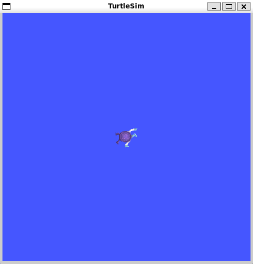
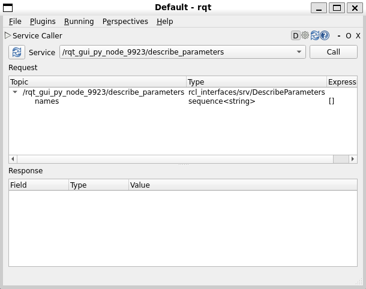
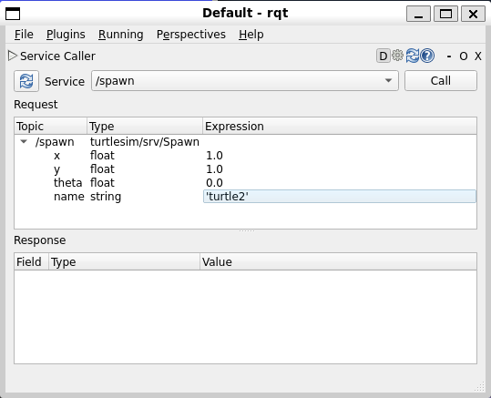
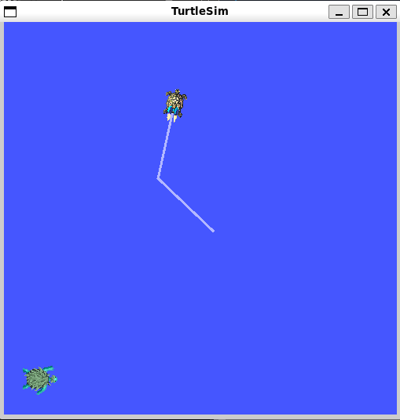
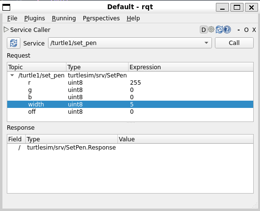
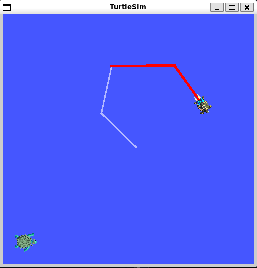
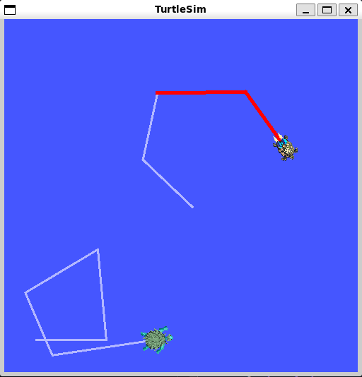

# Using `turtlesim`, `ros2`, and `rqt`

**Goal**: Install and use the turtlesim package and rqt tools to prepare for upcoming tutorials.

## 1 Install turtlesim

```shell
sudo apt update

sudo apt install ros-humble-turtlesim
```

Check that the package is installed:

```shell
ros2 pkg executables turtlesim
```

> The above command should return a list of turtlesim’s executables:

## 2 Start turtlesim

To start turtlesim, enter the following command in your terminal:

```shell
ros2 run turtlesim turtlesim_node
```


In the terminal, under the command, you will see messages from the node:

```shell
[INFO] [turtlesim]: Starting turtlesim with node name /turtlesim
[INFO] [turtlesim]: Spawning turtle [turtle1] at x=[5.544445], y=[5.544445], theta=[0.000000]
```

## 3 Use turtlesim

Open a new terminal and source ROS 2 again.

Now run a new node to control the turtle in the first node:

```shell
ros2 run turtlesim turtle_teleop_key
```

At this point you should have three windows open: a terminal running turtlesim_node, a terminal running turtle_teleop_key and the turtlesim window. Arrange these windows so that you can see the turtlesim window, but also have the terminal running turtle_teleop_key active so that you can control the turtle in turtlesim.

Use the arrow keys on your keyboard to control the turtle. It will move around the screen, using its attached “pen” to draw the path it followed so far.

## 4 Install rqt

Open a new terminal to install `rqt` and its plugins:

```shell
sudo apt update

sudo apt install '~nros-humble-rqt*'
```

To run rqt:

```shell
rqt
```

## 5 Use rqt

При первом запуске rqt, окно будет пустым. Выберите Plugins > Services > Service Caller в меню rqt.



### 5.1 Try the spawn service

Use rqt to call the `/spawn` service. `/spawn` will create another turtle in the turtlesim window.

Let `s give new turtle a name, like: turtle2. Next entre some valid coordinates, like: `x = 1.0 ` and` y = 1.0`.



> If you try to spawn a new turtle with the same name as an existing turtle, like the default turtle1, you will get an error message in the terminal running turtlesim_node:

> ```shell
> [ERROR] [turtlesim]: A turtle named [turtle1] already exists
> ```

To spawn turtle2, you then need to call the service by clicking the Call button on the upper right side of the rqt window.

If the service call was successful, you should see a new turtle (again with a random design) spawn at the coordinates you input for x and y.



If you refresh the service list in rqt, you will also see that now there are services related to the new turtle, `/turtle2/...`, in addition to `/turtle1/...`.

### 5.2 Try the set_pen service

Now let’s give turtle1 a unique pen using the `/set_pen` service:



The values for r, g and b, which are between 0 and 255, set the color of the pen turtle1 draws with, and width sets the thickness of the line.

To have turtle1 draw with a distinct red line, change the value of r to 255, and the value of width to 5. Don't forget to call the service after updating the values.

If you return to the terminal where turtle_teleop_key is running and press the arrow keys, you will see turtle1's pen has changed.



You've probably also noticed that there's no way to move `turtle2`. That's because there is no teleop node for `turtle2`.

## 6 Remapping

You need a second teleop node in order to control `turtle2`. However, if you try to run the same command as before, you will notice that this one also controls `turtle1`. The way to change this behavior is by remapping the `cmd_vel` topic.

In a new terminal, source ROS 2, and run:

```shell
ros2 run turtlesim turtle_teleop_key --ros-args --remap turtle1/cmd_vel:=turtle2/cmd_vel
```

Now, you can move `turtle2` when this terminal is active, and `turtle1` when the other terminal running `turtle_teleop_key` is active.



## 7 Close turtlesim

To stop the simulation, you can enter `Ctrl + C` in the `turtlesim_node` terminal, and `q` in the `turtle_teleop_key` terminals.
