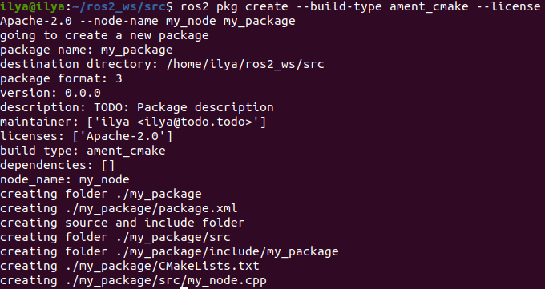
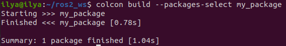
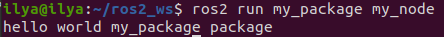
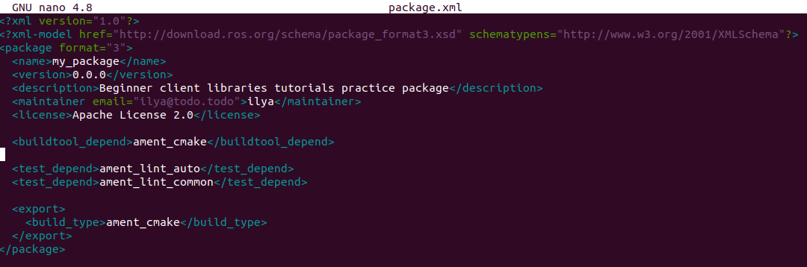

### Creating a package

## Background

### 1. What is a ROS 2 package?

A package is an organizational unit for your ROS 2 code. If you want to be able to install your code or share it with others, then you’ll need it organized in a package. With packages, you can release your ROS 2 work and allow others to build and use it easily.

Package creation in ROS 2 uses ament as its build system and colcon as its build tool. You can create a package using either CMake or Python, which are officially supported, though other build types do exist.

### 2. What makes up a ROS 2 package?

ROS 2 Python and CMake packages each have their own minimum required contents:

- `CMakeLists.txt` file that describes how to build the code within the package
- `include/<package_name>` directory containing the public headers for the package
- `package.xml` file containing meta information about the package
- `src` directory containing the source code for the package

The simplest possible package may have a file structure that looks like:

```bash
my_package/
     CMakeLists.txt
     include/my_package/
     package.xml
     src/
```

### 3. Packages in a workspace

A single workspace can contain as many packages as you want, each in their own folder. You can also have packages of different build types in one workspace (CMake, Python, etc.). You cannot have nested packages.

Best practice is to have a src folder within your workspace, and to create your packages in there. This keeps the top level of the workspace “clean”.

A trivial workspace might look like:

```bash
workspace_folder/
    src/
      cpp_package_1/
          CMakeLists.txt
          include/cpp_package_1/
          package.xml
          src/

      py_package_1/
          package.xml
          resource/py_package_1
          setup.cfg
          setup.py
          py_package_1/
      ...
      cpp_package_n/
          CMakeLists.txt
          include/cpp_package_n/
          package.xml
          src/
```

## Tasks

### 1. Create a package

Let’s use the workspace you created in the previous tutorial, `ros2_ws`, for your new package.

Make sure you are in the `src` folder before running the package creation command.

```bash
cd ~/ros2_ws/src
```

The command syntax for creating a new package in ROS 2 is:

```bash
ros2 pkg create --build-type ament_cmake --license Apache-2.0 <package_name>
```

For this tutorial, you will use the optional argument `--node-name` which creates a simple Hello World type executable in the package.

Enter the following command in your terminal:

```bash
ros2 pkg create --build-type ament_cmake --license Apache-2.0 --node-name my_node my_package
```
You will now have a new folder within your workspace’s `src` directory called `my_package`.

After running the command, your terminal will return the message:

```bash
going to create a new package
package name: my_package
destination directory: /home/user/ros2_ws/src
package format: 3
version: 0.0.0
description: TODO: Package description
maintainer: ['<name> <email>']
licenses: ['TODO: License declaration']
build type: ament_cmake
dependencies: []
node_name: my_node
creating folder ./my_package
creating ./my_package/package.xml
creating source and include folder
creating folder ./my_package/src
creating folder ./my_package/include/my_package
creating ./my_package/CMakeLists.txt
creating ./my_package/src/my_node.cpp
```



You can see the automatically generated files for the new package.

### 2. Build a package

Putting packages in a workspace is especially valuable because you can build many packages at once by running `colcon build` in the workspace root. Otherwise, you would have to build each package individually.

Return to the root of your workspace:

```bash
cd ~/ros2_ws
```

Now you can build your packages:

```bash
colcon build
```

Recall from the last tutorial that you also have the `ros_tutorials` packages in your `ros2_ws`. You might have noticed that running `colcon build` also built the `turtlesim` package. That’s fine when you only have a few packages in your workspace, but when there are many packages, `colcon build` can take a long time.

To build only the `my_package` package next time, you can run:

```bash
colcon build --packages-select my_package
```



### 3. Source the setup file

To use your new package and executable, first open a new terminal and source your main ROS 2 installation.

Then, from inside the `ros2_ws` directory, run the following command to source your workspace:

```bash
source install/local_setup.bash
```

Now that your workspace has been added to your path, you will be able to use your new package’s executables.

### 4. Use the package

To run the executable you created using the `--node-name` argument during package creation, enter the command:

```bash
ros2 run my_package my_node
```

Which will return a message to your terminal:

```bash
hello world my_package package
```


### 5. Examine package contents

Inside `ros2_ws/src/my_package`, you will see the files and folders that `ros2 pkg create` automatically generated:

```bash
CMakeLists.txt  include  package.xml  src
```

### 6. Customize package.xml

You may have noticed in the return message after creating your package that the fields `description` and `license` contain `TODO` notes. That’s because the package description and license declaration are not automatically set, but are required if you ever want to release your package. The `maintainer` field may also need to be filled in.

From `ros2_ws/src/my_package`, open `package.xml` using your preferred text editor:

```bash
<?xml version="1.0"?>
<?xml-model
   href="http://download.ros.org/schema/package_format3.xsd"
   schematypens="http://www.w3.org/2001/XMLSchema"?>
<package format="3">
 <name>my_package</name>
 <version>0.0.0</version>
 <description>TODO: Package description</description>
 <maintainer email="user@todo.todo">user</maintainer>
 <license>TODO: License declaration</license>

 <buildtool_depend>ament_cmake</buildtool_depend>

 <test_depend>ament_lint_auto</test_depend>
 <test_depend>ament_lint_common</test_depend>

 <export>
   <build_type>ament_cmake</build_type>
 </export>
</package>
```

Input your name and email on the maintainer line if it hasn’t been automatically populated for you. Then, edit the description line to summarize the package:

```bash
<description>Beginner client libraries tutorials practice package</description>
```

Then, update the license line. You can read more about open source licenses here. Since this package is only for practice, it’s safe to use any license. We’ll use Apache License 2.0:

```bash
<license>Apache License 2.0</license>
```

Don’t forget to save once you’re done editing.



Below the license tag, you will see some tag names ending with _depend. This is where your package.xml would list its dependencies on other packages, for colcon to search for. my_package is simple and doesn’t have any dependencies, but you will see this space being utilized in upcoming tutorials.

## Summary

You’ve created a package to organize your code and make it easy to use for others.

Your package was automatically populated with the necessary files, and then you used colcon to build it so you can use its executables in your local environment.
