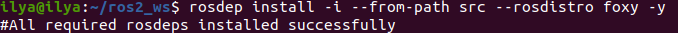
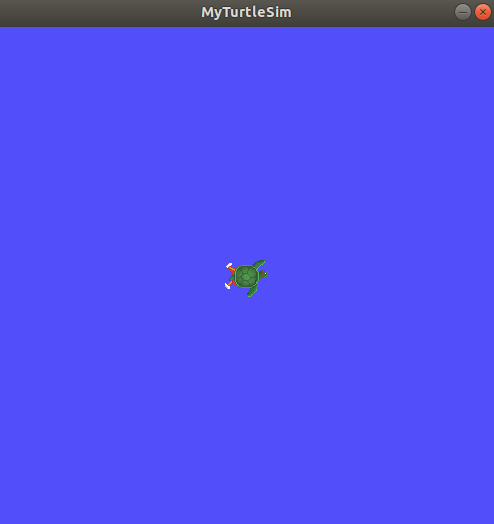
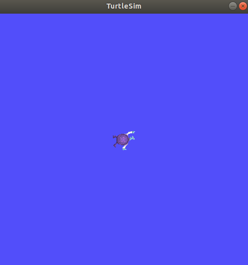

# Создание рабочего пространства

## Справочная информация

Рабочее пространство - это каталог, содержащий пакеты ROS 2. Перед использованием ROS 2 необходимо создать рабочее пространство установки ROS 2 в терминале, в котором вы планируете работать. Это сделает пакеты ROS 2 доступными для использования в этом терминале.

## Задачи

### 1. Исходное окружение ROS 2

В зависимости от того, как вы установили ROS 2 (из исходников или двоичных файлов) и на какой платформе вы работаете, ваша точная команда исходников будет отличаться:

```bash
source /opt/ros/humble/setup.bash
```

### 2. Создайте новый каталог

Лучше всего создавать новую директорию для каждого нового рабочего пространства. Название не имеет значения, но полезно, чтобы оно указывало на назначение рабочей области. Давайте выберем имя директории `ros2_ws`, для «рабочей области разработки»:

```bash
mkdir -p ~/ros2_ws/src
cd ~/ros2_ws/src
```

Еще одна лучшая практика - помещать все пакеты в рабочую область в каталог src. Приведенный выше код создает каталог `src` внутри `ros2_ws`, а затем переходит в него.

### 3. Клонирование примера репо

Перед клонированием убедитесь, что вы все еще находитесь в директории `ros2_ws/src`.

У репо может быть несколько веток. Вам нужно проверить ту, которая нацелена на ваш установленный дистрибутив ROS 2. Когда вы будете клонировать это репо, добавьте аргумент `-b`, за которым следует эта ветка.

В каталоге `ros2_ws/src` выполните следующую команду:

```bash
git clone https://github.com/ros/ros_tutorials.git -b humble
```

Теперь `ros_tutorials` клонирован в ваше рабочее пространство. Репозиторий `ros_tutorials` содержит пакет `turtlesim`, который мы будем использовать в остальной части этого руководства. Другие пакеты в этом репозитории не собираются, потому что содержат файл `COLCON_IGNORE`.

Пока что вы заполнили свое рабочее пространство примером пакета, но это еще не полностью функциональное рабочее пространство. Вам нужно сначала устранить зависимости, а затем собрать рабочее пространство.

### 4. Устранение зависимостей

Перед сборкой рабочего пространства необходимо разрешить зависимости пакета. Возможно, у вас уже есть все зависимости, но лучше всего проверять их при каждом клонировании. Вы же не хотите, чтобы сборка завершилась неудачей после долгого ожидания и только потом выяснилось, что зависимостей не хватает.

Из корня рабочей области (`ros2_ws`) выполните следующую команду:

```bash
# cd if you're still in the ``src`` directory with the ``ros_tutorials`` clone
cd ..
rosdep install -i --from-path src --rosdistro humble -y
```

Если у вас уже есть все зависимости, консоль вернется:

```bash
#All required rosdeps installed successfully
```



Пакеты объявляют о своих зависимостях в файле package.xml. Эта команда просматривает эти объявления и устанавливает те, которые отсутствуют.

### 5. Построение рабочего пространства с помощью colcon

Теперь из корня рабочего пространства (`ros2_ws`) вы можете собрать пакеты с помощью команды:

```bash
colcon build
```

Консоль выдаст следующее сообщение:

```bash
Starting >>> turtlesim
Finished <<< turtlesim [5.49s]

Summary: 1 package finished [5.58s]
```

После завершения сборки введите команду в корне рабочей области (~/ros2_ws):

```bash
ls
```

И вы увидите, что colcon создал новые каталоги:

```bash
build  install  log  src
```

В каталоге install находятся установочные файлы рабочей области, которые вы можете использовать для создания оверлея.

### 6. Создание оверлея

Перед созданием оверлея очень важно открыть новый терминал, отдельный от того, в котором вы собирали рабочее пространство. Исходное наложение в том же терминале, где вы создавали рабочее пространство, или в том же здании, где создается наложение, может создать сложные проблемы.

В новом терминале создайте основное окружение ROS 2 в качестве «подложки», чтобы можно было построить оверлей «поверх» него:

```bash
source /opt/ros/humble/setup.bash
```

Перейдите в корень рабочей области:

```bash
cd ~/ros2_ws
```

В корневой части создайте источник оверлея:

```bash
source install/local_setup.bash
```

Теперь вы можете запустить пакет turtlesim из оверлея:

```bash
ros2 run turtlesim turtlesim_node
```

### 7. Изменение оверлея

Вы можете изменить `turtlesim` в вашем оверлее, отредактировав строку заголовка в окне turtlesim. Для этого найдите файл `turtle_frame.cpp` в каталоге `~/ros2_ws/src/ros_tutorials/turtlesim/src`. Откройте файл `turtle_frame.cpp` в удобном для вас текстовом редакторе.

Найдите функцию `setWindowTitle(«TurtleSim»);`, измените значение `«TurtleSim»` на `«MyTurtleSim»` и сохраните файл.

Вернитесь в первый терминал, где вы ранее запускали `colcon build`, и запустите ее снова.

Вернитесь во второй терминал (где находится оверлей) и снова запустите turtlesim:

```bash
ros2 run turtlesim turtlesim_node
```

Вы увидите, что в строке заголовка окна turtlesim теперь написано «MyTurtleSim».



Даже если ваша основная среда ROS 2 была создана в этом терминале ранее, оверлей среды `ros2_ws` имеет приоритет над содержимым подложки.

Чтобы убедиться, что ваша подложка не повреждена, откройте новый терминал и создайте только вашу установку ROS 2. Снова запустите turtlesim:

```bash
ros2 run turtlesim turtlesim_node
```



Видно, что изменения в оверлее фактически не повлияли ни на что в подложке.

## Резюме

В этом уроке вы использовали основную установку дистрибутива ROS 2 в качестве подложки и создали оверлей, клонируя и собирая пакеты в новом рабочем пространстве. Оверлей добавляется к пути и имеет приоритет над подложкой, как вы видели на примере модифицированного turtlesim.

Использование оверлеев рекомендуется при работе над небольшим количеством пакетов, чтобы не размещать все в одном рабочем пространстве и не перестраивать огромное рабочее пространство на каждой итерации.
