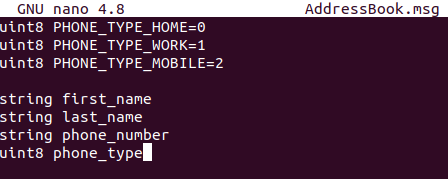
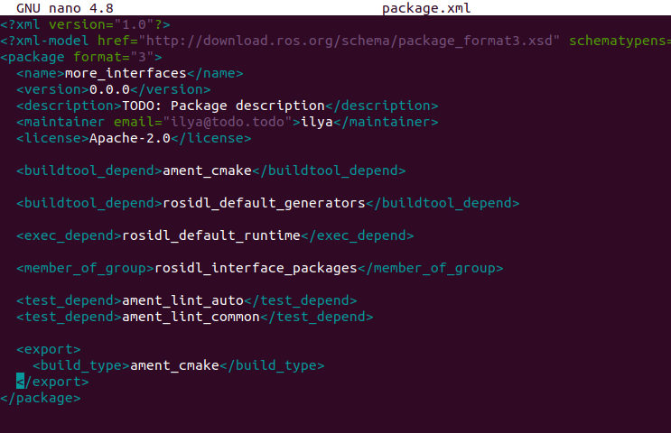
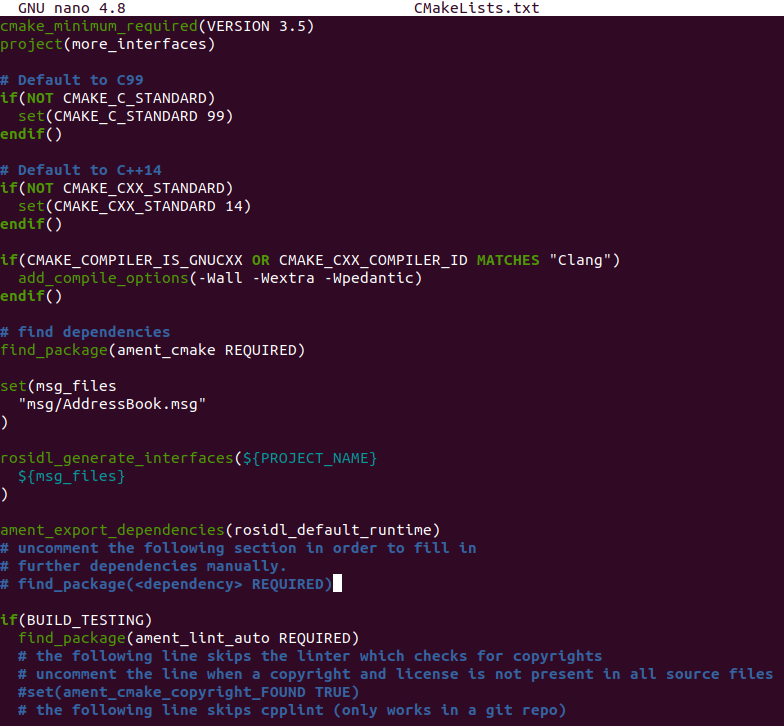
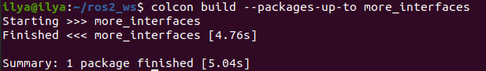
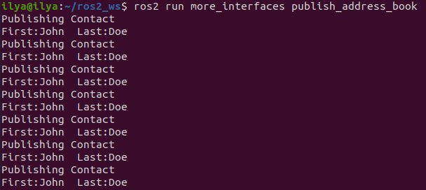

# Реализация пользовательских интерфейсов

## Задания

### 1. Создайте пакет

В каталоге `src` рабочей области создайте пакет `more_interfaces` и выделите в нем каталог для msg-файлов:

```bash
ros2 pkg create --build-type ament_cmake --license Apache-2.0 more_interfaces
mkdir more_interfaces/msg
```

### 2. Создайте файл msg

Внутри `more_interfaces/msg` создайте новый файл `AddressBook.msg` и вставьте в него следующий код, чтобы создать сообщение, предназначенное для передачи информации о человеке:

```bash
uint8 PHONE_TYPE_HOME=0
uint8 PHONE_TYPE_WORK=1
uint8 PHONE_TYPE_MOBILE=2

string first_name
string last_name
string phone_number
uint8 phone_type
```



Это сообщение состоит из следующих полей:

- first_name: типа string

- фамилия_имя: типа string

- номер_телефона: типа string

- phone_type: типа uint8, с несколькими определенными именованными константными значениями

Обратите внимание, что в определении сообщения можно задать значения по умолчанию для полей. Дополнительные способы настройки интерфейсов см. в разделе Интерфейсы.

Далее нам нужно убедиться, что файл msg превратился в исходный код для C++, Python и других языков.

### 2.1 Создайте msg-файл

Откройте файл `package.xml` и добавьте следующие строки:

```bash
<buildtool_depend>rosidl_default_generators</buildtool_depend>

<exec_depend>rosidl_default_runtime</exec_depend>

<member_of_group>rosidl_interface_packages</member_of_group>
```




Обратите внимание, что во время сборки нам нужны `rosidl_default_generators`, а во время выполнения - только `rosidl_default_runtime`.

Откройте `CMakeLists.txt` и добавьте следующие строки:

Найдите пакет, который генерирует код сообщений из файлов msg/srv:

```bash
find_package(rosidl_default_generators REQUIRED)
```

Объявите список сообщений, которые вы хотите сгенерировать:

```bash
set(msg_files
  "msg/AddressBook.msg"
)
```

Добавляя .msg-файлы вручную, мы убеждаемся, что CMake знает, когда ему нужно переконфигурировать проект после добавления других .msg-файлов.

Сгенерируйте сообщения:

```bash
rosidl_generate_interfaces(${PROJECT_NAME}
  ${msg_files}
)
```

Также убедитесь, что вы экспортировали зависимость времени выполнения сообщения:

```bash
ament_export_dependencies(rosidl_default_runtime)
```




Теперь вы готовы сгенерировать исходные файлы из определения msg. Шаг компиляции мы пока пропустим, так как сделаем все вместе ниже, в шаге 4.

### 3. Используйте интерфейс из того же пакета

Теперь мы можем начать писать код, который использует это сообщение.

В `more_interfaces/src` создайте файл `publish_address_book.cpp` и вставьте в него следующий код:

```bash
#include <chrono>
#include <memory>

#include "rclcpp/rclcpp.hpp"
#include "more_interfaces/msg/address_book.hpp"

using namespace std::chrono_literals;

class AddressBookPublisher : public rclcpp::Node
{
public:
  AddressBookPublisher()
  : Node("address_book_publisher")
  {
    address_book_publisher_ =
      this->create_publisher<more_interfaces::msg::AddressBook>("address_book", 10);

    auto publish_msg = [this]() -> void {
        auto message = more_interfaces::msg::AddressBook();

        message.first_name = "John";
        message.last_name = "Doe";
        message.phone_number = "1234567890";
        message.phone_type = message.PHONE_TYPE_MOBILE;

        std::cout << "Publishing Contact\nFirst:" << message.first_name <<
          "  Last:" << message.last_name << std::endl;

        this->address_book_publisher_->publish(message);
      };
    timer_ = this->create_wall_timer(1s, publish_msg);
  }

private:
  rclcpp::Publisher<more_interfaces::msg::AddressBook>::SharedPtr address_book_publisher_;
  rclcpp::TimerBase::SharedPtr timer_;
};


int main(int argc, char * argv[])
{
  rclcpp::init(argc, argv);
  rclcpp::spin(std::make_shared<AddressBookPublisher>());
  rclcpp::shutdown();

  return 0;
}
```

### 3.1 Объяснение кода

Включение заголовка нашего только что созданного файла `AddressBook.msg`.

```bash
#include "more_interfaces/msg/address_book.hpp"
```

Создание узла и издателя `AddressBook`.

```bash
using namespace std::chrono_literals;

class AddressBookPublisher : public rclcpp::Node
{
public:
  AddressBookPublisher()
  : Node("address_book_publisher")
  {
    address_book_publisher_ =
      this->create_publisher<more_interfaces::msg::AddressBook>("address_book");
```

Создание обратного вызова для периодической публикации сообщений.

```bash
auto publish_msg = [this]() -> void {
```

Создание экземпляра сообщения `AddressBook`, которое мы впоследствии опубликуем.

```bash
auto message = more_interfaces::msg::AddressBook();
```

Заполнение полей Адресной книги.

```bash
message.first_name = "John";
message.last_name = "Doe";
message.phone_number = "1234567890";
message.phone_type = message.PHONE_TYPE_MOBILE;
```

Периодическая отправка сообщений

```bash
std::cout << "Publishing Contact\nFirst:" << message.first_name <<
  "  Last:" << message.last_name << std::endl;

this->address_book_publisher_->publish(message);
```

Создаем 1-секундный таймер, который будет вызывать нашу функцию publish_msg каждую секунду.

```bash
timer_ = this->create_wall_timer(1s, publish_msg);
```

### 3.2 Создание издателя

Нам нужно создать новую цель для этого узла в файле `CMakeLists.txt`:

```bash
find_package(rclcpp REQUIRED)

add_executable(publish_address_book src/publish_address_book.cpp)
ament_target_dependencies(publish_address_book rclcpp)

install(TARGETS
    publish_address_book
  DESTINATION lib/${PROJECT_NAME})
```

### 3.3 Ссылка на интерфейс

Чтобы использовать сообщения, сгенерированные в том же пакете, нам нужно использовать следующий код CMake:

```bash
rosidl_get_typesupport_target(cpp_typesupport_target
  ${PROJECT_NAME} rosidl_typesupport_cpp)

target_link_libraries(publish_address_book "${cpp_typesupport_target}")
```

Это позволяет найти соответствующий сгенерированный код C++ из `AddressBook.msg` и скомпоновать его.

Вы могли заметить, что этот шаг не требовался, когда используемые интерфейсы были из другого пакета, который был собран независимо. Этот код CMake требуется только в том случае, если вы хотите использовать интерфейсы из того же пакета, в котором они определены.

### 4. Тестирование

Вернитесь в корень рабочей области, чтобы собрать пакет:

```bash
cd ~/ros2_ws
colcon build --packages-up-to more_interfaces
```



Затем создайте рабочую область и запустите издателя:

```bash
source install/local_setup.bash
ros2 run more_interfaces publish_address_book
```



Вы должны увидеть, как издатель передает заданный вами msg, включая значения, установленные в `publish_address_book.cpp`.

Чтобы убедиться, что сообщение публикуется в теме `address_book`, откройте другой терминал, выберите источник рабочей области и вызовите `topic echo`:

```bash
source install/setup.bash
ros2 topic echo /address_book
```

## Заключение

В этом уроке вы опробовали различные типы полей для определения интерфейсов, а затем создали интерфейс в том же пакете, в котором он используется.

Вы также узнали, как использовать другой интерфейс в качестве типа поля, а также о том, какие документы `package.xml`, `CMakeLists.txt` и `#include` необходимы для использования этой возможности.
