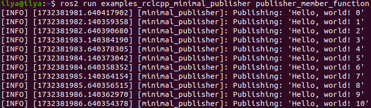
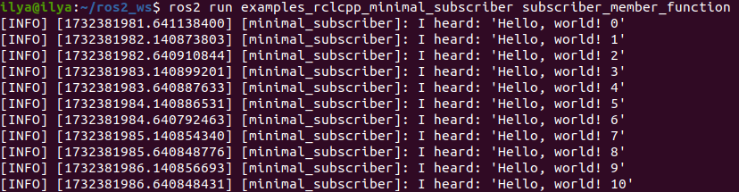

# Using `colcon` to build packages

`colcon` is an iteration on the ROS build tools `catkin_make`, `catkin_make_isolated`, `catkin_tools` and `ament_tools`.

## Install colcon

```bash
sudo apt install python3-colcon-common-extensions
```
## Basics

A ROS workspace is a directory with a particular structure. Commonly there is a `src` subdirectory. Inside that subdirectory is where the source code of ROS packages will be located. Typically the directory starts otherwise empty.

`colcon` does out of source builds. By default it will create the following directories as peers of the `src` directory:

- The `build` directory will be where intermediate files are stored. For each package a subfolder will be created in which e.g. CMake is being invoked.
- The `install` directory is where each package will be installed to. By default each package will be installed into a separate subdirectory.
- The `log` directory contains various logging information about each colcon invocation.

### Create a workspace

First, create a directory (`ros2_ws`) to contain our workspace:

```bash
mkdir -p ~/ros2_ws/src
cd ~/ros2_ws
```
At this point the workspace contains a single empty directory `src`:

```bash
.
└── src

1 directory, 0 files
```

### Add some sources

Let’s clone the examples repository into the `src` directory of the workspace:

```bash
git clone https://github.com/ros2/examples src/examples -b humble
```
Now the workspace should have the source code to the ROS 2 examples:

```bash
.
└── src
    └── examples
        ├── CONTRIBUTING.md
        ├── LICENSE
        ├── rclcpp
        ├── rclpy
        └── README.md

4 directories, 3 files
```

### Build the workspace

In the root of the workspace, run `colcon build`. Since build types such as `ament_cmake` do not support the concept of the `devel` space and require the package to be installed, colcon supports the option `--symlink-install`. This allows the installed files to be changed by changing the files in the `source` space (e.g. Python files or other non-compiled resources) for faster iteration.

```bash
colcon build --symlink-install
```

After the build is finished, we should see the `build`, `install`, and `log` directories:

```bash
.
├── build
├── install
├── log
└── src

4 directories, 0 files
```

### Run tests

To run tests for the packages we just built, run the following:

```bash
colcon test
```

### Source the environment

When colcon has completed building successfully, the output will be in the `install` directory. Before you can use any of the installed executables or libraries, you will need to add them to your path and library paths. colcon will have generated bash/bat files in the `install` directory to help set up the environment. These files will add all of the required elements to your path and library paths as well as provide any bash or shell commands exported by packages.

```bash
source install/setup.bash
```

### Try a demo
With the environment sourced, we can run executables built by colcon. Let’s run a subscriber node from the examples:

```bash
ros2 run examples_rclcpp_minimal_subscriber subscriber_member_function
```

In another terminal, let’s run a publisher node (don’t forget to source the setup script):

```bash
ros2 run examples_rclcpp_minimal_publisher publisher_member_function
```

You should see messages from the publisher and subscriber with numbers incrementing.





## Setup `colcon_cd`

The command `colcon_cd` allows you to quickly change the current working directory of your shell to the directory of a package. As an example `colcon_cd some_ros_package` would quickly bring you to the directory `~/ros2_ws/src/some_ros_package`.

```bash
echo "source /usr/share/colcon_cd/function/colcon_cd.sh" >> ~/.bashrc
echo "export _colcon_cd_root=/opt/ros/humble/" >> ~/.bashrc
```

## Setup `colcon` tab completion

The `colcon` command supports command completion for bash and bash-like shells. The `colcon-argcomplete` package must be installed, and some setup may be required to make it work.
