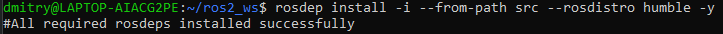
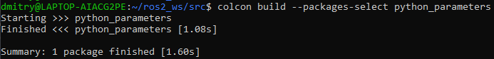
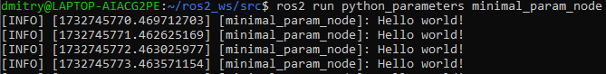
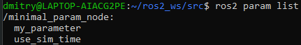
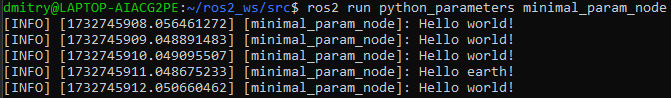
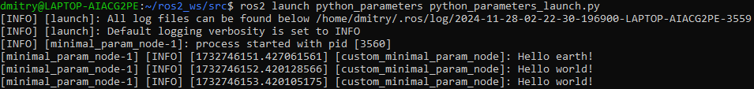

# Using parameters in a class (Python)

**Цель**: Создать и запустить класс с параметрами ROS с помощью Python.

# Общие сведения

При создании собственных узлов иногда требуется добавить параметры, которые можно задать из файла запуска.

# Задачи

## 1 Создание пакета

Откройте новый терминал и создайте исходники вашей системы ROS 2, чтобы команды `ros2` работали.

Напомним, что пакеты должны создаваться в директории `src`, а не в корне рабочей области. Перейдите в каталог `ros2_ws/src` и создайте новый пакет:

```shell
ros2 pkg create --build-type ament_python --license Apache-2.0 python_parameters --dependencies rclpy
```

Ваш терминал выдаст сообщение, подтверждающее создание пакета `python_parameters` и всех необходимых файлов и папок.

Аргумент `--dependencies` автоматически добавит необходимые строки зависимостей в `package.xml` и `CMakeLists.txt`.

### 1.1 Обновление package.xml

Поскольку вы использовали опцию `--dependencies` при создании пакета, вам не нужно вручную добавлять зависимости в `package.xml` или `CMakeLists.txt`.

Однако, как всегда, не забудьте добавить в `package.xml` описание, email и имя сопровождающего, а также информацию о лицензии.

```xml
<description>Python parameter tutorial</description>
<maintainer email="you@email.com">Your Name</maintainer>
<license>Apache License 2.0</license>
```

## 2 Напишите узел на языке Python

Внутри каталога `ros2_ws/src/python_parameters/python_parameters` создайте новый файл `python_parameters_node.py` и вставьте в него следующий код:

```python
import rclpy
import rclpy.node

class MinimalParam(rclpy.node.Node):
    def __init__(self):
        super().__init__('minimal_param_node')

        self.declare_parameter('my_parameter', 'world')

        self.timer = self.create_timer(1, self.timer_callback)

    def timer_callback(self):
        my_param = self.get_parameter('my_parameter').get_parameter_value().string_value

        self.get_logger().info('Hello %s!' % my_param)

        my_new_param = rclpy.parameter.Parameter(
            'my_parameter',
            rclpy.Parameter.Type.STRING,
            'world'
        )
        all_new_parameters = [my_new_param]
        self.set_parameters(all_new_parameters)

def main():
    rclpy.init()
    node = MinimalParam()
    rclpy.spin(node)

if __name__ == '__main__':
    main()
```

### 2.1 Анализ кода

Следующий фрагмент кода создает класс и конструктор. Строка `self.declare_parameter('my_parameter', 'world')` конструктора создает параметр с именем `my_parameter` и значением по умолчанию world. Тип параметра выводится из значения по умолчанию, поэтому в данном случае он будет установлен в тип string. Далее инициализируется `таймер` с периодом 1, что заставляет функцию `timer_callback` выполняться раз в секунду.

```python
class MinimalParam(rclpy.node.Node):
    def __init__(self):
        super().__init__('minimal_param_node')

        self.declare_parameter('my_parameter', 'world')

        self.timer = self.create_timer(1, self.timer_callback)
```

Первая строка функции `timer_callback` получает параметр `my_parameter` от узла и сохраняет его в `my_param`. Далее функция `get_logger` обеспечивает регистрацию события. Затем функция `set_parameters` устанавливает параметр `my_parameter` обратно в строковое значение по умолчанию `world`. В случае, если пользователь изменил параметр извне, это гарантирует, что он всегда будет возвращен к исходному значению.

```python
def timer_callback(self):
    my_param = self.get_parameter('my_parameter').get_parameter_value().string_value

    self.get_logger().info('Hello %s!' % my_param)

    my_new_param = rclpy.parameter.Parameter(
        'my_parameter',
        rclpy.Parameter.Type.STRING,
        'world'
    )
    all_new_parameters = [my_new_param]
    self.set_parameters(all_new_parameters)
```

За `timer_callback` следует наш `main`. Здесь инициализируется ROS 2, создается экземпляр класса `MinimalParam`, и `rclpy.spin` начинает обрабатывать данные с узла.

```python
def main():
    rclpy.init()
    node = MinimalParam()
    rclpy.spin(node)

if __name__ == '__main__':
    main()
```

#### 2.1.1 (Необязательно) Добавить дескриптор параметра

Опционально можно задать дескриптор параметра. Дескрипторы позволяют указать текстовое описание параметра и его ограничения, например, сделать его доступным только для чтения, указать диапазон и т. д. Чтобы это работало, конструктор  `__init__` нужно изменить на:

```python
# ...

class MinimalParam(rclpy.node.Node):
    def __init__(self):
        super().__init__('minimal_param_node')

        from rcl_interfaces.msg import ParameterDescriptor
        my_parameter_descriptor = ParameterDescriptor(description='This parameter is mine!')

        self.declare_parameter('my_parameter', 'world', my_parameter_descriptor)

        self.timer = self.create_timer(1, self.timer_callback)

# ...
```

### 2.2 Добавьте точку входа

Откройте файл `setup.py`. Снова установите поля `maintainer`, `maintainer_email`, `description` и `license` в ваш `package.xml`:

```python
maintainer='YourName',
maintainer_email='you@email.com',
description='Python parameter tutorial',
license='Apache License 2.0',
```

Добавьте следующую строку в скобках `console_scripts` в поле `entry_points`:

```python
entry_points={
    'console_scripts': [
        'minimal_param_node = python_parameters.python_parameters_node:main',
    ],
},
```

Не забудьте сохранить)

## 3 Сборка и запуск

Хорошей практикой является запуск `rosdep` в корне вашего рабочего пространства (`ros2_ws`), чтобы проверить наличие отсутствующих зависимостей перед сборкой:

```shell
rosdep install -i --from-path src --rosdistro humble -y
```



Перейдите в корень рабочей области, `ros2_ws`, и соберите новый пакет:

```shell
colcon build --packages-select python_parameters
```



Откройте новый терминал, перейдите в раздел `ros2_ws` и найдите установочные файлы:

```shell
source install/local_setup.bash
```

Теперь запустите узел:

```shell
ros2 run python_parameters minimal_param_node
```



Терминал должен ежесекундно выдавать следующее сообщение:

```shell
[INFO] [parameter_node]: Hello world!
```

Теперь можно увидеть значение параметра по умолчанию, но если хочется иметь возможность задать его самостоятельно. Это можно сделать двумя способами.

### 3.1 Изменение через консоль

Убедитесь, что узел запущен:

```shell
ros2 run python_parameters minimal_param_node
```

Откройте другой терминал, снова создайте файлы настроек внутри `ros2_ws` и введите следующую строку:

```shell
ros2 param list
```



Там вы увидите пользовательский параметр `my_parameter`. Чтобы изменить его, просто выполните следующую строку в консоли:

```shell
ros2 param set /minimal_param_node my_parameter earth
```

Вы знаете, что все прошло успешно, если получили вывод `Set parameter successful`. Если вы посмотрите на другой терминал, то увидите, что вывод изменился на `[INFO] [minimal_param_node]: Hello Earth!`



Поскольку после этого узел установил параметр обратно в `world`, дальнейший вывод показывает `[INFO] [minimal_param_node]: Hello world!`
### 3.2 Change via a launch file

Вы также можете задать параметры в файле запуска, но сначала вам нужно будет добавить каталог запуска. Внутри каталога `ros2_ws/src/python_parameters/` создайте новый каталог с именем `launch`. В ней создайте новый файл `python_parameters_launch.py`.

```python
from launch import LaunchDescription
from launch_ros.actions import Node

def generate_launch_description():
    return LaunchDescription([
        Node(
            package='python_parameters',
            executable='minimal_param_node',
            name='custom_minimal_param_node',
            output='screen',
            emulate_tty=True,
            parameters=[
                {'my_parameter': 'earth'}
            ]
        )
    ])
```

Здесь видно, что мы установили `my_parameter` в `earth` при запуске нашего узла `parameter_node`. Добавив две строки ниже, мы обеспечиваем вывод в консоль.

```shell
output="screen",
emulate_tty=True,
```

Теперь откройте файл `setup.py`. Добавьте `import` в верхнюю часть файла, а также другое новое выражение к параметру `data_files`, чтобы включить все файлы запуска:

```python
import os
from glob import glob
# ...

setup(
  # ...
  data_files=[
      # ...
      (os.path.join('share', package_name), glob('launch/*launch.[pxy][yma]*')),
    ]
  ) 
```

Откройте консоль, перейдите в корень рабочей области, `ros2_ws`, и соберите новый пакет:

```shell
colcon build --packages-select python_parameters
```

Затем перейдите к файлам настроек в новом терминале:

```shell
source install/setup.bash
```

Теперь запустите узел с помощью файла запуска, который мы только что создали:

```shell
ros2 launch python_parameters python_parameters_launch.py
```

Терминал должен ежесекундно выдавать следующее сообщение:

```shell
[INFO] [custom_minimal_param_node]: Hello earth!
```



# Заключение
Мы создали узел с пользовательским параметром, который может быть задан как из файла запуска, так и из командной строки. Добавили зависимости, исполняемые файлы и файл запуска в файлы конфигурации пакета, чтобы можно было собрать и запустить их и увидеть работу параметров.