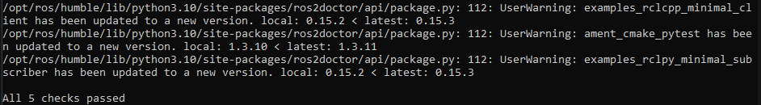
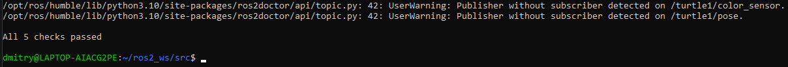
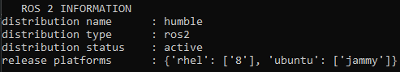

# Using `ros2doctor` to identify issues

**Цель**: Выявить проблемы в настройках ROS 2 с помощью инструмента `ros2doctor`.

# Общие сведения

Если ваша установка ROS 2 работает не так, как ожидалось, вы можете проверить ее настройки с помощью инструмента ros2doctor.

ros2doctor проверяет все аспекты ROS 2, включая платформу, версию, сеть, окружение, запущенные системы и многое другое, и предупреждает вас о возможных ошибках и причинах проблем.

# Задачи

## 1 Проверьте свою установку

Давайте проверим общую настройку ROS 2 в целом с помощью `ros2doctor`. Для начала запустите ROS 2 в новом терминале, затем введите команду:

```shell
ros2 doctor
```

В результате будут проверены все модули вашей установки и выданы предупреждения и ошибки.

Если ваша установка ROS 2 находится в безупречном состоянии, то на экране появится сообщение, похожее на это:

```shell
All <n> checks passed
```



Однако нет ничего необычного в том, чтобы получить несколько предупреждений. Предупреждение `UserWarning` не означает, что ваша установка непригодна для использования; скорее всего, это просто признак того, что что-то настроено не идеально.

Если вы получите предупреждение, оно будет выглядеть примерно так:

```shell
<path>: <line>: UserWarning: <message>
```

Например, `ros2doctor` обнаружит это предупреждение, если вы используете нестабильный дистрибутив ROS 2:

```shell
UserWarning: Distribution <distro> is not fully supported or tested. To get more consistent features, download a stable version at https://index.ros.org/doc/ros2/Installation/
```

Если `ros2doctor` находит в вашей системе только предупреждения, вы все равно получите сообщение `All <n> checks passed`.

Большинство проверок классифицируются как предупреждения, а не ошибки. В основном именно пользователь определяет важность информации, которую возвращает `ros2doctor`. Если проверка обнаружит редкую ошибку в вашей настройке, на которую указывает `UserWarning: ERROR:`, проверка считается неудачной.

Вы увидите сообщение, похожее на следующий список отзывов о проблемах:

```shell
1/3 checks failed

Failed modules:  network
```

Ошибка указывает на то, что в системе отсутствуют важные настройки или функции, имеющие решающее значение для ROS 2. Чтобы система функционировала должным образом, необходимо устранить ошибки.

## 2 Проверка системы

Вы также можете проверить работающую систему ROS 2, чтобы выявить возможные причины проблем. Чтобы увидеть, как `ros2doctor` работает на работающей системе, давайте запустим turtlesim, в котором узлы активно общаются друг с другом.

Запустите систему, открыв новый терминал, выбрав ROS 2 и введя команду:

```shell
ros2 run turtlesim turtlesim_node
```

Откройте другой терминал и запустите ROS 2, чтобы запустить teleop controls:

```shell
ros2 run turtlesim turtle_teleop_key
```

Теперь снова запустите `ros2doctor` в отдельном терминале. Вы увидите предупреждения и ошибки, которые были в прошлый раз, когда вы запускали `ros2doctor` на своей установке, если они были. Вслед за ними появится несколько новых предупреждений, относящихся к самой системе:

```shell
UserWarning: Publisher without subscriber detected on /turtle1/color_sensor.
UserWarning: Publisher without subscriber detected on /turtle1/pose.
```



Похоже, что узел `/turtlesim` публикует данные в два топика, на которые никто не подписан, и ros2doctor считает, что это может привести к проблемам.

Если вы выполните команды для эха топиков `/color_sensor` и `/pose`, эти предупреждения исчезнут, потому что у издателей появятся подписчики.

Вы можете попробовать это сделать, открыв два новых терминала при запущенном turtlesim, запустив в каждом из них ROS 2 и выполнив каждую из следующих команд в своем терминале:

```shell
ros2 topic echo /turtle1/color_sensor
```

```shell
ros2 topic echo /turtle1/pose
```

Затем снова запустите `ros2doctor`. Предупреждения `publisher without subscriber` исчезнут. (Не забудьте после ввести `Ctrl+C` в терминалах, где вы запускали echo).

Теперь попробуйте выйти из окна turtlesim или выйти из teleop и снова запустить `ros2doctor`. Вы увидите больше предупреждений, указывающих на `publisher without subscriber` или `ubscriber without publisher` для различных топиков, теперь, когда один узел в системе недоступен.

В сложной системе с большим количеством узлов ros2doctor будет неоценим для выявления возможных причин проблем со связью.

## 3 Получение полного отчета

Хотя `ros2doctor` позволит вам узнать предупреждения о вашей сети, системе и т. д., запуск его с аргументом `--report` даст вам гораздо больше деталей, которые помогут вам проанализировать проблемы.

Вы можете использовать `--report`, если получите предупреждение о настройках сети и захотите выяснить, какая именно часть вашей конфигурации вызывает предупреждение.

Чтобы получить полный отчет, введите в терминале следующую команду:

```shell
ros2 doctor --report
```

В результате вы получите список информации, разделенной на пять групп:

```shell
NETWORK CONFIGURATION
...

PLATFORM INFORMATION
...

RMW MIDDLEWARE
...

ROS 2 INFORMATION
...

TOPIC LIST
...
```

Вы можете сверить информацию, содержащуюся здесь, с предупреждениями, которые вы получаете при запуске `ros2 doctor`. Например, если `ros2doctor` выдал предупреждение (упомянутое ранее) о том, что ваш дистрибутив «не полностью поддерживается или протестирован», вы можете взглянуть на раздел отчета `ROS 2 INFORMATION`:

```shell
distribution name      : <distro>
distribution type      : ros2
distribution status    : prerelease
release platforms      : {'<platform>': ['<version>']}
```

Здесь вы можете увидеть, что `distribution status` - `prerelease`, что объясняет, почему он не полностью поддерживается.



Для ros2 humble `distribution status` будет `active`.

# Заключение

`ros2doctor` будет сообщать вам о проблемах в установленной и работающей системе ROS 2. С помощью аргумента `--report` вы можете получить более подробную информацию, скрывающуюся за этими предупреждениями.