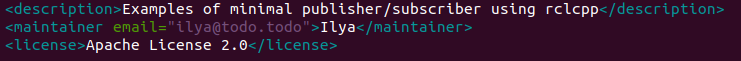

# Writing a simple publisher and subscriber (C++)

## Background

Nodes are executable processes that communicate over the ROS graph. In this tutorial, the nodes will pass information in the form of string messages to each other over a topic. The example used here is a simple “talker” and “listener” system; one node publishes data and the other subscribes to the topic so it can receive that data.

## Tasks

### 1. Create a package

Open a new terminal and source your ROS 2 installation so that `ros2` commands will work.

Navigate into the `ros2_ws` directory created in a previous tutorial.

Recall that packages should be created in the `src` directory, not the root of the workspace. So, navigate into `ros2_ws/src`, and run the package creation command:

```bash
ros2 pkg create --build-type ament_cmake --license Apache-2.0 cpp_pubsub
```
Your terminal will return a message verifying the creation of your package `cpp_pubsub` and all its necessary files and folders.


Navigate into `ros2_ws/src/cpp_pubsub/src`. Recall that this is the directory in any CMake package where the source files containing executables belong.

### 2. Write the publisher node

Download the example talker code by entering the following command:

```bash
wget -O publisher_member_function.cpp https://raw.githubusercontent.com/ros2/examples/humble/rclcpp/topics/minimal_publisher/member_function.cpp
```

Now there will be a new file named `publisher_member_function.cpp`. Open the file using your preferred text editor.


### 2.1. Examine the code

The top of the code includes the standard C++ headers you will be using. After the standard C++ headers is the `rclcpp/rclcpp.hpp` include which allows you to use the most common pieces of the ROS 2 system. Last is `std_msgs/msg/string.hpp`, which includes the built-in message type you will use to publish data.


These lines represent the node’s dependencies. Recall that dependencies have to be added to `package.xml` and `CMakeLists.txt`, which you’ll do in the next section.

The next line creates the node class `MinimalPublisher` by inheriting from `rclcpp::Node`. Every `this` in the code is referring to the node.


The public constructor names the node `minimal_publisher` and initializes `count_` to 0. Inside the constructor, the publisher is initialized with the `String` message type, the topic name `topic`, and the required queue size to limit messages in the event of a backup. Next, `timer_` is initialized, which causes the `timer_callback` function to be executed twice a second.


The `timer_callback` function is where the message data is set and the messages are actually published. The `RCLCPP_INFO` macro ensures every published message is printed to the console.


Last is the declaration of the timer, publisher, and counter fields.


Following the `MinimalPublisher` class is `main`, where the node actually executes. `rclcpp::init` initializes ROS 2, and `rclcpp::spin` starts processing data from the node, including callbacks from the timer.


### 2.2. Add dependencies

Navigate one level back to the `ros2_ws/src/cpp_pubsub` directory, where the `CMakeLists.txt` and `package.xml` files have been created for you.

Open `package.xml` with your text editor.

As mentioned in the previous tutorial, make sure to fill in the `<description>`, `<maintainer>` and `<license>` tags:



Add a new line after the `ament_cmake` buildtool dependency and paste the following dependencies corresponding to your node’s include statements:


This declares the package needs `rclcpp` and `std_msgs` when its code is built and executed.

Make sure to save the file.

### 2.3. CMakeLists.txt

Now open the `CMakeLists.txt` file. Below the existing dependency `find_package(ament_cmake REQUIRED)`, add the lines:


After that, add the executable and name it `talker` so you can run your node using `ros2 run`:


Finally, add the `install(TARGETS...)` section so `ros2 run` can find your executable:


You can clean up your `CMakeLists.txt` by removing some unnecessary sections and comments, so it looks like this:


### 3. Write the subscriber node

Return to `ros2_ws/src/cpp_pubsub/src` to create the next node. Enter the following code in your terminal:

```bash
wget -O subscriber_member_function.cpp https://raw.githubusercontent.com/ros2/examples/humble/rclcpp/topics/minimal_subscriber/member_function.cpp
```

Check to ensure that these files exist:

```bash
publisher_member_function.cpp  subscriber_member_function.cpp
```

Open the `subscriber_member_function.cpp` with your text editor.


### 3.1. Examine the code

The subscriber node’s code is nearly identical to the publisher’s. Now the node is named `minimal_subscriber`, and the constructor uses the node’s `create_subscription` class to execute the callback.

There is no timer because the subscriber simply responds whenever data is published to the `topic` topic.


The `topic_callback` function receives the string message data published over the topic, and simply writes it to the console using the `RCLCPP_INFO` macro.

The only field declaration in this class is the subscription.


The `main` function is exactly the same, except now it spins the `MinimalSubscriber` node. For the publisher node, spinning meant starting the timer, but for the subscriber it simply means preparing to receive messages whenever they come.

Since this node has the same dependencies as the publisher node, there’s nothing new to add to `package.xml`.

### 3.2. CMakeLists.txt

Reopen `CMakeLists.txt` and add the executable and target for the subscriber node below the publisher’s entries.


Make sure to save the file, and then your pub/sub system should be ready.

### 4. Build and run

You likely already have the `rclcpp` and `std_msgs` packages installed as part of your ROS 2 system. It’s good practice to run `rosdep` in the root of your workspace (`ros2_ws`) to check for missing dependencies before building:

```bash
rosdep install -i --from-path src --rosdistro humble -y
```

Still in the root of your workspace, `ros2_ws`, build your new package:

```bash
colcon build --packages-select cpp_pubsub
```

Open a new terminal, navigate to `ros2_ws`, and source the setup files:

```bash
. install/setup.bash
```

Now run the talker node:

```bash
ros2 run cpp_pubsub talker
```

The terminal should start publishing info messages every 0.5 seconds, like so:


Open another terminal, source the setup files from inside `ros2_ws` again, and then start the listener node:

```bash
ros2 run cpp_pubsub listener
```

The listener will start printing messages to the console, starting at whatever message count the publisher is on at that time, like so:


Enter `Ctrl+C` in each terminal to stop the nodes from spinning.

## Summary

You created two nodes to publish and subscribe to data over a topic. Before compiling and running them, you added their dependencies and executables to the package configuration files.You created two nodes to publish and subscribe to data over a topic. Before compiling and running them, you added their dependencies and executables to the package configuration files.

You created two nodes to publish and subscribe to data over a topic. Before compiling and running them, you added their dependencies and executables to the package configuration files.

