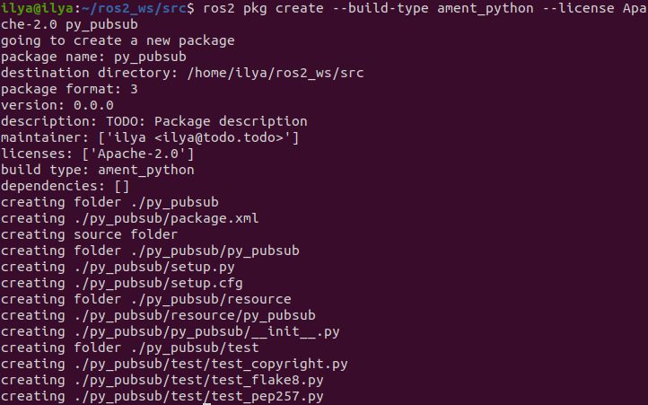
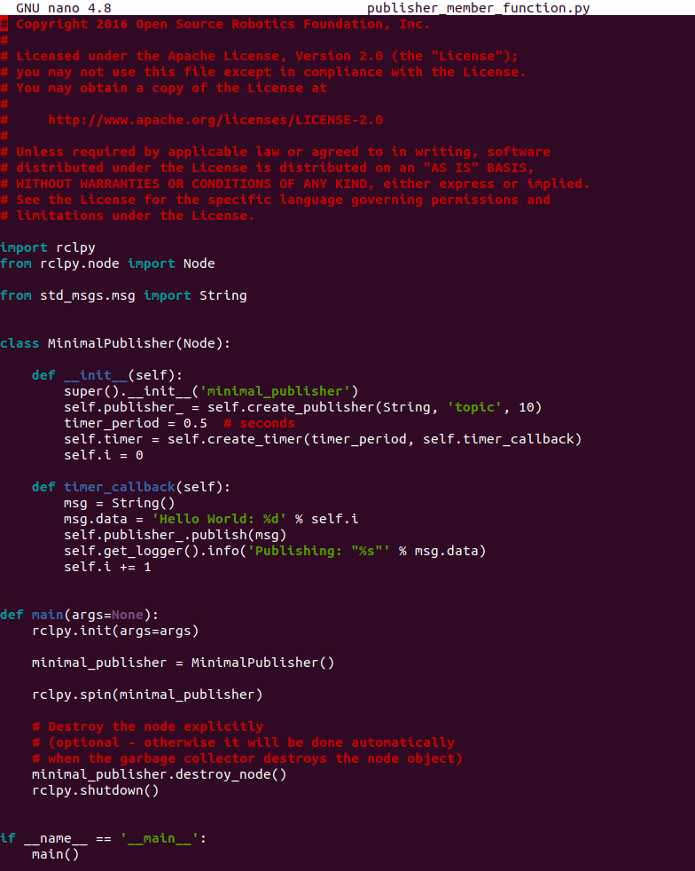
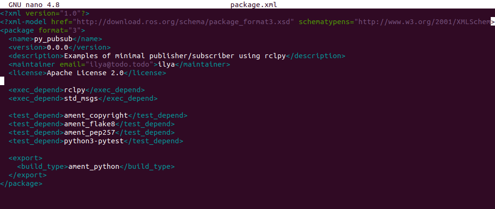
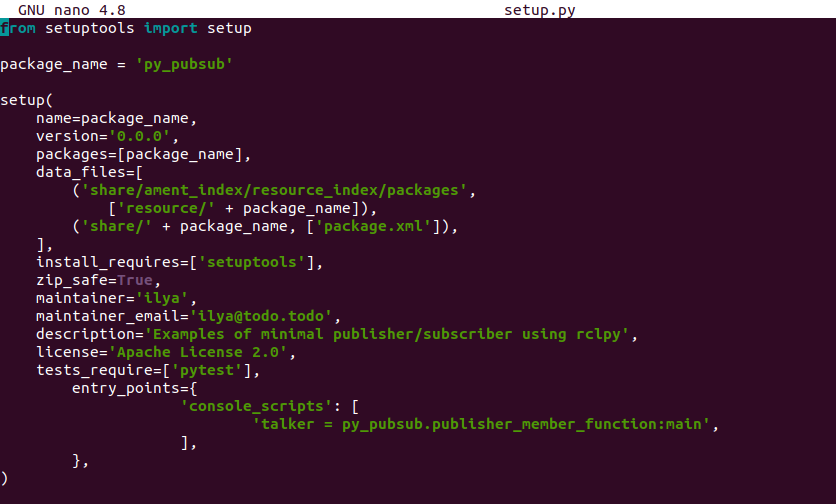
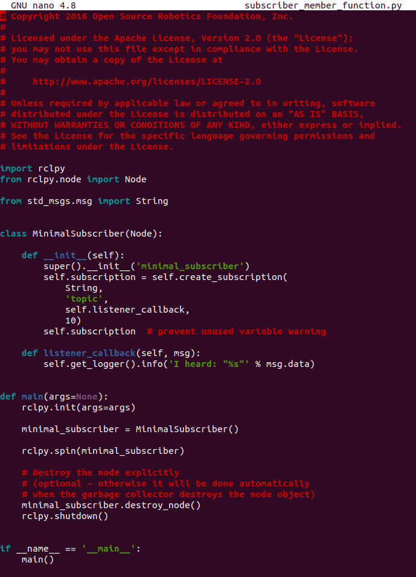
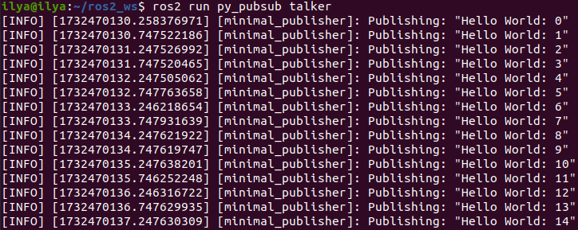
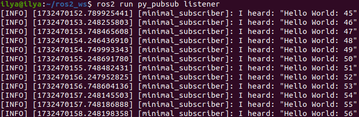

# Написание простого издателя и подписчика (Python)

## Предыстория

В этом уроке вы создадите узлы, которые будут передавать друг другу информацию в виде строковых сообщений через тему. В данном примере используется простая система «говорящего» и «слушающего»; один узел публикует данные, а другой подписывается на тему, чтобы получать эти данные.

## Задачи

### 1. Создайте пакет

Откройте новый терминал и создайте исходный код вашей установки ROS 2, чтобы команды `ros2` работали.

Перейдите в каталог `ros2_ws`, созданный в предыдущем уроке.

Напомним, что пакеты должны создаваться в каталоге src, а не в корне рабочей области. Поэтому перейдите в каталог `ros2_ws/src` и выполните команду создания пакета:

```bash
ros2 pkg create --build-type ament_python --license Apache-2.0 py_pubsub
```
Ваш терминал выдаст сообщение, подтверждающее создание вашего пакета `py_pubsub` и всех необходимых файлов и папок.



### 2. Напишите узел издателя

Перейдите в директорию `ros2_ws/src/py_pubsub/py_pubsub`. Напомним, что эта директория представляет собой пакет Python с тем же именем, что и пакет ROS 2, в который он вложен.

Загрузите пример кода talker, введя следующую команду:

```bash
wget https://raw.githubusercontent.com/ros2/examples/humble/rclpy/topics/minimal_publisher/examples_rclpy_minimal_publisher/publisher_member_function.py
```

Теперь рядом с файлом `__init__.py` будет находиться новый файл с именем `publisher_member_function.py`.

Откройте этот файл с помощью удобного для вас текстового редактора.



### 2.1 Изучите код

Первые строки кода после комментариев импортируют `rclpy`, чтобы можно было использовать его класс `Node`.

```bash
import rclpy
from rclpy.node import Node
```

Следующий оператор импортирует встроенный тип сообщения string, который узел использует для структурирования данных, передаваемых в тему.

```bash
from std_msgs.msg import String
```

Эти строки представляют собой зависимости узла. Напомним, что зависимости должны быть добавлены в `package.xml`, что вы и сделаете в следующем разделе.

Далее создается класс `MinimalPublisher`, который наследует от (или является подклассом) `Node`.

```bash
class MinimalPublisher(Node):
```

Ниже приведено определение конструктора класса. `super().__init__` вызывает конструктор класса `Node` и дает ему имя вашего узла, в данном случае `minimal_publisher`.

`create_publisher` объявляет, что узел публикует сообщения типа `String` (импортированные из модуля `std_msgs.msg`), по теме с именем `topic`, и что «размер очереди» равен 10. Размер очереди - это необходимый параметр QoS (качество обслуживания), который ограничивает количество сообщений в очереди, если абонент не получает их достаточно быстро.

Далее создается таймер с обратным вызовом, который должен выполняться каждые 0,5 секунды. `self.i` - это счетчик, используемый в обратном вызове.

```bash
def __init__(self):
    super().__init__('minimal_publisher')
    self.publisher_ = self.create_publisher(String, 'topic', 10)
    timer_period = 0.5  # seconds
    self.timer = self.create_timer(timer_period, self.timer_callback)
    self.i = 0
```

`timer_callback` создает сообщение с добавлением значения счетчика и публикует его в консоли с помощью `get_logger().info`.

```bash
def timer_callback(self):
    msg = String()
    msg.data = 'Hello World: %d' % self.i
    self.publisher_.publish(msg)
    self.get_logger().info('Publishing: "%s"' % msg.data)
    self.i += 1
```

Наконец, определена главная функция.

```bash
def main(args=None):
    rclpy.init(args=args)

    minimal_publisher = MinimalPublisher()

    rclpy.spin(minimal_publisher)

    # Destroy the node explicitly
    # (optional - otherwise it will be done automatically
    # when the garbage collector destroys the node object)
    minimal_publisher.destroy_node()
    rclpy.shutdown()
```

Сначала инициализируется библиотека `rclpy`, затем создается узел, а потом он «вращает» узел, чтобы вызывались его обратные вызовы.

### 2.2. Добавление зависимостей

Перейдите на один уровень назад в каталог `ros2_ws/src/py_pubsub`, где для вас были созданы файлы `setup.py`, `setup.cfg` и `package.xml`.

Откройте файл `package.xml` в текстовом редакторе.

Как уже говорилось в предыдущем уроке, не забудьте заполнить теги `<description>`, `<maintainer>` и `<license>`:

```bash
<description>Examples of minimal publisher/subscriber using rclpy</description>
<maintainer email="you@email.com">Your Name</maintainer>
<license>Apache License 2.0</license>
```

После строк, указанных выше, добавьте следующие зависимости, соответствующие заявлениям об импорте вашего узла:

```bash
<exec_depend>rclpy</exec_depend>
<exec_depend>std_msgs</exec_depend>
```

Это объявляет, что пакету нужны `rclpy` и `std_msgs` при выполнении его кода.

Не забудьте сохранить файл.



### 2.3. Добавление точки входа

Откройте файл `setup.py`. Снова сопоставьте поля `maintainer`, `maintainer_email`, `description` и `license` с вашим `package.xml`:

```bash
maintainer='YourName',
maintainer_email='you@email.com',
description='Examples of minimal publisher/subscriber using rclpy',
license='Apache License 2.0',
```

Добавьте следующую строку в скобках `console_scripts` в поле `entry_points`:

```bash
entry_points={
        'console_scripts': [
                'talker = py_pubsub.publisher_member_function:main',
        ],
},
```

Не забудьте сохранить файл.



### 2.4. Проверка файла setup.cfg

Содержимое файла `setup.cfg` должно быть корректно заполнено автоматически, как показано ниже:

```bash
[develop]
script_dir=$base/lib/py_pubsub
[install]
install_scripts=$base/lib/py_pubsub
```

Это просто указывает setuptools поместить ваши исполняемые файлы в lib, потому что ros2 run будет искать их там.

### 3. Напишите узел подписчика

Вернитесь в `ros2_ws/src/py_pubsub/py_pubsub` для создания следующего узла. Введите в терминал следующий код:

```bash
wget https://raw.githubusercontent.com/ros2/examples/humble/rclpy/topics/minimal_subscriber/examples_rclpy_minimal_subscriber/subscriber_member_function.py
```

Теперь в каталоге должны быть эти файлы:

```bash
__init__.py  publisher_member_function.py  subscriber_member_function.py
```

### 3.1. Изучите код

Откройте файл `subscriber_member_function.py в текстовом редакторе.



Код узла подписчика практически идентичен коду издателя. Конструктор создает подписчика с теми же аргументами, что и издателя. Вспомните из учебника по темам, что имя темы и тип сообщения, используемые издателем и подписчиком, должны совпадать, чтобы они могли взаимодействовать.

```bash
self.subscription = self.create_subscription(
    String,
    'topic',
    self.listener_callback,
    10)
```

Конструктор и обратный вызов подписчика не содержат определения таймера, потому что он ему не нужен. Его обратный вызов вызывается, как только он получает сообщение.

Определение обратного вызова просто печатает информационное сообщение в консоль вместе с полученными данными. Вспомните, что издатель определяет `msg.data = 'Hello World: %d' % self.i`.

```bash
def listener_callback(self, msg):
    self.get_logger().info('I heard: "%s"' % msg.data)
```

Определение `main` почти полностью аналогично, заменяя создание и вращение издателя на подписчика.

```bash
minimal_subscriber = MinimalSubscriber()

rclpy.spin(minimal_subscriber)
```

Поскольку этот узел имеет те же зависимости, что и издатель, в `package.xml` ничего нового добавлять не нужно. Файл `setup.cfg` также может оставаться нетронутым.

### 3.3. Добавить точку входа

Откройте заново файл `setup.py` и добавьте точку входа для узла подписчика ниже точки входа издателя. Поле `entry_points` теперь должно выглядеть следующим образом:

```bash
entry_points={
        'console_scripts': [
                'talker = py_pubsub.publisher_member_function:main',
                'listener = py_pubsub.subscriber_member_function:main',
        ],
},
```

Не забудьте сохранить файл, и ваша система pub/sub будет готова.

### 4. Сборка и запуск

Скорее всего, у вас уже установлены пакеты `rclpy` и `std_msgs` как часть вашей системы ROS 2. Хорошей практикой является запуск `rosdep` в корне вашего рабочего пространства (`ros2_ws`), чтобы проверить наличие отсутствующих зависимостей перед сборкой:

```bash
rosdep install -i --from-path src --rosdistro humble -y
```

Все еще находясь в корне рабочей области, `ros2_ws`, соберите новый пакет:

```bash
colcon build --packages-select py_pubsub
```

Откройте новый терминал, перейдите в раздел `ros2_ws` и найдите установочные файлы:

```bash
source install/setup.bash
```

Теперь запустите узел talker:

```bash
ros2 run py_pubsub talker
```

Терминал должен начать публиковать информационные сообщения каждые 0,5 секунды, как показано ниже:



Откройте другой терминал, снова создайте файлы настроек внутри `ros2_ws`, а затем запустите узел прослушивателя:

```bash
ros2 run py_pubsub listener
```

Слушатель начнет печатать сообщения в консоль, начиная с того количества сообщений, на котором в данный момент находится издатель, как показано ниже:



Введите `Ctrl+C` в каждом терминале, чтобы остановить вращение узлов.

## Резюме

Вы создали два узла для публикации и подписки на данные по теме. Перед их запуском вы добавили их зависимости и точки входа в файлы конфигурации пакетов.
