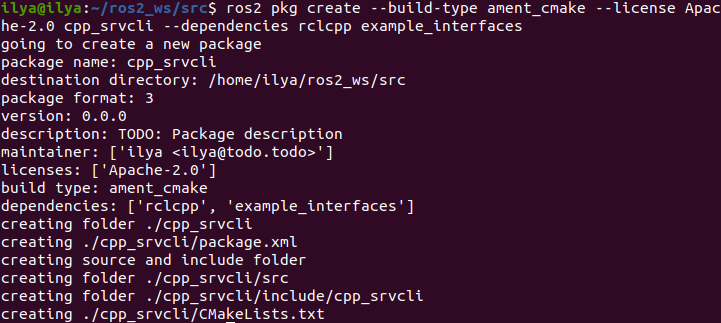
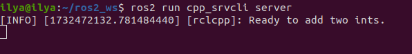
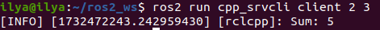
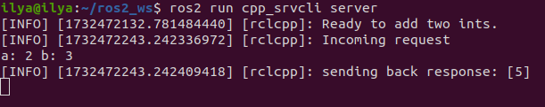

# Writing a simple service and client (C++)

## Background

When nodes communicate using services, the node that sends a request for data is called the client node, and the one that responds to the request is the service node. The structure of the request and response is determined by a .srv file.

The example used here is a simple integer addition system; one node requests the sum of two integers, and the other responds with the result.

## Tasks

### 1. Create a package

Open a new terminal and source your ROS 2 installation so that `ros2` commands will work.

Navigate into the `ros2_ws` directory created in a previous tutorial.

Recall that packages should be created in the `src` directory, not the root of the workspace. Navigate into `ros2_ws/src` and create a new package:

```bash
ros2 pkg create --build-type ament_cmake --license Apache-2.0 cpp_srvcli --dependencies rclcpp example_interfaces
```



Your terminal will return a message verifying the creation of your package `cpp_srvcli` and all its necessary files and folders.

The `--dependencies` argument will automatically add the necessary dependency lines to `package.xml` and `CMakeLists.txt`. `example_interfaces` is the package that includes the .srv file you will need to structure your requests and responses:

```bash
int64 a
int64 b
---
int64 sum
```

The first two lines are the parameters of the request, and below the dashes is the response.

### 1.1. Update `package.xml`

Because you used the `--dependencies` option during package creation, you don’t have to manually add dependencies to `package.xml` or `CMakeLists.txt`.

As always, though, make sure to add the description, maintainer email and name, and license information to `package.xml`.

```bash
<description>C++ client server tutorial</description>
<maintainer email="you@email.com">Your Name</maintainer>
<license>Apache License 2.0</license>
```

### 2. Write the service node

Inside the `ros2_ws/src/cpp_srvcli/src` directory, create a new file called `add_two_ints_server.cpp` and paste the following code within:

```bash
#include "rclcpp/rclcpp.hpp"
#include "example_interfaces/srv/add_two_ints.hpp"

#include <memory>

void add(const std::shared_ptr<example_interfaces::srv::AddTwoInts::Request> request,
          std::shared_ptr<example_interfaces::srv::AddTwoInts::Response>      response)
{
  response->sum = request->a + request->b;
  RCLCPP_INFO(rclcpp::get_logger("rclcpp"), "Incoming request\na: %ld" " b: %ld",
                request->a, request->b);
  RCLCPP_INFO(rclcpp::get_logger("rclcpp"), "sending back response: [%ld]", (long int)response->sum);
}

int main(int argc, char **argv)
{
  rclcpp::init(argc, argv);

  std::shared_ptr<rclcpp::Node> node = rclcpp::Node::make_shared("add_two_ints_server");

  rclcpp::Service<example_interfaces::srv::AddTwoInts>::SharedPtr service =
    node->create_service<example_interfaces::srv::AddTwoInts>("add_two_ints", &add);

  RCLCPP_INFO(rclcpp::get_logger("rclcpp"), "Ready to add two ints.");

  rclcpp::spin(node);
  rclcpp::shutdown();
}
```

### 2.1. Examine the code

The first two `#include` statements are your package dependencies.

The `add` function adds two integers from the request and gives the sum to the response, while notifying the console of its status using logs.

```bash
void add(const std::shared_ptr<example_interfaces::srv::AddTwoInts::Request> request,
         std::shared_ptr<example_interfaces::srv::AddTwoInts::Response>      response)
{
    response->sum = request->a + request->b;
    RCLCPP_INFO(rclcpp::get_logger("rclcpp"), "Incoming request\na: %ld" " b: %ld",
        request->a, request->b);
    RCLCPP_INFO(rclcpp::get_logger("rclcpp"), "sending back response: [%ld]", (long int)response->sum);
}
```

The `main` function accomplishes the following, line by line:

- Initializes ROS 2 C++ client library:

```bash
rclcpp::init(argc, argv);
```

- Creates a node named `add_two_ints_server`:

```bash
std::shared_ptr<rclcpp::Node> node = rclcpp::Node::make_shared("add_two_ints_server");
```

- Creates a service named `add_two_ints` for that node and automatically advertises it over the networks with the `&add` method:

```bash
rclcpp::Service<example_interfaces::srv::AddTwoInts>::SharedPtr service =
node->create_service<example_interfaces::srv::AddTwoInts>("add_two_ints", &add);
```

- Prints a log message when it’s ready:

```bash
RCLCPP_INFO(rclcpp::get_logger("rclcpp"), "Ready to add two ints.");
```

- Spins the node, making the service available.

```bash
rclcpp::spin(node);
```

### 2.2. Add executable

The `add_executable` macro generates an executable you can run using `ros2 run`. Add the following code block to `CMakeLists.txt` to create an executable named `server`:

```bash
add_executable(server src/add_two_ints_server.cpp)
ament_target_dependencies(server rclcpp example_interfaces)
```

So `ros2 run` can find the executable, add the following lines to the end of the file, right before `ament_package()`:

```bash
install(TARGETS
    server
  DESTINATION lib/${PROJECT_NAME})
```

### 3. Write the client node

Inside the `ros2_ws/src/cpp_srvcli/src directory`, create a new file called `add_two_ints_client.cpp` and paste the following code within:

```bash
#include "rclcpp/rclcpp.hpp"
#include "example_interfaces/srv/add_two_ints.hpp"

#include <chrono>
#include <cstdlib>
#include <memory>

using namespace std::chrono_literals;

int main(int argc, char **argv)
{
  rclcpp::init(argc, argv);

  if (argc != 3) {
      RCLCPP_INFO(rclcpp::get_logger("rclcpp"), "usage: add_two_ints_client X Y");
      return 1;
  }

  std::shared_ptr<rclcpp::Node> node = rclcpp::Node::make_shared("add_two_ints_client");
  rclcpp::Client<example_interfaces::srv::AddTwoInts>::SharedPtr client =
    node->create_client<example_interfaces::srv::AddTwoInts>("add_two_ints");

  auto request = std::make_shared<example_interfaces::srv::AddTwoInts::Request>();
  request->a = atoll(argv[1]);
  request->b = atoll(argv[2]);

  while (!client->wait_for_service(1s)) {
    if (!rclcpp::ok()) {
      RCLCPP_ERROR(rclcpp::get_logger("rclcpp"), "Interrupted while waiting for the service. Exiting.");
      return 0;
    }
    RCLCPP_INFO(rclcpp::get_logger("rclcpp"), "service not available, waiting again...");
  }

  auto result = client->async_send_request(request);
  // Wait for the result.
  if (rclcpp::spin_until_future_complete(node, result) ==
    rclcpp::FutureReturnCode::SUCCESS)
  {
    RCLCPP_INFO(rclcpp::get_logger("rclcpp"), "Sum: %ld", result.get()->sum);
  } else {
    RCLCPP_ERROR(rclcpp::get_logger("rclcpp"), "Failed to call service add_two_ints");
  }

  rclcpp::shutdown();
  return 0;
}
```

### 3.1. Examine the code

Similar to the service node, the following lines of code create the node and then create the client for that node:

```bash
std::shared_ptr<rclcpp::Node> node = rclcpp::Node::make_shared("add_two_ints_client");
rclcpp::Client<example_interfaces::srv::AddTwoInts>::SharedPtr client =
  node->create_client<example_interfaces::srv::AddTwoInts>("add_two_ints");
```

Next, the request is created. Its structure is defined by the .srv file mentioned earlier.

```bash
auto request = std::make_shared<example_interfaces::srv::AddTwoInts::Request>();
request->a = atoll(argv[1]);
request->b = atoll(argv[2]);
```

The `while` loop gives the client 1 second to search for service nodes in the network. If it can’t find any, it will continue waiting.

```bash
RCLCPP_INFO(rclcpp::get_logger("rclcpp"), "service not available, waiting again...");
```

If the client is canceled (e.g. by you entering `Ctrl+C` into the terminal), it will return an error log message stating it was interrupted.

```bash
RCLCPP_ERROR(rclcpp::get_logger("rclcpp"), "Interrupted while waiting for the service. Exiting.");
```

Then the client sends its request, and the node spins until it receives its response, or fails.

### 3.2. Add executable

Return to `CMakeLists.txt` to add the executable and target for the new node. After removing some unnecessary boilerplate from the automatically generated file, your `CMakeLists.txt` should look like this:

```bash
cmake_minimum_required(VERSION 3.5)
project(cpp_srvcli)

find_package(ament_cmake REQUIRED)
find_package(rclcpp REQUIRED)
find_package(example_interfaces REQUIRED)

add_executable(server src/add_two_ints_server.cpp)
ament_target_dependencies(server rclcpp example_interfaces)

add_executable(client src/add_two_ints_client.cpp)
ament_target_dependencies(client rclcpp example_interfaces)

install(TARGETS
  server
  client
  DESTINATION lib/${PROJECT_NAME})

ament_package()
```

### 4. Build and run

It’s good practice to run `rosdep` in the root of your workspace (`ros2_ws`) to check for missing dependencies before building:

```bash
rosdep install -i --from-path src --rosdistro humble -y
```

Navigate back to the root of your workspace, ros2_ws, and build your new package:

```bash
colcon build --packages-select cpp_srvcli
```

Open a new terminal, navigate to `ros2_ws`, and source the setup files:

```bash
source install/setup.bash
```

Now run the service node:

```bash
ros2 run cpp_srvcli server
```

The terminal should return the following message, and then wait:



Open another terminal, source the setup files from inside `ros2_ws` again. Start the client node, followed by any two integers separated by a space:

```bash
ros2 run cpp_srvcli client 2 3
```

If you chose `2` and `3`, for example, the client would receive a response like this:



Return to the terminal where your service node is running. You will see that it published log messages when it received the request and the data it received, and the response it sent back:



Enter `Ctrl+C` in the server terminal to stop the node from spinning.

## Summary

You created two nodes to request and respond to data over a service. You added their dependencies and executables to the package configuration files so that you could build and run them, and see a service/client system at work.

You created two nodes to request and respond to data over a service. You added their dependencies and executables to the package configuration files so that you could build and run them, and see a service/client system at work.

