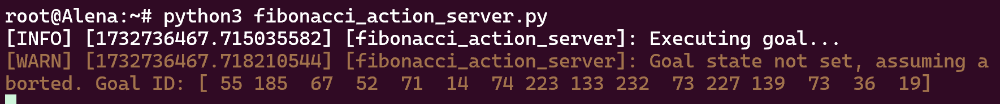
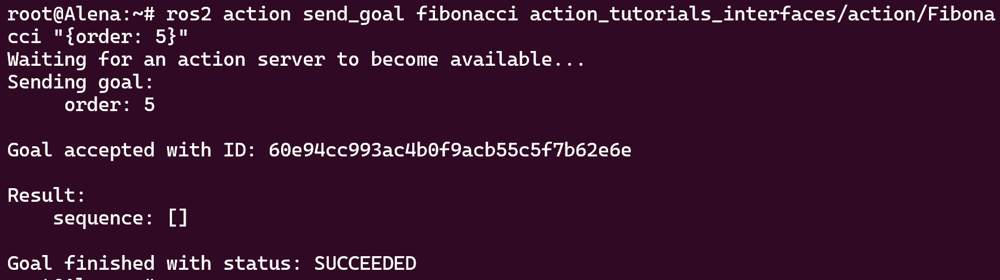
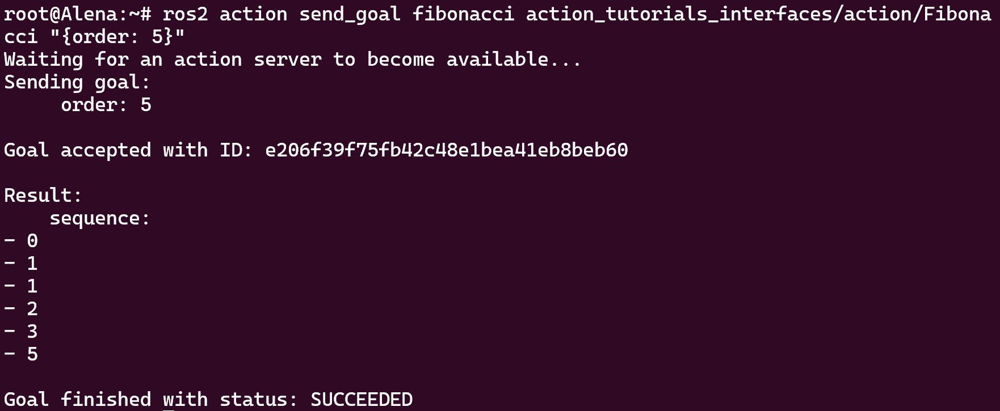
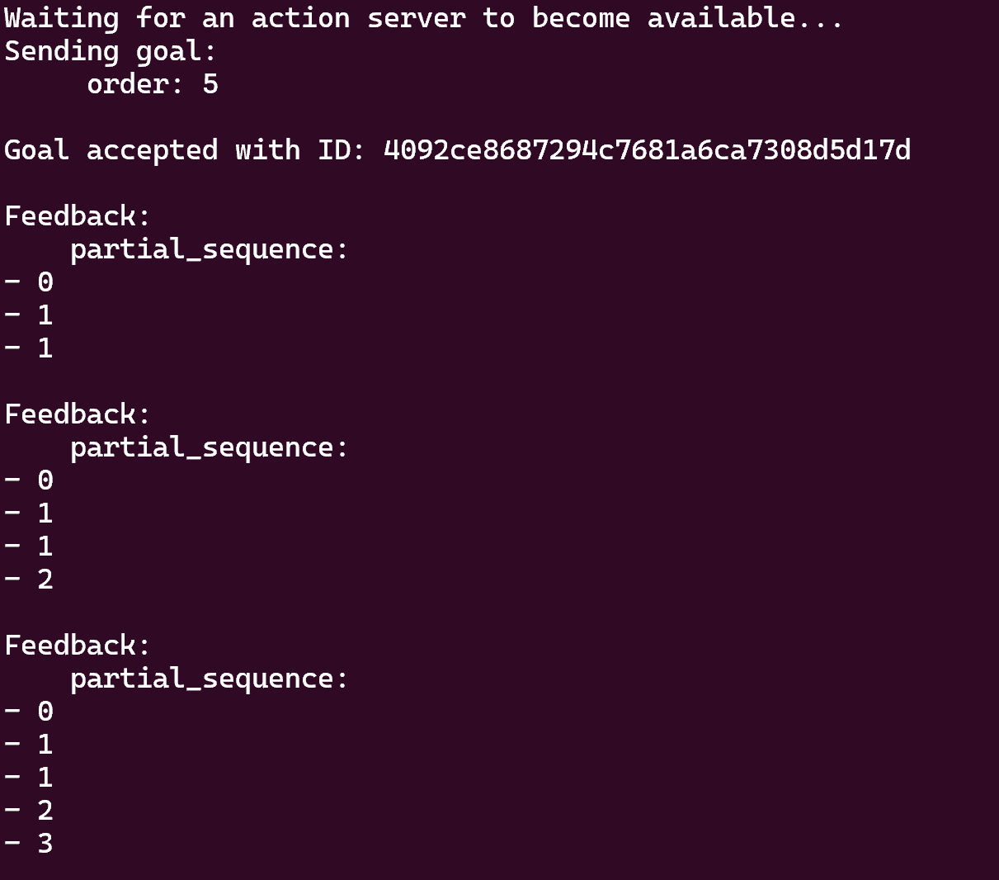
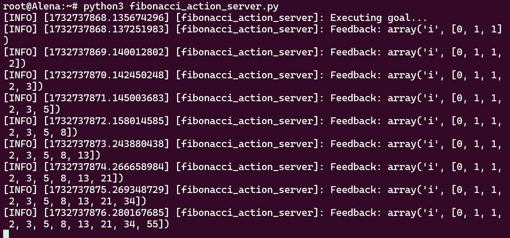
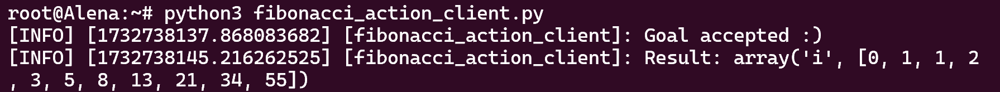
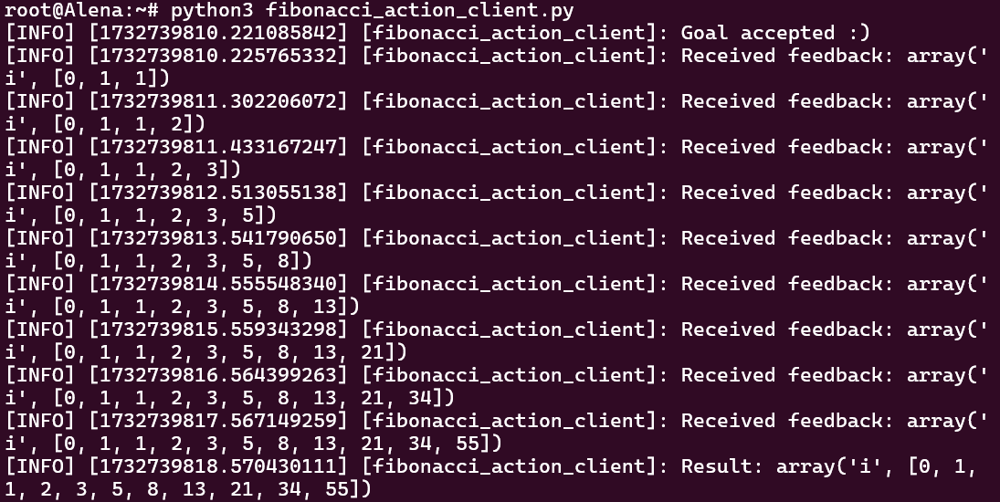

# Writing an action server and client (Python)

**Цель:** Реализовать сервер и клиент действий на Python.

## 1 Написание сервера действий

Давайте сосредоточимся на написании сервера действий, который вычисляет последовательность Фибоначчи, используя действие, которое мы создали в туториале [`Creating-an-Action`](https://github.com/ros2/ros2_documentation/blob/humble/source/Tutorials/Intermediate/Writing-an-Action-Server-Client/Py.rst#id3).

До этого вы создавали пакеты и использовали `ros2 run` для запуска узлов. Однако, чтобы упростить этот туториал, мы ограничим сервер действий одним файлом.

Создайте новый файл в вашем домашнем каталоге, назовем его `fibonacci_action_server.py`, и добавьте следующий код:

```python
import rclpy
from rclpy.action import ActionServer
from rclpy.node import Node

from action_tutorials_interfaces.action import Fibonacci


class FibonacciActionServer(Node):

    def __init__(self):
        super().__init__('fibonacci_action_server')
        self._action_server = ActionServer(
            self,
            Fibonacci,
            'fibonacci',
            self.execute_callback)

    def execute_callback(self, goal_handle):
        self.get_logger().info('Executing goal...')
        result = Fibonacci.Result()
        return result


def main(args=None):
    rclpy.init(args=args)

    fibonacci_action_server = FibonacciActionServer()

    rclpy.spin(fibonacci_action_server)


if __name__ == '__main__':
    main()
```

Строка 8 определяет класс `FibonacciActionServer`, который является подклассом `Node`. Класс инициализируется вызовом конструктора `Node`, называя наш узел `fibonacci_action_server`:

```python
        super().__init__('fibonacci_action_server')
```

В конструкторе мы также создаем экземпляр нового сервера действий:

```python
self._action_server = ActionServer(
            self,
            Fibonacci,
            'fibonacci',
            self.execute_callback)
```

Сервер действий требует четырех аргументов:

1. Узел ROS 2, к которому нужно добавить клиент действий: `self`.
2. Тип действия: `Fibonacci` (импортированный в строке 5).
3. Имя действия: `'fibonacci'`.
4. Функция обратного вызова для выполнения принятых целей: `self.execute_callback`. Этот callback **должен** возвращать сообщение с результатом для данного типа действия.

Мы также определяем метод `execute_callback` в нашем классе:

```python
    def execute_callback(self, goal_handle):
        self.get_logger().info('Executing goal...')
        result = Fibonacci.Result()
        return result
```

Это метод, который будет вызываться для выполнения цели после ее принятия.

Давайте попробуем запустить наш сервер действий:

```bash
ros2 action send_goal fibonacci action_tutorials_interfaces/action/Fibonacci "{order: 5}"
```



Мы можем использовать метод `succeed()` у цели для указания, что цель была успешной:

```python
    def execute_callback(self, goal_handle):
        self.get_logger().info('Executing goal...')
        goal_handle.succeed()
        result = Fibonacci.Result()
        return result
```

Теперь, если вы перезапустите сервер действий и отправите другую цель, вы должны увидеть, что цель завершилась со статусом `SUCCEEDED`.



Теперь давайте сделаем так, чтобы наше выполнение цели действительно вычисляло и возвращало запрошенную последовательность Фибоначчи:

```python
    def execute_callback(self, goal_handle):
        self.get_logger().info('Executing goal...')

        sequence = [0, 1]

        for i in range(1, goal_handle.request.order):
            sequence.append(sequence[i] + sequence[i-1])

        goal_handle.succeed()

        result = Fibonacci.Result()
        result.sequence = sequence
        return result
```
После вычисления последовательности мы присваиваем её полю сообщения результата перед возвратом.

Снова перезапустите сервер действий и отправьте другую цель. Вы должны увидеть, что цель завершается с правильной последовательностью результата.




### 1.2 Публикация обратной связи


Одна из хороших особенностей действий - это возможность предоставлять обратную связь клиенту действия во время выполнения цели. Мы можем сделать так, чтобы наш сервер действий публиковал обратную связь для клиентов действий, вызывая метод publish_feedback() у обработчика цели.

Мы заменим переменную `sequence` и вместо неё будем использовать сообщение обратной связи для хранения последовательности. После каждого обновления сообщения обратной связи в цикле for мы публикуем сообщение обратной связи и делаем паузу:

```python
import time

import rclpy
from rclpy.action import ActionServer
from rclpy.node import Node

from action_tutorials_interfaces.action import Fibonacci


class FibonacciActionServer(Node):

    def __init__(self):
        super().__init__('fibonacci_action_server')
        self._action_server = ActionServer(
            self,
            Fibonacci,
            'fibonacci',
            self.execute_callback)

    def execute_callback(self, goal_handle):
        self.get_logger().info('Executing goal...')

        feedback_msg = Fibonacci.Feedback()
        feedback_msg.partial_sequence = [0, 1]

        for i in range(1, goal_handle.request.order):
            feedback_msg.partial_sequence.append(
                feedback_msg.partial_sequence[i] + feedback_msg.partial_sequence[i-1])
            self.get_logger().info('Feedback: {0}'.format(feedback_msg.partial_sequence))
            goal_handle.publish_feedback(feedback_msg)
            time.sleep(1)

        goal_handle.succeed()

        result = Fibonacci.Result()
        result.sequence = feedback_msg.partial_sequence
        return result


def main(args=None):
    rclpy.init(args=args)

    fibonacci_action_server = FibonacciActionServer()

    rclpy.spin(fibonacci_action_server)


if __name__ == '__main__':
    main()
```


После перезапуска сервера действий мы можем подтвердить, что обратная связь теперь публикуется, используя инструмент командной строки с опцией `--feedback`:

```
ros2 action send_goal --feedback fibonacci action_tutorials_interfaces/action/Fibonacci "{order: 5}"
```



...


## 2 Написание клиента действий

Мы также ограничим клиент действий одним файлом. Откройте новый файл, назовем его `fibonacci_action_client.py`, и добавьте следующий код:

```python
import rclpy
from rclpy.action import ActionClient
from rclpy.node import Node

from action_tutorials_interfaces.action import Fibonacci


class FibonacciActionClient(Node):

    def __init__(self):
        super().__init__('fibonacci_action_client')
        self._action_client = ActionClient(self, Fibonacci, 'fibonacci')

    def send_goal(self, order):
        goal_msg = Fibonacci.Goal()
        goal_msg.order = order

        self._action_client.wait_for_server()

        return self._action_client.send_goal_async(goal_msg)


def main(args=None):
    rclpy.init(args=args)

    action_client = FibonacciActionClient()

    future = action_client.send_goal(10)

    rclpy.spin_until_future_complete(action_client, future)


if __name__ == '__main__':
    main()
```

Мы определили класс `FibonacciActionClient`, который является подклассом `Node`. Класс инициализируется вызовом конструктора `Node`, называя наш узел `fibonacci_action_client`:

```python
        super().__init__('fibonacci_action_client')
```

Также в конструкторе класса мы создаем клиент действий, используя пользовательское определение действия из предыдущего туториала по созданию действия:

```python
        self._action_client = ActionClient(self, Fibonacci, 'fibonacci')
```

Мы создаем `ActionClient`, передавая ему три аргумента:

1. Узел ROS 2, к которому нужно добавить клиент действий: `self`
2. Тип действия: `Fibonacci`
3. Имя действия: `'fibonacci'`

Наш клиент действий сможет взаимодействовать с серверами действий того же имени и типа действия.

Мы также определяем метод `send_goal` в классе `FibonacciActionClient`:

```python
    def send_goal(self, order):
        goal_msg = Fibonacci.Goal()
        goal_msg.order = order

        self._action_client.wait_for_server()

        return self._action_client.send_goal_async(goal_msg)
```

Этот метод ожидает, пока сервер действий станет доступным, затем отправляет цель на сервер.

После определения класса мы определяем функцию `main()`, которая инициализирует ROS 2 и создает экземпляр нашего узла `FibonacciActionClient`. Затем она отправляет цель и ждет, пока эта цель не будет завершена.

Наконец, мы вызываем `main()` в точке входа нашей Python-программы.

Давайте протестируем наш клиент действий, сначала запустив ранее созданный сервер действий:

```bash
python3 fibonacci_action_server.py
```

В другом терминале запустите клиент действий:

```bash
python3 fibonacci_action_client.py
```

Вы должны увидеть сообщения, напечатанные сервером действий, когда он успешно выполняет цель:



Клиент действий должен запуститься и быстро завершиться. На этом этапе у нас есть функционирующий клиент действий, но мы не видим никаких результатов или обратных связей.

### 2.1 Получение результата

Мы можем получить информацию о результате с помощью нескольких шагов. Во-первых, нам нужно получить цель для цели, которую мы отправили. Затем мы можем использовать цель для запроса результата.

Вот полный код для этого примера:

```python
import rclpy
from rclpy.action import ActionClient
from rclpy.node import Node

from action_tutorials_interfaces.action import Fibonacci


class FibonacciActionClient(Node):

    def __init__(self):
        super().__init__('fibonacci_action_client')
        self._action_client = ActionClient(self, Fibonacci, 'fibonacci')

    def send_goal(self, order):
        goal_msg = Fibonacci.Goal()
        goal_msg.order = order

        self._action_client.wait_for_server()

        self._send_goal_future = self._action_client.send_goal_async(goal_msg)

        self._send_goal_future.add_done_callback(self.goal_response_callback)

    def goal_response_callback(self, future):
        goal_handle = future.result()
        if not goal_handle.accepted:
            self.get_logger().info('Goal rejected :(')
            return

        self.get_logger().info('Goal accepted :)')

        self._get_result_future = goal_handle.get_result_async()
        self._get_result_future.add_done_callback(self.get_result_callback)

    def get_result_callback(self, future):
        result = future.result().result
        self.get_logger().info('Result: {0}'.format(result.sequence))
        rclpy.shutdown()


def main(args=None):
    rclpy.init(args=args)

    action_client = FibonacciActionClient()

    action_client.send_goal(10)

    rclpy.spin(action_client)


if __name__ == '__main__':
    main()
```

Метод ActionClient.send_goal_async() возвращает future для цели. Сначала мы регистрируем callback для случая, когда future завершено:

```python
        self._send_goal_future.add_done_callback(self.goal_response_callback)
```

Обратите внимание, что future завершается, когда сервер действий принимает или отклоняет запрос на выполнение цели. Давайте подробнее рассмотрим `goal_response_callback`. Мы можем проверить, была ли цель отклонена, и закончить раньше, так как знаем, что результата не будет:

```python
    def goal_response_callback(self, future):
        goal_handle = future.result()
        if not goal_handle.accepted:
            self.get_logger().info('Goal rejected :(')
            return

        self.get_logger().info('Goal accepted :)')
```

Теперь, когда мы получили цель, мы можем использовать её для запроса результата с помощью метода get_result_async(). Аналогично отправке цели, мы получим future, которое завершится, когда результат будет готов. Давайте зарегистрируем callback, как мы делали для ответа на цель:

```python
        self._get_result_future = goal_handle.get_result_async()
        self._get_result_future.add_done_callback(self.get_result_callback)
```

В callback-функции мы записываем последовательность результата и завершаем ROS 2 для чистого выхода:

```python
    def get_result_callback(self, future):
        result = future.result().result
        self.get_logger().info('Result: {0}'.format(result.sequence))
        rclpy.shutdown()
```

С сервером действий, работающим в отдельном терминале, попробуйте запустить наш клиент действий:

```bash
python3 fibonacci_action_client.py
```

Вы должны увидеть сообщения о том, что цель была принята и конечный результат.




### 2.2 Получение обратной связи

Было бы здорово получить некоторую обратную связь о целях, которые мы отправляем на сервер действий.

Вот полный код для этого примера:

```python
import rclpy
from rclpy.action import ActionClient
from rclpy.node import Node

from action_tutorials_interfaces.action import Fibonacci


class FibonacciActionClient(Node):

    def __init__(self):
        super().__init__('fibonacci_action_client')
        self._action_client = ActionClient(self, Fibonacci, 'fibonacci')

    def send_goal(self, order):
        goal_msg = Fibonacci.Goal()
        goal_msg.order = order

        self._action_client.wait_for_server()

        self._send_goal_future = self._action_client.send_goal_async(goal_msg, feedback_callback=self.feedback_callback)

        self._send_goal_future.add_done_callback(self.goal_response_callback)

    def goal_response_callback(self, future):
        goal_handle = future.result()
        if not goal_handle.accepted:
            self.get_logger().info('Goal rejected :(')
            return

        self.get_logger().info('Goal accepted :)')

        self._get_result_future = goal_handle.get_result_async()
        self._get_result_future.add_done_callback(self.get_result_callback)

    def get_result_callback(self, future):
        result = future.result().result
        self.get_logger().info('Result: {0}'.format(result.sequence))
        rclpy.shutdown()

    def feedback_callback(self, feedback_msg):
        feedback = feedback_msg.feedback
        self.get_logger().info('Received feedback: {0}'.format(feedback.partial_sequence))


def main(args=None):
    rclpy.init(args=args)

    action_client = FibonacciActionClient()

    action_client.send_goal(10)

    rclpy.spin(action_client)


if __name__ == '__main__':
    main()
```

Here’s the callback function for feedback messages:

```python
    def feedback_callback(self, feedback_msg):
        feedback = feedback_msg.feedback
        self.get_logger().info('Received feedback: {0}'.format(feedback.partial_sequence))
```

В callback-функции мы получаем часть сообщения с обратной связью и выводим поле `partial_sequence` на экран.

Нам нужно зарегистрировать callback-функцию с клиентом действий. Это достигается путем дополнительной передачи callback-функции клиенту действий, когда мы отправляем цель:

```python
        self._send_goal_future = self._action_client.send_goal_async(goal_msg, feedback_callback=self.feedback_callback)
```

Теперь, если мы запустим наш клиент действий, вы должны увидеть, что обратная связь выводится на экран.



## Заключение

В этом туториале вы создали сервер действий и клиент действий построчно, и настроили их для обмена целями, обратными связями и результатами.
